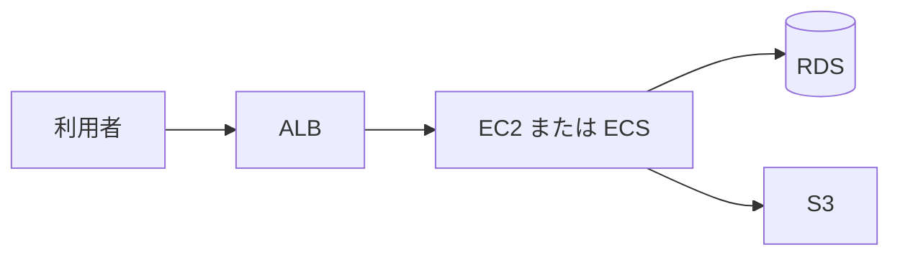

# アプリと RDS

EC2 は 2 台生きているのに、利用者が片方の古いアプリだけを見続ける。  
手前の **Elastic Load Balancing（ALB）** が無いか、ヘルスチェックが片方だけ成功している、がよくある形です。  
注文の表は **RDS**（または Aurora）に置き、計算は EC2 でも ECS でも、状態は外へ出します。

## このページで分かること

- ALB が引き受ける HTTPS とヘルスチェック
- RDS のサブネットグループと、公開アクセス
- EC2 に載せる場合と、コンテナ基盤に載せる場合

## 負荷分散

Application Load Balancer は、HTTPS を受け、後ろのターゲット（EC2 やコンテナ）へ振ります。  
公開サブネットに置き、後ろのアプリは非公開サブネット、が [よくある構成](../fundamentals/typical-architecture) の AWS 版です。

見る点:

- リスナーが 443 か、証明書の期限
- ターゲットのヘルスチェックパス（例: `/health`）がアプリで 200 を返すか
- セキュリティグループ: 世界から 443、ALB からアプリのポートだけ

アプリを増やしても、同じ RDS と同じ S3 を見ていないと、ログイン状態が台ごとに割れます。

## RDS

RDS はマネージドな PostgreSQL や MySQL です。  
[マネージドなデータ](../fundamentals/managed-data) のとおり、スキーマと SQL は自分たちです。  
**サブネットグループ** で、DB をどのゾーンの非公開サブネットに置くかを決めます。  
`PubliclyAccessible` を `true` にし、セキュリティグループを世界に開けると、パスワードがあっても総当たりの対象になります。

接続の部品は [psql](../../data/sql-rdb/connect-and-psql) と同じです。ホスト名だけが `shop-db.xxxx.ap-northeast-1.rds.amazonaws.com` のようになります。  
アプリのロールや、接続ユーザのパスワードは Secrets Manager などに置き、Git に書きません。

:::warning[PubliclyAccessible を検証の楽さで残さない]

ノート PC から直接繋ぎたいときは、踏み台か SSM、または一時的な自分の IP に限定します。  
本番の RDS は非公開、アプリからのみ、が基本です。

:::

メンテナンスとフェイルオーバーで接続は切れます。  
アプリ側の接続プールは、切断を例外で終わらせず再接続します。

## 計算の載せ方

| 載せ方          | 渡すもの             | 調査                       |
| --------------- | -------------------- | -------------------------- |
| EC2             | OS 上のプロセス      | SSH / SSM、プロセス、ログ  |
| ECS / Fargate   | コンテナ             | タスクログ、サービスの事象 |
| App Runner など | ソースまたはコンテナ | サービスログ               |

HTTP の `shop-api` は、コンテナを渡す基盤（ECS や App Runner）が、ソースやコンテナを渡すアプリ基盤に近いです。  
既存の Linux 手順をそのまま、なら EC2 です。  
どちらでも、IAM ロールを計算に付け、S3 と（必要なら）他サービスへ一時資格で届きます。RDS はネットワークとユーザ認証です。

<QuizChoice
title="RDS の公開"
options={[
{ id: 'a', label: 'PubliclyAccessible が true でも、パスワードがあれば世界に開けてよい' },
{ id: 'b', label: 'RDS は非公開サブネットに置き、アプリのセキュリティグループからだけ 5432 を許可する' },
{ id: 'c', label: 'ALB を置けば、RDS のポートも自動的に世界から見えなくなる' },
]}
answer="b"
explanation="ALB は利用者とアプリの間です。RDS の公開設定と SG は別です。"

>

  
shop-api のデータベースについて、適切なものはどれですか。

</QuizChoice>

## よくあるつまずき

- ヘルスチェックが `/` のログイン画面で 302 になり、ターゲットが全部 unhealthy
- RDS のマイナーバージョンアップ時間に、再接続しないアプリが全滅する
- ECS のタスクロールと、EC2 インスタンスロールを混同して 403 になる

## まとめ

- ALB が HTTPS とヘルスチェック、アプリは非公開、状態は RDS と S3 へ出す
- RDS はサブネットグループと SG で閉じ、公開アクセスを残さない
- EC2 でも ECS でも、身分はロール、調査方法は借り方に合わせる

次は [組み立てと運用](./assemble) で、ログと消し忘れをまとめます。
