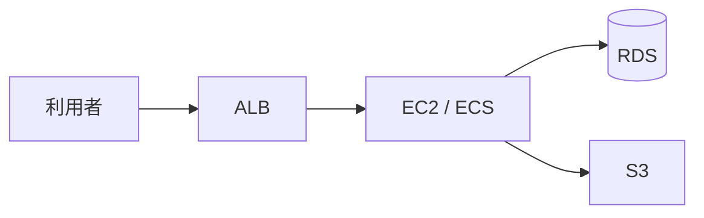

# 組み立てと運用

AWS のチケットも、結局は「検証アカウントの shop-api を動かして」です。  
このページでは、ALB・計算・RDS・S3 を一枚に戻し、CloudWatch と請求の見方を実務の順にします。

## このページで分かること

- 東京リージョンでの箱の対応
- CloudWatch Logs と、403 / timeout の切り分け
- 検証資源を消す順

## 一枚の絵



確認の核は [GCP の組み立て](../gcp/assemble) と同じです。商品名だけ読み替えます。

- アカウント ID とリージョン（`ap-northeast-1`）
- アプリの IAM ロール
- RDS が非公開か
- S3 のパブリックアクセスブロック
- アクセスキーがコードに無いか

## ログ

アプリの標準出力は、EC2 ならファイルか CloudWatch エージェント、ECS なら awslogs、Lambda なら標準で CloudWatch Logs に集まりやすいです。

```bash
aws logs describe-log-groups --region ap-northeast-1
```

成功時は、ロググループ名の一覧です。  
`/ecs/shop-api` のような名前を付けておくと、探す時間が短くなります。

切り分け:

- **403 / AccessDenied**: IAM。ロール、Action、Resource、リージョン
- **timeout**: セキュリティグループ、サブネット、RDS の公開設定、ターゲットのヘルス
- **5xx on ALB**: アプリ例外か、ヘルスチェック失敗でターゲットが空

:::tip[先にアカウントとリージョン]

別アカウントのログを見て、検証の失敗を追う、が AWS ではよく起きます。  
`aws sts get-caller-identity` と `aws configure get region` を、調査の最初に戻します。

:::

## 検証を消す順

時間課金が大きいものから確認します。

1. ALB とターゲットグループ（時間課金）
2. EC2（終了）と、残った EBS、Elastic IP
3. NAT ゲートウェイ（忘れやすく高い）
4. RDS（スナップショットを残すかも決める）
5. 空にした検証バケット

```bash
aws elbv2 describe-load-balancers --region ap-northeast-1
aws ec2 describe-instances --region ap-northeast-1
aws rds describe-db-instances --region ap-northeast-1
aws s3 ls
```

NAT ゲートウェイは、非公開サブネットから外へ出るために置き、消し忘れの定番です。  
タグ `env=dev` を付けておくと、請求の内訳と削除対象の検索が楽になります。

<QuizChoice
title="消し忘れ"
options={[
{ id: 'a', label: 'EC2 を terminate すれば、NAT ゲートウェイと Elastic IP も必ず消える' },
{ id: 'b', label: 'ALB、NAT、RDS、EBS、Elastic IP は、インスタンスとは別に残ることがある' },
{ id: 'c', label: 'S3 バケット名が一覧にあっても、空なら請求は考えなくてよい' },
]}
answer="b"
explanation="計算を消しても、ALB や NAT、ディスク、IP は残ります。S3 もリクエストや保管で課金されます。"

>

  <div>AWS の検証片付けについて、適切なものはどれですか。</div>
</QuizChoice>

## よくあるつまずき

- CloudWatch のリージョンが違い、ロググループが空
- ルートアカウントの請求メールだけが届き、開発者が消し忘れに気づかない
- スナップショットを残し続け、RDS 本体より保管代が大きい

## まとめ

- AWS の shop-api は ALB、EC2 または ECS、RDS、S3 で組める
- ログは CloudWatch、先にアカウントとリージョンを確認する
- NAT と ALB とディスクは、VM 終了とは別に消す

同じ絵を GCP で読むなら [GCP](../gcp/)、Azure なら [Azure](../azure/) です。  
現場が AWS なら、この章までで、一般の開発者が構成図と CLI で会話する土台は揃います。
