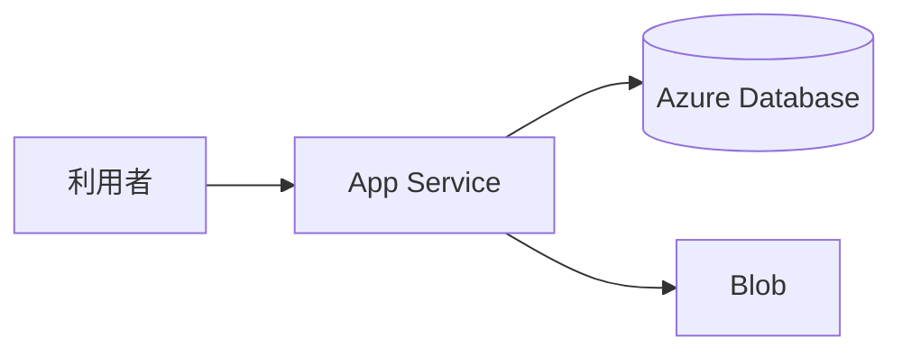

# App Service と Azure Database

App Service は 200 を返しているのに、PostgreSQL へはタイムアウトする。  
原因は、DB のファイアウォールが自分のノート PC だけを許し、App Service の出どころを許していない、ことが多いです。  
Azure で HTTP アプリを出す定番が **App Service**、表の定番が **Azure Database for PostgreSQL**（Flexible Server など）です。

## このページで分かること

- App Service のプラン、設定、マネージド ID
- PostgreSQL のファイアウォールと、VNet 統合
- 接続文字列を Git に置かないこと

## App Service

App Service は、ソースやコンテナを渡すアプリ基盤です。  
[計算資源](../fundamentals/compute) の PaaS 寄りで、OS へ SSH する前提は薄いです。  
**App Service プラン** が、下の計算の大きさです。プランを共有すると、別アプリの負荷が乗ることがあります。検証と本番でプランを分ける、が請求と障害の切り分けに効きます。

設定（接続先、環境）は、ポータルのアプリケーション設定または:

```bash
az webapp config appsettings list --resource-group rg-shop-dev --name app-shop-api
```

成功時は、名前と値の一覧です。  
値に秘密があるなら、スロット設定と Key Vault 参照に寄せ、リポジトリとスクリーンショットから外します。

マネージド ID を有効にし、Blob へは RBAC、DB へは Entra 認証または Key Vault 上のパスワード、が [IAM](./entra-and-rbac) の具体です。

ログ:

```bash
az webapp log tail --resource-group rg-shop-dev --name app-shop-api
```

成功時は、アプリの標準出力が流れてきます。  
例外の直後は、ここを先に見ます。

## Azure Database for PostgreSQL

マネージド PostgreSQL です。スキーマは [SQL / RDB](../../data/sql-rdb/) のままです。  
**ファイアウォール規則** で、どの IP から 5432 相当に届くかを決めます。  
`0.0.0.0-255.255.255.255` は、世界に開けるのと同じです。

App Service から届けるには、次のどれかに寄せます。

- VNet 統合 + プライベートアクセス（DB を仮想ネットワークに置く）
- 製品が用意する、アプリ基盤からの到達手段
- 一時的な自分の IP（人間の `psql` だけ）

:::warning[「どこからでもアクセスを許可」を検証の楽さで残さない]

パスワードがあっても、データベースを Internet 全面に開けないでください。  
App Service の出どころと、人間の調査経路を分けて許可します。

:::

接続ホストは `shop-db.postgres.database.azure.com` のような形です。  
SSL 必須が既定のことが多いです。ローカル Docker の接続文字列を、フラグごと貼らないでください。



公開の HTTPS は App Service（または前段の Front Door / Application Gateway）が受けます。  
社内だけに出すなら、認証とネットワークの制限を足します。「URL が分かれば誰でも」は既定にしないでください。

<QuizChoice
title="App Service と DB"
options={[
{ id: 'a', label: 'DB のファイアウォールを全世界にすれば、App Service からも必ず届くのでそれが標準である' },
{ id: 'b', label: 'DB は非公開寄りに置き、App Service の経路だけを許可する。接続秘密は設定や Key Vault に置く' },
{ id: 'c', label: 'App Service が 200 なら、マネージド ID の Blob 権限は確認しなくてよい' },
]}
answer="b"
explanation="全世界開放は届くことの証明にはなっても、安全の標準ではありません。HTTP の 200 と Blob の 403 は別です。"

>

  <div>shop-api を Azure で組むとき、適切なものはどれですか。</div>
</QuizChoice>

## よくあるつまずき

- プランのリージョンと DB の場所が違い、遅延とプライベート接続の条件が崩れる
- 接続文字列をアプリ設定に置いたあと、デプロイで空文字に上書きする
- Flexible Server のメンテナンスで接続が切れ、再接続しない

## まとめ

- App Service はソースやコンテナを HTTPS で出す基盤で、設定とマネージド ID が調査の入り口である
- PostgreSQL はファイアウォールと VNet で閉じ、世界開放を残さない
- 接続文字列は Git に置かず、SSL と再接続を前提にする

次は [組み立てと運用](./assemble) で、一枚と削除をまとめます。
