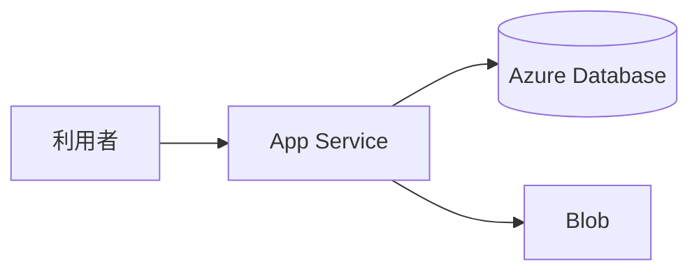

# 組み立てと運用

Azure の作業も、最後は「`rg-shop-dev` の shop-api を動かして、終わったら消す」です。  
このページでは、App Service・データベース・Blob・VNet を一枚に戻し、Monitor と削除の順を実務にします。

## このページで分かること

- japaneast での箱の対応
- ログと RBAC の切り分け
- リソースグループ単位の削除と、残るもの

## 一枚の絵



確認の核は GCP / AWS と同じです。

- `az account show` が検証サブスクリプションか
- 資源が `rg-shop-dev` に揃っているか
- DB のファイアウォールが世界開放でないか
- Blob コンテナが匿名でないか
- 接続文字列とアカウントキーが Git に無いか

## ログ

```bash
az webapp log tail --resource-group rg-shop-dev --name app-shop-api
```

より長い保管は、診断設定で Log Analytics へ送る構成が現場ではよく出ます。  
最初の切り分けは、アプリ例外か、DB タイムアウトか、Blob の 403 か、です。

- **403**: マネージド ID にデータ面ロールが無いか、ストレージのファイアウォール
- **timeout**: NSG、DB ファイアウォール、VNet 統合の有無
- **502 / 503**: プランの停止、起動失敗、ヘルスチェック

:::tip[グループ名を先に]

別リソースグループのログを見て、検証のデプロイを追う、が起きます。  
`--resource-group` とサブスクリプションを、調査の最初に戻します。

:::

## 検証を消す順

検証がグループに閉じているなら、中身の一覧を見てからグループ削除が速いです。

```bash
az resource list --resource-group rg-shop-dev --output table
```

成功時は、種類と名前の表です。本番の名前が混ざっていたら、グループ削除はしません。

```bash
az group delete --name rg-shop-dev --yes --no-wait
```

削除は取り消せません。  
`--no-wait` は、削除ジョブを投げてシェルを返す、という意味です。完了までは時間がかかることがあります。

グループ外に残るもの（別グループの DNS、共有 Key Vault、別サブスクリプションのバックアップ）は、このコマンドでは消えません。  
タグ `env=dev` を付けておくと、請求の分解と検索が楽です。

<QuizChoice
title="削除"
options={[
{ id: 'a', label: 'リソースグループを消せば、別グループの本番 Key Vault も必ず消える' },
{ id: 'b', label: '中身を az resource list で確認してから、検証グループだけを削除する' },
{ id: 'c', label: 'App Service を止めれば、PostgreSQL とストレージの請求も必ずゼロになる' },
]}
answer="b"
explanation="削除はグループの中だけです。DB とストレージは、アプリ停止とは別に残ります。"

>

  <div>Azure の検証片付けについて、適切なものはどれですか。</div>
</QuizChoice>

## よくあるつまずき

- 診断ログを有効にしたまま長期保管し、アプリ本体よりログ代が大きい
- 削除ロックを本番グループに付け忘れて、誤削除する
- サブスクリプションのクォータ不足を権限不足と読み、Owner を足す

## まとめ

- Azure の shop-api は App Service、Azure Database、Blob で組める
- ログは Web アプリと Monitor、先にサブスクリプションとグループを確認する
- 検証は一覧確認のあと、グループ単位で消すと漏れが減る

同じ絵の GCP は [GCP](../gcp/)、AWS は [AWS](../aws/) です。  
現場が Azure なら、この章までで、一般の開発者がポータルと `az` で会話する土台は揃います。

クラウドの部品そのものの復習は [クラウドの考え方](../fundamentals/) に戻れます。
