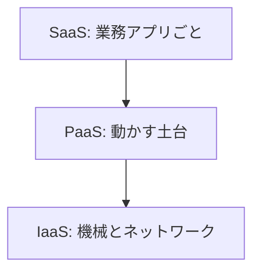

# サービスの借り方

仮想マシンを借りたのに、OS のパッチ当番が自分のまま、ということが起きます。  
「クラウドに載せた」だけでは、どこまで事業者に任せたかは分かりません。  
借り方の種類を先に分けると、チケットの「誰が直すか」が読みやすくなります。

## このページで分かること

- IaaS / PaaS / SaaS の違い
- マネージドが引き受ける範囲
- 注文 API を載せるときの、よくある選択の軸

## 三つの借り方

現場でよく使う分類です。境界は製品によってにじむので、名前の暗記より **自分たちが面倒を見る境界** で捉えます。

| 分類     | ざっくり言うと                     | 注文システムの例                        | 自分たちが見ることが多いもの   |
| -------- | ---------------------------------- | --------------------------------------- | ------------------------------ |
| **IaaS** | 仮想の機械とネットワークを借りる   | 仮想マシンに Java を入れて API を動かす | OS、パッチ、プロセス、ディスク |
| **PaaS** | アプリを動かす土台を借りる         | ソースやコンテナを渡して HTTPS で出す   | アプリ本体、設定、接続先       |
| **SaaS** | 完成した業務アプリそのものを借りる | メール、チケット、表計算                | 利用者管理と、自社データの扱い |

上に行くほど、自分たちが触る部品は減ります。  
その代わり、「中の OS に SSH して好きに入れる」自由度も減ることが多いです。

IaaS の仮想マシンは、[Linux / Shell](../../foundations/linux/) で見てきたサーバに近いです。  
ログインしてプロセスを見る感覚は、リモートの Linux と同じです。

## マネージドとは何か

**マネージド** は、「その製品の運用の一部を事業者が引き受ける」という意味で使います。  
データベースなら、OS のパッチ、ディスク故障、定期バックアップの取得まで含む製品が多いです。

任せても、次は残り続けます。

- どのデータを、どの形で置くか（スキーマ）
- 誰が接続してよいか（ネットワークと認証）
- 遅い問い合わせをどう直すか（インデックスや発行 SQL）

「マネージドにしたから SQL を読まなくてよい」にはなりません。  
[SQL / RDB](../../data/sql-rdb/) で押さえた表とトランザクションは、クラウドの画面の奥でも同じです。

:::tip[判断の核]

「誰が OS に入るか」より先に、「障害のとき、自分たちが直せる範囲はどこまでか」を見る。  
IaaS は中まで見られる。PaaS はアプリと設定が主戦場になる。

:::

## 注文 API での選択

同じ `shop-api` でも、借り方は要件で分かれます。

- 既存の Linux 手順をほぼそのまま移したい、特殊なミドルウェアがある → IaaS（仮想マシン）が寄りやすい
- HTTP の API を、ソースやコンテナを渡して出したい → PaaS（アプリ基盤）が寄りやすい
- 短いイベント処理（画像が置かれたらサムネイルを作る）だけ切り出したい → イベントや短い HTTP の単位でコードを走らせる関数型の実行が寄りやすい
- メールや表計算そのものを自前実装したくない → SaaS を組み合わせる

全部を IaaS に寄せると、パッチと監視の作業がアプリ開発に混ざります。  
全部を SaaS に寄せると、注文のような自社の正を、外部サービスの制約に合わせることになります。  
現場の構成は、多くの場合この中間です。アプリは PaaS、データベースはマネージド、一部のバッチだけ仮想マシン、といった混在です。

サーバーレスという言い方

「サーバが無い」わけではありません。  
自分たちが OS を管理せず、リクエストやイベントの単位で実行基盤を借りる、という意味で使われることが多いです。  
PaaS や関数に近い借り方、と捉えると、カタログの宣伝文句に引きずられにくいです。

<QuizChoice
title="PaaS で残る責任"
options={[
{ id: 'a', label: 'OS のカーネルパッチまで、アプリ担当が毎週当てる' },
{ id: 'b', label: 'アプリのコード、設定、データベースへの接続先は自分たちが見る' },
{ id: 'c', label: 'マネージド DB にすると、遅い SQL は事業者が自動で書き換える' },
]}
answer="b"
explanation="PaaS では土台の運用が減る一方、アプリと接続とデータの正しさは残ります。SQL の遅さも自分たちの範囲です。"

>

  
注文 API を PaaS に載せるとき、自分たちに残りやすいものはどれですか。

</QuizChoice>

## よくあるつまずき

- 「仮想マシンを借りた = 運用から解放された」と思い、パッチとディスク容量を見ない
- PaaS なのに SSH 前提の手順書を書き、デプロイ方法と調査方法が噛み合わない
- SaaS に業務の正を置き、エクスポートも契約も確認せず、いざ移行できなくなる

## まとめ

- IaaS は機械、PaaS はアプリの土台、SaaS は完成した業務アプリ、という借り方の差である
- マネージドは運用の一部を任せるが、データの形と権限は残る
- 同じ注文 API でも、移したいものの形で選択が変わる

次は [リージョンと可用性](./regions-and-availability) で、資源を「どこに置くか」を扱います。
