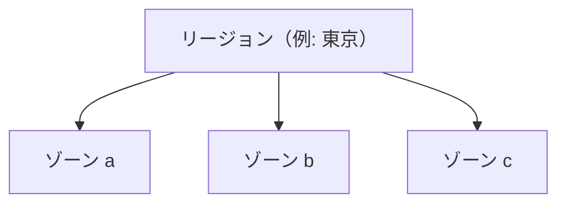

# リージョンと可用性

東京の利用者が、画面のボタンを押してから応答まで数秒かかる。  
アプリは落ちていない。ログも正常。原因をたどると、検証のつもりで選んだ遠いリージョンで API が動いていた、ということが起きます。  
クラウドでは、**どこに置くか** が速さだけでなく、障害の範囲と法令・社内ルールにも効きます。

## このページで分かること

- リージョンとゾーン（可用性ゾーン）の役割
- 単一ゾーン障害と、リージョン障害の違い
- 遅延、データ置き場、検証環境の選び方

## リージョン

**リージョン** は、事業者が計算資源を置く地理的なまとまりです。  
`asia-northeast1`（東京）、`ap-northeast-1`（東京）、`japaneast`（東京）のように、事業者ごとに名前が違います。  
同じ「東京」でも、識別子はクラウドごとに覚える必要があります。

選ぶときに効くのは、だいたい次です。

- **遅延**: 利用者や社内ネットワークから近いか
- **データの置き場**: 個人情報や契約上、国内に置きたい、といった制約
- **使えるサービス**: 新しい製品が、全リージョンで同時に出るとは限らない
- **災害**: 一つの都市の障害に、システム全体を乗せてよいか

検証と本番でリージョンを分けることもあります。  
その場合、データのコピー方法と、誤って本番へ接続しない手順が別課題になります。

## ゾーン

リージョンの中は、さらに **ゾーン**（AWS では Availability Zone、Azure でも Availability Zone）に分かれます。  
ゾーンは、電源やネットワークを分けた障害の単位、と捉えると実務に足ります。  
「同じリージョンの別ゾーン」は、近い遅延のまま、データセンター単位の故障をまたぎやすくするための仕組みです。

仮想マシンをゾーン a に 1 台だけ置くと、そのゾーンの障害でアプリは止まります。  
マネージド DB の「マルチゾーン」は、別ゾーンに待機を置く、という意味で使われることが多いです。  
アプリを複数ゾーンに置くときは、その手前の負荷分散もリージョンをまたがない設計か、確認します。

:::warning[本番を単一ゾーンのまま忘れない]

検証で 1 ゾーンの小さな DB を使い、本番でも同じ設定のまま公開すると、ゾーン障害が即停止になります。  
「マネージドだから落ちない」ではなく、どの障害単位まで耐える設定かを見ます。

:::

## 可用性を現場の言葉で

**可用性** は、「使いたいときに使える割合」です。  
99.9% と 99.99% は数字の差が小さく見えて、月あたりの停止時間の目安は桁が違います。  
ただし、事業者が掲げる数値は、自分たちの設定ミス（公開鍵の失効、ディスク満杯、課金停止）までは含まないことがほとんどです。

開発者が最初に押さえる判断は、次で足ります。

- 止まってよい時間はどれくらいか（夜間バッチだけ、なのか、注文画面も含むのか）
- ゾーン一つが落ちたときに、残りのゾーンで継続するか
- リージョンごと使えない事態を、別リージョンで続けるのか（多くの業務システムでは、まず同一リージョンの複数ゾーンまで）

マルチリージョンは最初から必要か

別の地理までまたぐと、データの複製方法、書き込みの向き、障害時の切り替え手順が急に重くなります。  
個人情報の置き場や、災害時も止められない要件が無い限り、最初から世界分散にしない、が多くの業務システムでは現実的です。  
「東京リージョンの複数ゾーン」と「東京と大阪の両方」は、設計の厚さが違います。

## 遅延と検証の罠

利用者のブラウザ → 負荷分散 → アプリ → DB、とホップするたびに遅延は積み上がります。  
アプリと DB を別リージョンに置くと、1 回の `SELECT` が遠くなります。  
検証だけ海外リージョン、本番は東京、も可能ですが、性能の感覚が検証で取れなくなります。

同じリージョンに、アプリと DB とオブジェクトストレージを寄せる、が基本の置き方です。  
画像だけ別リージョン、も可能ですが、その理由（法令、既存資産）を説明できるときだけにします。

<QuizChoice
title="ゾーンの役割"
options={[
{ id: 'a', label: 'ゾーンは請求書の通貨を分ける単位である' },
{ id: 'b', label: 'ゾーンはリージョン内の障害単位で、複数ゾーンにまたがるとデータセンター単位の故障を避けやすい' },
{ id: 'c', label: 'リージョンを一つ選べば、世界中の遅延は同じになる' },
]}
answer="b"
explanation="ゾーンは近い遅延のまま障害単位を分ける仕組みです。リージョンが遠いと遅延は大きくなります。"

>

  
東京リージョンの中でゾーンを分ける目的として、適切なものはどれですか。

</QuizChoice>

## よくあるつまずき

- コンソールの初期選択のまま遠いリージョンに作り、遅延の原因調査が長引く
- アプリはマルチゾーンなのに、DB が単一ゾーンのまま
- 「東京」という表示だけ見て、識別子（`ap-northeast-1` など）を設定ファイルと食い違える

## まとめ

- リージョンは地理と遅延とデータの置き場、ゾーンはリージョン内の障害単位である
- アプリと DB は、特別な理由が無ければ同じリージョンに置く
- 事業者の可用性数値は、自分たちの設定ミスまで保証しない

次は [責任分界](./shared-responsibility) で、障害や漏洩のとき「誰の作業か」を分けます。
