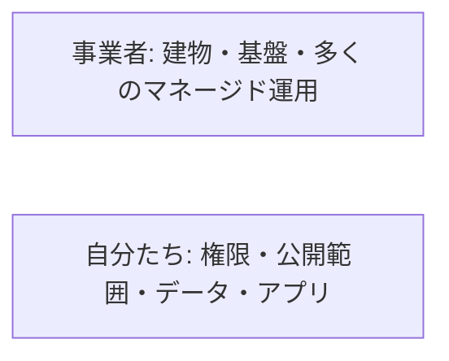

# 責任分界

クラウド上のデータベースから個人情報が漏れた、というニュースのあと、「クラウドなのに、なぜ自社の責任になるのか」と会話が止まります。  
事業者は機器と基盤の多くを守ります。一方、**誰に権限を付けたか、何を公開したか、どのデータを置いたか** は、多くの場合こちら側です。  
この境目を責任分界（シェアードレスポンシビリティ）と呼びます。

## このページで分かること

- 事業者が守る範囲と、自分たちが見る範囲
- IaaS と PaaS で境界がずれること
- 開発者が日常で踏みやすい側（公開設定、秘密情報、パッチ）

## 境界のイメージ

借り方によって、線の位置が変わります。

| 対象                         | IaaS（仮想マシン） | PaaS（アプリ基盤）   | マネージド DB            |
| ---------------------------- | ------------------ | -------------------- | ------------------------ |
| 建物・電源・物理ネットワーク | 事業者             | 事業者               | 事業者                   |
| 仮想化基盤                   | 事業者             | 事業者               | 事業者                   |
| OS のパッチ                  | 自分たち           | 事業者寄り           | 事業者                   |
| アプリのコード               | 自分たち           | 自分たち             | 使わない（SQL 側は自分） |
| ファイアウォールの穴         | 自分たち           | 自分たち（公開設定） | 自分たち（公開 IP など） |
| データの分類と暗号化の使い方 | 自分たち           | 自分たち             | 自分たち                 |
| アカウントの権限             | 自分たち           | 自分たち             | 自分たち                 |

物理故障の交換は、クラウドの大きな価値です。  
その価値と、「設定を間違えても事業者が取り消してくれる」は別です。

## 漏洩と障害を切り分ける

次は、切り分けの例です。

- ゾーンの電源故障で仮想マシンが止まった → 基盤側。ただし単一ゾーンに全部載せていた設計は自分たち
- データベースのディスクを誰でも読める公開設定にした → 自分たち
- アプリに DB パスワードを直書きし、Git リポジトリが漏れた → 自分たち
- マネージド DB のエンジンに緊急パッチが出た → 適用の仕組みは事業者寄り。ただしメンテナンス時間の合意や、接続が切れたときのアプリ側再試行は自分たち
- 請求が止まったために資源が停止した → 契約とアラートは自分たち

:::warning[公開と権限は、ほぼ常に自分たち]

「クラウドのデフォルトだから安全」は、製品と設定次第です。  
オブジェクトストレージの公開、広いネットワーク許可、全員が管理者、は事故の定番です。

:::

## 開発者が日常で見る三点

インフラ専任でなくても、次はアプリの変更に紛れてきます。

1. **秘密情報**: パスワード、API キー、アクセスキーをリポジトリやチケットに貼らない。プレースホルダと、実行環境の秘密管理を使う
2. **公開範囲**: 「とりあえず動いた」の URL が、社外から届くアドレスになっていないか
3. **更新**: 仮想マシンを使うなら OS とランタイムの更新担当が誰か。PaaS でも、アプリ依存ライブラリの更新は残る

認証と認可の設計そのものは、サイトの [セキュリティ](../../security/) カテゴリでも扱います。  
このカテゴリでは、「クラウド資源に対する誰が何をしてよいか」を [アカウントと IAM](./iam-and-accounts) で続けます。

<QuizChoice
title="漏洩の責任範囲"
options={[
{ id: 'a', label: 'マネージド DB を使っていれば、公開設定を間違えても事業者の責任になる' },
{ id: 'b', label: '誰に接続を許すか、どのデータを置くか、権限の付け方は自分たちの範囲であることが多い' },
{ id: 'c', label: '仮想マシンの物理ディスク故障も、交換作業までアプリ担当が行う' },
]}
answer="b"
explanation="物理と基盤の多くは事業者、権限と公開とデータの扱いは自分たち、が基本の分け方です。"

>

  
クラウド上の DB について、このページの説明に合うものはどれですか。

</QuizChoice>

## よくあるつまずき

- 障害レポートの「基盤は正常」を、アプリが正常だと読み替える
- 検証の全公開設定を、本番へ構成ごとコピーする
- パッチ担当が無い IaaS を増やし、数年後に更新できない OS が残る

## まとめ

- 事業者は建物と基盤の多くを担い、権限・公開・データ・アプリは自分たちに残ることが多い
- 借り方が IaaS か PaaS かで、OS の線は動く
- 開発者は、秘密情報・公開範囲・更新の三点を日常の変更に含めて見る

次は [アカウントと IAM](./iam-and-accounts) で、「誰が・何を・どの資源に」を扱います。
