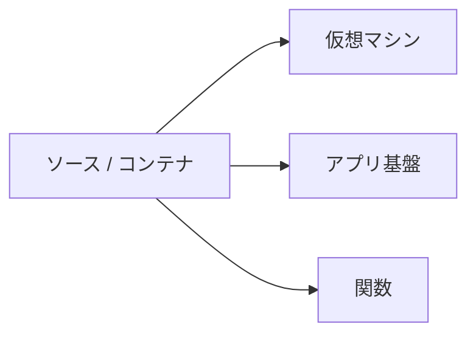

# 計算資源

「SSH できる箱が欲しい」と「ソースを渡せば HTTPS で出したい」は、同じ「アプリを動かす」でも借りる物が違います。  
計算資源の種類を間違えると、調査は Linux のつもりなのに SSH が無く、逆にパッチ当番だけが残る、といった噛み合わせが起きます。

## このページで分かること

- 仮想マシン、アプリ基盤、関数の違い
- 注文 API とバッチで、どちらに寄りやすいか
- 開発者がデプロイと調査で見るポイント

## 三つの形

| 種類       | 渡すもの             | 調査の入り口                     | 向く仕事                           |
| ---------- | -------------------- | -------------------------------- | ---------------------------------- |
| 仮想マシン | OS の上のプロセス    | SSH、プロセス、ログファイル      | 既存手順の移行、特殊な常駐プロセス |
| アプリ基盤 | ソースまたはコンテナ | 基盤のログ、リビジョン、環境変数 | HTTP の API、Web 画面              |
| 関数       | 短いハンドラ         | 実行ログ、トリガー               | 短いイベント処理、軽い API         |

仮想マシンは [サービスの借り方](./service-models) の IaaS に近いです。  
アプリ基盤と関数は PaaS 寄りです。  
事業者ごとの商品名は違います。このページでは役割だけを固定します。

## 仮想マシン

仮想マシンは、リモートの Linux（または Windows）に近いです。  
起動、停止、ディスク、公開 IP、SSH 鍵は自分たちで設計します。  
[SSH](../../foundations/remote-access/ssh) で入り、[プロセス](../../foundations/linux/processes) を見る、という調査がそのまま使えます。

残る作業の例:

- OS とランタイムの更新
- ディスク満杯
- デーモンが落ちたあとの再起動
- 時刻同期、ホスト名、セキュリティパッチ

「中に自由に入れない」基盤より、特殊なミドルウェアや、既存の手順書を活かしやすいです。  
その代わり、台数が増えると、同じ作業の漏れが増えます。

## アプリ基盤

注文 API のように、HTTP で待ち受けるプロセスは、ソースやコンテナを渡す基盤に載せることが増えています。  
自分たちは「どのリビジョンが今生きているか」「環境変数は何か」「ログに例外が出たか」を見ます。  
OS の中に入って `systemctl` する前提は、製品によっては持てません。

うれしい点:

- 台数の増減や、新しいリビジョンへの切り替えを、基盤側の操作に寄せられる
- HTTPS の終端や、ヘルスチェックを、製品の機能として使えることが多い

注意点:

- ローカルのディスクに書いたファイルは、次のリビジョンや別インスタンスで消えることがある
- 起動時間と、リクエストが無いときの縮退は、製品の課金モデルに効く
- 秘密情報は、基盤の秘密ストアか、実行環境の身分で取る

:::tip[状態は外に出す]

アプリ基盤では、注文の正をプロセスのメモリやローカルディスクに置かない。  
表はマネージド DB、画像はオブジェクトストレージ、と外へ出すと、台数を増やしても同じ正を見られます。

:::

## 関数

関数は、イベントや短い HTTP に対してコードを走らせ、終わったら基盤が畳む、という形です。  
「画像がバケットに置かれた」「1 日 1 回」といったトリガーと相性がよいです。  
長時間の処理、大きなメモリ、起動のたびに重い初期化、は向く製品と向かない製品があります。

注文 API の本体を全部関数にすると、接続の使い回しや制限時間と戦いやすいです。  
本体はアプリ基盤、付随する短い仕事だけ関数、という分け方が現場ではよく出ます。

コンテナという言葉

コンテナは、アプリと依存ライブラリを一つの実行単位にまとめる入れ物です。  
仮想マシンより軽く、アプリ基盤や関数の多くが、この単位で動かします。  
この章では「渡す単位」として扱い、オーケストレーションの詳細には入りません。

<QuizChoice
title="注文 API の載せ方"
options={[
{ id: 'a', label: 'HTTP の注文 API は、必ず 1 分で終わる関数に全部載せる' },
{ id: 'b', label: '常時待つ HTTP API はアプリ基盤や仮想マシンが寄りやすく、短いイベント処理は関数が寄りやすい' },
{ id: 'c', label: 'アプリ基盤では、注文の正をローカルディスクに置くのが基本である' },
]}
answer="b"
explanation="常時待つ API と短いイベントでは、向く計算の形が違います。状態は DB やオブジェクトストレージへ出します。"

>

  
shop-api の計算資源の選び方として、このページの説明に合うものはどれですか。

</QuizChoice>

## よくあるつまずき

- 仮想マシンの手順書のまま PaaS に載せ、SSH が無いので調査できない
- アプリ基盤のローカルディスクにアップロードファイルを置き、デプロイのたびに消える
- 関数の制限時間を知らず、大きな CSV 変換を乗せて途中で切れる

## まとめ

- 仮想マシンは OS ごと、アプリ基盤はソースやコンテナ、関数は短い実行、という差である
- 注文のような状態は、計算の外（DB とオブジェクトストレージ）に置く
- 調査方法（SSH か、基盤のログか）を、借り方に合わせて選ぶ

次は [保存](./storage) で、ディスクとオブジェクトストレージの違いを扱います。
