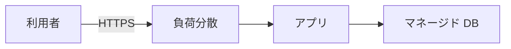

# ネットワーク

アプリのプロセスは生きている。データベースの画面も「起動中」と出ている。  
なのに注文 API は `connection timed out` を返す。  
クラウドでは、この切り分けの多くが **仮想ネットワークのどこまで届く設計か** に落ちます。コードのバグより先に、公開 IP・経路・許可ルールを見ます。

## このページで分かること

- VPC（仮想ネットワーク）とサブネットの役割
- 公開と非公開、許可ルール（ファイアウォール / セキュリティグループ）
- 負荷分散と、「繋がらない」ときの見方

## VPC とサブネット

**VPC**（Virtual Private Cloud。Azure では仮想ネットワーク）は、クラウド内に作る自分たち用のネットワーク空間です。  
その中を **サブネット** に分け、アプリ用・データベース用、のように役割を切ります。

よく使う分け方です。

| 置き場   | 置くもの                     | インターネットからの直接到達 |
| -------- | ---------------------------- | ---------------------------- |
| 公開寄り | 負荷分散、場合によって踏み台 | 必要なポートだけ             |
| 非公開   | アプリ、データベース         | 原則なし（内側からだけ）     |

「公開サブネット」は、外向きの経路（インターネットゲートウェイ等）を持ち、公開 IP を付けられる、という意味で使います。  
「非公開サブネット」は、外から直接届かず、出て行くときも別の経路（NAT 等）を通す、という意味です。  
名前の定義は事業者で差がありますが、**データベースに世界から届くアドレスを付けない** という判断は共通です。

利用者は負荷分散まで届き、DB はアプリからだけ届く、が基本の絵です。

## 許可ルール

仮想マシンやマネージド DB には、**どの IP から、どのポートへ入ってよいか** のルールが付きます。  
GCP では VPC ファイアウォール、AWS ではセキュリティグループ、Azure では NSG、がこの役割です。

現場で事故になる設定:

- `0.0.0.0/0`（すべてのアドレス）に対して SSH（22）や RDP（3389）を開ける
- 同じように、データベースのポート（5432 など）を世界に開ける
- 検証で開けた穴を、本番構成に残す

「自分の IP だけ」は検証では楽です。  
IP が変わるたびに入れなくなるので、踏み台や、事業者の接続サービス、VPN に寄せる、が続く話です。  
開発者は、アプリの接続先を `localhost` のつもりで書き、クラウドではプライベートアドレスへ向ける、という差に最初つまずきます。

:::warning[DB を世界に開けない]

パスワードが付いていても、データベースのポートを `0.0.0.0/0` にしないでください。  
総当たりと、アプリの脆弱性の被害範囲が、一気に広がります。

:::

## 負荷分散

**負荷分散**（ロードバランサ）は、利用者からの HTTPS を受け、後ろのアプリへ振ります。  
ヘルスチェックで「応答しない台」を外す、TLS 証明書をここで終端する、といった役割も担います。

仮想マシンを 2 台に増やしても、手前の負荷分散と、同じ DB・同じオブジェクトストレージを見ていないと、片方だけ古い、片方だけログイン状態、が起きます。  
状態を外に出す話は [計算資源](./compute) と同じです。

## 繋がらないときの順番

コードを疑う前に、次の順で見ると早いです。

1. **今見ている箱か**: 検証のアプリが、本番の DB ホストを向いていないか
2. **名前解決**: ホスト名が、意図したプライベートアドレスに引けるか
3. **許可ルール**: アプリ側の身分と IP 範囲が、DB の受け入れに入っているか
4. **公開 IP の有無**: DB に公開アドレスが無いのに、インターネット経由で繋ごうとしていないか
5. **アプリは待っているか**: プロセスは生きていても、待っているポートが違うことがある

SSH で入れる箱なら、[リモートアクセス](../../foundations/remote-access/) の経路確認と同じ感覚です。  
PaaS では SSH が無いので、基盤の接続テストとログが入り口になります。

DNS と証明書

利用者が叩く名前（`shop.example.com`）は、負荷分散の公開アドレスへ向ける DNS レコードです。  
証明書の期限切れは、アプリが生きていてもブラウザが止める、よくある停止です。  
証明書の置き場が負荷分散側か、アプリ側かは製品によります。構成図で「TLS はどこか」を一度確認します。

<QuizChoice
title="DB の置き方"
options={[
{ id: 'a', label: 'マネージド DB には公開 IP を付け、世界から psql できると運用が楽である' },
{ id: 'b', label: 'DB は非公開に置き、アプリや許可した経路からだけ届ける' },
{ id: 'c', label: '負荷分散を置けば、DB のポートを 0.0.0.0/0 に開けても届かない' },
]}
answer="b"
explanation="負荷分散は利用者とアプリの間です。DB のポートを世界に開ける理由にはなりません。"

>

  
shop-api のデータベース接続について、適切なものはどれですか。

</QuizChoice>

## よくあるつまずき

- タイムアウトをアプリのバグと決め、許可ルールを見ない
- 検証の自分の IP 許可を本番に残し、別の人は永遠に繋がらない
- プライベート接続の DB なのに、ノート PC から直接 `psql` しようとして詰まる

## まとめ

- VPC は自分たち用のネットワーク、サブネットで公開寄りと非公開を分ける
- DB と管理ポートを世界に開けない。許可ルールは最小にする
- 繋がらないときは、箱・名前解決・許可・公開 IP・待ち受けの順で見る

次は [マネージドなデータ](./managed-data) で、データベースとキャッシュのクラウドでの位置を扱います。
