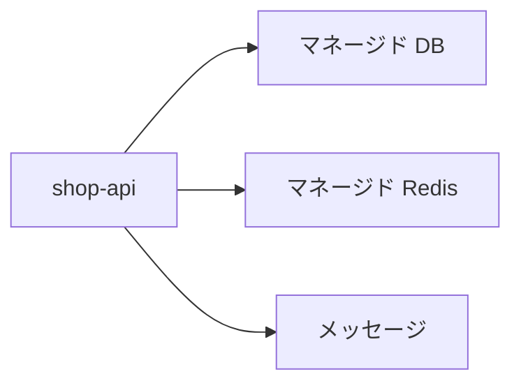

# マネージドなデータ

仮想マシンに PostgreSQL を入れ、ある夜にディスクが壊れてバックアップが昨日分しか無い。  
クラウドのマネージド DB は、この「箱の運用」の多くを事業者に渡します。  
一方、[トランザクション](../../data/sql-rdb/transactions) も [インデックス](../../data/sql-rdb/indexes-and-explain) も、中身の正しさはこれまでどおり自分たちです。

## このページで分かること

- マネージド DB が引き受ける運用と、残る設計
- キャッシュ、メッセージとの役割分担
- 接続、バックアップ、プライベート配置で見る点

## マネージド DB

AWS の RDS、GCP の Cloud SQL、Azure Database などは、PostgreSQL や MySQL などを **サービスとして** 提供します。  
自分たちはインスタンスの大きさ、ゾーン、バックアップの保持日数、接続の公開範囲を選びます。  
OS のパッチや、ディスク故障の交換作業は、多くの場合こちらではやりません。

残るもの:

- 表、キー、制約、発行 SQL
- 接続ユーザと、アプリへのパスワードの渡し方
- コネクション数、遅い問い合わせ
- 「戻す」ときの手順（どの時点に戻すか、アプリは止めるか）

[SQL / RDB](../../data/sql-rdb/) で学んだことは、ホストが `localhost` からクラウドのホスト名に変わるだけ、という側面が強いです。  
接続の部品（ホスト、ポート、DB 名、ユーザ）は [接続と psql](../../data/sql-rdb/connect-and-psql) と同じです。

:::info[マネージドでもスキーマは自分たち]

自動バックアップは「ディスクが死んでも戻せる」方向です。  
誤った `DELETE` を毎日取るバックアップが、どこまで救うかは保持期間と、戻し方の訓練次第です。

:::

## 仮想マシン上の DB との比較

| 観点         | VM 上の PostgreSQL   | マネージド DB                      |
| ------------ | -------------------- | ---------------------------------- |
| パッチ       | 自分たち             | 事業者（メンテナンス時間は要確認） |
| バックアップ | 自分で設計           | 製品のバックアップ機能を使う       |
| 中身の SQL   | 自分たち             | 自分たち                           |
| 特殊拡張     | 入れやすい           | 製品が許す範囲                     |
| 調査         | SSH して中を見やすい | 接続とメトリクス、ログが入り口     |

「どうしても拡張が要る」「既存の手順をそのまま」以外は、業務システムの正の置き場としてマネージド DB が選ばれやすいです。  
アプリ担当は、SSH で `postgres` ユーザになる前提を、最初から持たない方が現場に合います。

## キャッシュとメッセージ

注文の正は RDB のまま、次を横に置きます。

- **キャッシュ / セッション**: [NoSQL](../../data/nosql/) で見た Redis を、各クラウドのマネージド Redis で借りる
- **システム間の知らせ**: [メッセージング](../../data/messaging/) の Kafka 相当を、クラウドの仲介サービスで借りる。GCP の用語は [Cloud Pub/Sub](../../data/messaging/cloud-pubsub) で対応済みです

置き場を全部マネージド DB に寄せると、セッションやランキングまで表に書き、負荷の性質が混ざります。  
全部 Redis に寄せると、[使い分けと限界](../../data/nosql/when-to-choose) で見た「正が消える」問題が戻ります。  
クラウドは製品名を足しますが、役割の分け方はデータカテゴリと同じです。

## 接続で踏む点

クラウドの DB で、アプリ担当が最初に踏むのは次です。

- **公開接続を検証の楽さで残す**: [ネットワーク](./networking) のとおり、本番では非公開に寄せる
- **SSL/TLS 必須**: 接続文字列のフラグを、ローカルの Docker と同じにすると失敗する
- **ユーザを分けない**: マイグレーション用の強いユーザでアプリも動かす
- **接続数**: アプリ台数 × プールサイズが、インスタンスの上限を超える

パスワードは [アカウントと IAM](./iam-and-accounts) のとおり、Git に置かず、実行環境の秘密管理か、IAM 認証（製品が対応している場合）に寄せます。

メンテナンス時間

マネージド DB は、パッチ適用のために短い中断やフェイルオーバーが入ります。  
アプリ側は、接続切断を前提に再接続する実装が必要です。  
「一度繋いだらプロセスが生きている間は切れない」は、クラウドでは前提にしない方が安全です。

<QuizChoice
title="マネージド DB に残る仕事"
options={[
{ id: 'a', label: 'スキーマ、発行 SQL、接続権限、誤削除からの戻し方は自分たちである' },
{ id: 'b', label: 'マネージドにすると、遅い SELECT は事業者が自動で書き換える' },
{ id: 'c', label: '注文の正もセッションも、同じ Redis にまとめるのがクラウド流である' },
]}
answer="a"
explanation="運用の一部は任せても、データの形と問い合わせと権限は残ります。セッションは Redis、注文の正は RDB です。"

>

  
Cloud SQL や RDS を使うときの説明として、適切なものはどれですか。

</QuizChoice>

## よくあるつまずき

- ローカル Docker の接続文字列を、SSL もホスト名も変えずに貼る
- バックアップはあるが、戻したことが無く、リストアに半日かかる
- キャッシュを「速い DB」と呼び、注文を移してしまう

## まとめ

- マネージド DB は箱の運用を渡し、スキーマと SQL と権限は残す
- キャッシュとメッセージは、RDB の代わりではなく横の役割である
- 接続は非公開と秘密管理を前提にし、切断と再接続をアプリ側で扱う

次は [料金とコスト感覚](./billing) で、何に課金され、何を消し忘れてはいけないかを扱います。
