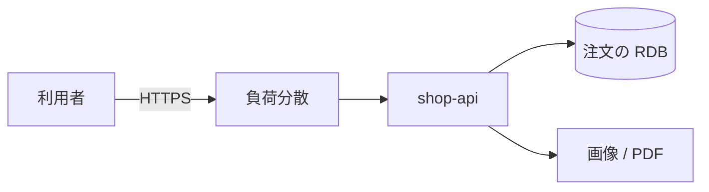

# よくある構成

構成図に箱が並んでいるのに、自分の担当が「アプリの環境変数」なのか「DB の公開設定」なのか分からない。  
ここまでの部品を、業務でよく出る **Web API + DB + オブジェクトストレージ** に一度組み立てます。  
この絵が読めると、GCP / AWS / Azure の章は商品名の対応として入れられます。

## このページで分かること

- 注文 API の典型的な箱の配置
- 三つのクラウドでの呼び方の対応
- 開発者がレビューと障害で見る順番

## shop-api の一枚

利用者はブラウザや別システムから HTTPS で届きます。  
手前に負荷分散、後ろにアプリ、その横にマネージド DB とオブジェクトストレージ、という形です。

[ネットワーク](./networking) のとおり、利用者は負荷分散まで、DB はアプリからだけ、が基本です。  
[保存](./storage) のとおり、注文の正は表、画像の実体はバケットです。  
[計算資源](./compute) のとおり、アプリは仮想マシンでもアプリ基盤でもよく、状態は外に出します。

メッセージで倉庫やメールへ知らせる場合は、アプリからトピックへ書き、RDB の代わりにはしません。  
流れは [メッセージング](../../data/messaging/) です。

## 名前の対応

同じ役割の、事業者ごとの呼び方です。細かい製品差は各章で扱います。

| 役割                  | GCP                      | AWS                   | Azure                                 |
| --------------------- | ------------------------ | --------------------- | ------------------------------------- |
| 資源の箱              | プロジェクト             | アカウント            | サブスクリプション / リソースグループ |
| 仮想ネットワーク      | VPC                      | VPC                   | 仮想ネットワーク                      |
| 仮想マシン            | Compute Engine           | EC2                   | Virtual Machines                      |
| アプリ基盤            | Cloud Run など           | ECS / App Runner など | App Service                           |
| オブジェクト          | Cloud Storage            | S3                    | Blob Storage                          |
| マネージド PostgreSQL | Cloud SQL                | RDS / Aurora          | Azure Database for PostgreSQL         |
| 人間とアプリの権限    | IAM / サービスアカウント | IAM ロール            | Entra ID / マネージド ID              |
| ログ                  | Cloud Logging            | CloudWatch Logs       | Azure Monitor                         |

全部を暗記する必要はありません。  
現場の構成図に出た箱を、この表の「役割」列に戻せる、が最初の目標です。

:::tip[レビューで見る核]

1. 今の操作は検証の箱か、本番の箱か
2. DB と管理ポートは世界に開いていないか
3. バケットは既定非公開か
4. アプリの秘密は Git に無いか
5. 検証資源に消し忘れは無いか

:::

## 開発者として聞かれやすい仕事

アーキテクトでなくても、次は一般の開発者のチケットになりやすいです。

- アプリに、DB ホストとバケット名を環境変数で渡す
- 実行環境の身分に、そのバケットへの書き込みだけを付ける
- デプロイ後、基盤のログで例外とヘルスチェックを確認する
- 「繋がらない」を、許可ルールとホスト名から切り分ける
- 画像 URL の公開範囲が、要件どおりかレビューする

仮想マシンに載せる場合は、[Linux](../../foundations/linux/) と [SSH](../../foundations/remote-access/ssh) が調査の手足になります。  
SQL の遅さはクラウドの画面より、[インデックスと実行計画](../../data/sql-rdb/indexes-and-explain) 側です。

このカテゴリで扱わない境界

コンテナの細かい作り方、クラスタ、CI で毎回デプロイするパイプライン、設定をファイルから再現する運用は、隣の [DevOps / コンテナ](../../platform/) の領域です。  
認証プロトコルやクラウド設定の深い防御は [セキュリティ](../../security/) 側です。  
この章では、箱の役割と、開発者が踏んではいけない公開・権限・請求までを範囲にします。

<QuizChoice
title="構成図の読み方"
options={[
{ id: 'a', label: 'S3 も Cloud Storage も Blob も、役割としてはオブジェクトストレージである' },
{ id: 'b', label: '負荷分散を置けば、注文の正をアプリのメモリに置いてよい' },
{ id: 'c', label: '三つのクラウドは、資源の箱の名前まで同一である' },
]}
answer="a"
explanation="商品名は違っても役割は共通です。状態は DB とバケットへ出し、箱の名前は事業者ごとに違います。"

>

  
shop-api の構成を三つのクラウドで見るとき、適切な理解はどれですか。

</QuizChoice>

## よくあるつまずき

- 製品名を先に覚え、役割（計算・保存・ネットワーク）に戻せない
- 構成図の線（誰が誰に届くか）を見ず、箱の数だけ議論する
- 自分の担当外だと思い、環境変数に本番の秘密を直書きする

## まとめ

- 業務の Web API は、負荷分散・アプリ・RDB・オブジェクトストレージの組み合わせが多い
- 三つのクラウドは、同じ役割を別の商品名で提供する
- 開発者は、箱・公開範囲・秘密・ログ・消し忘れを、日常の変更に含めて見る

手を動かすときは、現場のクラウドを一つ選びます。  
[GCP](../gcp/) はプロジェクトと `gcloud`、[AWS](../aws/) はアカウントと AWS CLI、[Azure](../azure/) はサブスクリプションと Azure CLI から入ります。  
どれも、この章の部品に対する商品名です。
