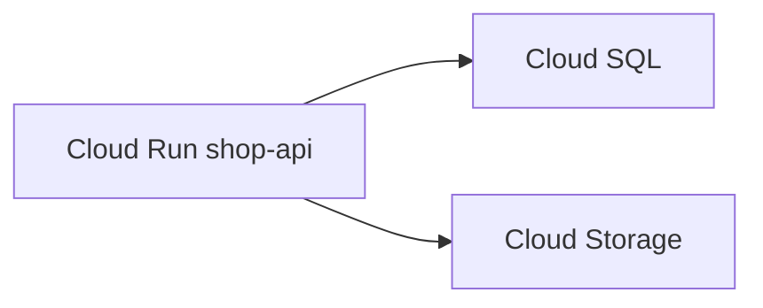

# Cloud Run と Cloud SQL

コンテナは起動している。画面は 502。ログを読むと、データベースへの接続がタイムアウトしている。  
GCP で HTTP の API を出す定番の一つが **Cloud Run**、PostgreSQL のマネージドが **Cloud SQL** です。  
二つを繋ぐ線が、公開 IP かプライベートか、どのサービスアカウントか、で決まります。

## このページで分かること

- Cloud Run が引き受ける範囲と、環境変数・身分
- Cloud SQL の接続名と、公開 IP を避ける理由
- アプリから表へ届けるときの部品

## Cloud Run

Cloud Run は、コンテナを渡すと HTTPS で出してくれるアプリ基盤です。  
[計算資源](../fundamentals/compute) の PaaS 寄りです。OS に SSH する前提は持ちません。  
リビジョン（デプロイの版）、同時実行数、CPU をリクエスト中だけ付けるか、が運用のつまみです。

検証でソースからデプロイする例です（ビルドできる Dockerfile またはビルドパック前提）。  
リージョンは DB と同じにします。

```bash
gcloud run deploy shop-api \
  --source . \
  --region=asia-northeast1 \
  --service-account=shop-api@shop-dev-123456.iam.gserviceaccount.com \
  --no-allow-unauthenticated
```

成功時は、サービス URL と、新しいリビジョン名が出ます。  
`--no-allow-unauthenticated` は、認証した呼び出し元だけ、という向きです。  
ブラウザで誰でも叩く公開 API にするなら、負荷分散と認証の設計が別に要ります。「動いた」で `--allow-unauthenticated` を本番に残さないでください。

環境変数は、コンソールまたは `--set-env-vars` で渡します。  
DB のパスワードは、環境変数の平文より Secret Manager に寄せます。値は Git に置きません。

ログは次です。

```bash
gcloud run services logs read shop-api --region=asia-northeast1 --limit=50
```

成功時は、アプリが標準出力に出した行が時系列で出ます。  
例外のスタックトレースも、ここに出ているかを先に見ます。

## Cloud SQL

Cloud SQL はマネージドな PostgreSQL（または MySQL 等）です。  
[マネージドなデータ](../fundamentals/managed-data) のとおり、スキーマは自分たち、パッチとバックアップ機能は製品側です。

インスタンス作成は時間がかかり、時間課金です。検証で作るなら最小、作業後に削除します。  
接続の識別子は **接続名** で、次の形です。

```text
shop-dev-123456:asia-northeast1:shop-db
```

`プロジェクト:リージョン:インスタンス名` です。  
アプリは、公開 IP で `psql` するより、次のどちらかに寄せます。

- **Cloud SQL Auth Proxy** またはコネクタ: IAM と暗号化を足して繋ぐ
- **プライベート IP**: 同じ VPC 内の Cloud Run / GCE からだけ届く

ノート PC から直接、公開 5432 を世界に開けて繋ぐ、は [ネットワーク](../fundamentals/networking) の反例です。

:::warning[Cloud SQL の公開 IP を検証の楽さで残さない]

パスワード付きでも、5432 を `0.0.0.0/0` にしないでください。  
Cloud Run からはコネクタまたはプライベート IP を使い、人間の調査は Proxy か、許可した踏み台にします。

:::

## 線を結ぶ

必要な許可のイメージです。

| 主体                           | 必要なもの                           |
| ------------------------------ | ------------------------------------ |
| Cloud Run のサービスアカウント | Cloud SQL Client、バケットの読み書き |
| Cloud SQL インスタンス         | 同じリージョン、非公開接続           |
| 人間の調査                     | 最小の Viewer と、Proxy または踏み台 |

注文の正は表です。接続文字列のホストは、ローカル Docker の `localhost` ではありません。  
SSL や Proxy の差し込みで、フラグがローカルと違います。失敗ログのホスト名を、まず確認します。



<QuizChoice
title="Cloud Run と DB"
options={[
{ id: 'a', label: 'Cloud Run が 200 を返していれば、Cloud SQL への接続設定は見てよい' },
{ id: 'b', label: '同じリージョンで、サービスアカウントと非公開（またはコネクタ）の線を設計する' },
{ id: 'c', label: 'Cloud SQL はマネージドなので、アプリ側の再接続は不要である' },
]}
answer="b"
explanation="ヘルスチェックと DB 接続は別です。リージョンと身分と非公開接続を揃えます。メンテナンス切断への再接続もアプリ側です。"

>

  <div>shop-api を Cloud Run と Cloud SQL で組むとき、適切なものはどれですか。</div>
</QuizChoice>

## よくあるつまずき

- `--allow-unauthenticated` のまま社内 API を出す
- Cloud Run のサービスアカウントと、自分のユーザ権限を混同する
- Cloud SQL のメンテナンスで接続が切れ、アプリが例外のまま復帰しない

## まとめ

- Cloud Run はコンテナを HTTPS で出す基盤で、身分と秘密は実行環境側に置く
- Cloud SQL はマネージド PostgreSQL で、公開 5432 ではなくコネクタかプライベート IP で繋ぐ
- ログは `gcloud run services logs read` から入り、ホスト名と権限を疑う

次は [組み立てと運用](./assemble) で、一枚の構成と消し忘れをまとめます。
