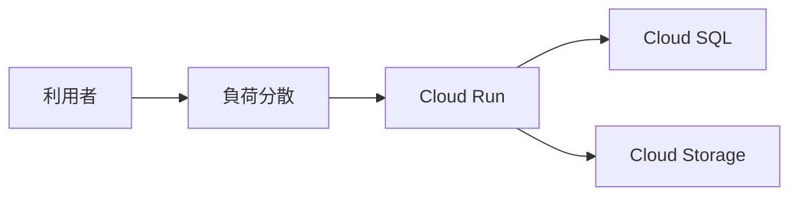

# 組み立てと運用

製品を一つずつ触れるようになっても、チケットは「注文 API を検証に出して」と一枚で来ます。  
このページでは、GCP 上の `shop-api` を一枚に戻し、ログと請求と削除の見方を実務の順にします。

## このページで分かること

- 負荷分散・Cloud Run・Cloud SQL・Cloud Storage の線
- 障害時に開く場所
- 検証資源の消し方の順

## 一枚の絵



役割の確認です。

- 利用者は HTTPS で負荷分散（または Cloud Run の URL）へ
- 注文の正は Cloud SQL の表。[SQL / RDB](../../data/sql-rdb/) の範囲
- 画像と PDF は `gs://...`。[Cloud Storage](./cloud-storage)
- アプリの身分はサービスアカウント。[IAM](./iam)

倉庫へ知らせるなら、[Cloud Pub/Sub](../../data/messaging/cloud-pubsub) を横に足します。表の代わりにはしません。

## デプロイ後に見ること

1. `gcloud config get-value project` が検証か本番か
2. Cloud Run のリビジョンが意図した版か
3. ログに接続エラー（Cloud SQL、権限 403）が無いか
4. バケットが匿名読み取りになっていないか
5. Cloud SQL に公開 IP と広いファイアウォールが無いか

ログの入口:

```bash
gcloud run services logs read shop-api --region=asia-northeast1 --limit=50
```

メトリクスやエラー率は Cloud Monitoring の画面でも見ます。  
最初の切り分けは、ログの例外メッセージと、タイムアウトか 403 か、です。

:::tip[403 と timeout は別]

403 は身分と IAM。  
timeout はネットワーク、公開 IP の有無、Cloud SQL が起動しているか。  
同じ「繋がらない」でも、直す場所が違います。

:::

## 検証を消す順

[料金](../fundamentals/billing) のとおり、停止と削除は別です。目安の順です。

1. Cloud Run サービス（リクエストが止まったか確認）
2. Compute Engine の VM と、残ったディスク・外部 IP
3. Cloud SQL インスタンス（時間課金が大きい）
4. 空にした検証バケット（中身とバージョニングも）
5. 使わないロードバランサと固定 IP

```bash
gcloud compute instances list
gcloud sql instances list
gcloud run services list --region=asia-northeast1
gcloud storage buckets list
```

一覧に名前が残っていたら、まだ請求の候補です。  
ラベル `env=dev` を付けておくと、この確認が速くなります。

<QuizChoice
title="切り分け"
options={[
{ id: 'a', label: 'Cloud Run が起動していれば、IAM の 403 は起きない' },
{ id: 'b', label: '403 は権限、タイムアウトは経路や公開範囲を疑う' },
{ id: 'c', label: '検証の Cloud SQL は、削除せず停止すればディスク課金も必ず無い' },
]}
answer="b"
explanation="起動と権限と経路は別です。SQL インスタンスも、残し方によって課金が続きます。"

>

  <div>GCP 上の shop-api で「繋がらない」を見るとき、適切なものはどれですか。</div>
</QuizChoice>

## よくあるつまずき

- 本番プロジェクトのログを見て、検証のデプロイ失敗を追っている
- Pub/Sub のトピックだけ作り、サブスクリプションが無く「書いたのに誰も読まない」
- 削除順を逆にし、まだアプリが向いている DB を先に消して調査不能になる

## まとめ

- GCP の shop-api は、負荷分散、Cloud Run、Cloud SQL、Cloud Storage で組める
- ログで 403 と timeout を分け、プロジェクト ID を先に確認する
- 検証は一覧コマンドで残存を見てから削除する

同じ絵を AWS の商品名で読むときは [AWS](../aws/) へ、Azure で読むときは [Azure](../azure/) へ進みます。  
現場のクラウドが GCP なら、この章までで、一般の開発者が触る箱の読み方は一通り揃います。
