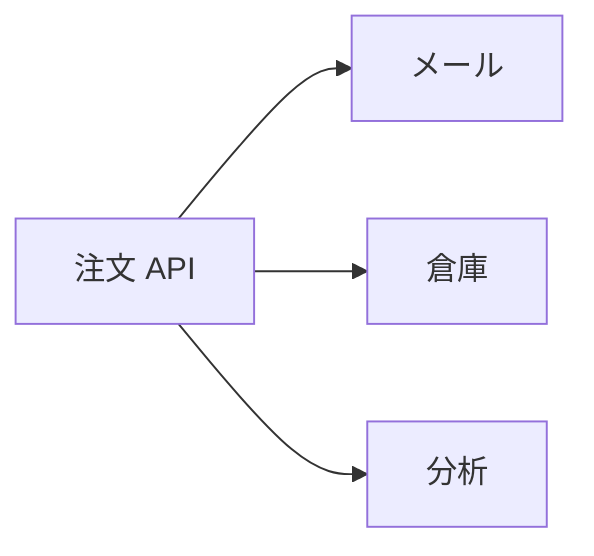
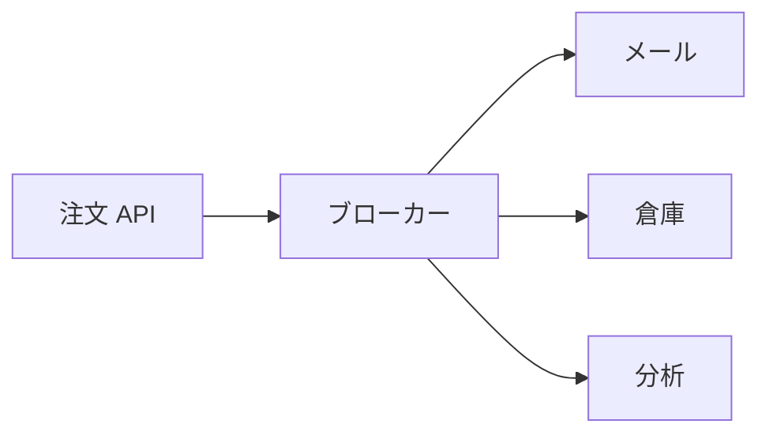

# メッセージングの考え方

コマンドの前に、「何を仲介して、何を仲介しないか」を押さえます。  
ここが分かると、あとの Kafka のトピックも「データベースの代わり」ではなく「知らせの通り道」として読めます。

## このページで分かること

- 同期呼び出しが苦しくなる理由
- プロデューサ・コンシューマ・ブローカーの役割
- メッセージングが向かないこと（正の保存や、画面への即答）

## 注文 API に全部載せると何が起きるか

[RDB と SQL の考え方](../sql-rdb/concepts) では、注文を表に残す話をしました。  
残したあとにやる仕事は、保存そのものとは別です。

- 利用者へメールを送る
- 倉庫システムへ出荷を依頼する
- 分析用に「支払いが終わった」と伝える

これを注文 API が順に HTTP で呼ぶと、次が同時に起きます。

- メールが遅いと、注文画面も遅い
- 倉庫がメンテ中だと、注文そのものが失敗に見える
- 新しい知らせ先（ポイント付与など）が増えるたびに、注文 API を直して再デプロイする

「保存できたか」と「関係者へ届いたか」を同じリクエストに縛ると、片方の障害が全体に波及します。

仲介を置くと、注文 API は「支払い完了」を一回渡して応答を返せます。  
メール・倉庫・分析は、それぞれ都合のよい速さで受け取ります。

:::info[覚えておく対比]

RDB は「今の正しい状態」を置く場所です。  
メッセージングは「起きたことを、関係する処理へ渡す」通り道です。  
画面の「この注文は何か」は表を読み、ほかシステムへの知らせはメッセージにします。

:::

## 登場人物

この章では次の意味で使います。

| 用語             | ざっくり言うと                                  | 通販の例                            |
| ---------------- | ----------------------------------------------- | ----------------------------------- |
| **メッセージ**   | 渡す一件分の知らせ（多くの場合は文字列や JSON） | `{"order_id":1001,"status":"paid"}` |
| **プロデューサ** | メッセージを書く側                              | 注文 API                            |
| **コンシューマ** | メッセージを読む側                              | メール送信サービス                  |
| **ブローカー**   | 預かって届ける仲介                              | Kafka のサーバ、Pub/Sub のサービス  |
| **トピック**     | 知らせの名前付きの流れ                          | `shop.orders.paid`                  |

トピックは、ファイル名や表名に近い「どこへ書くか / どこから読むか」です。  
中身の検索や結合は得意ではありません。条件で探したい履歴は、これまでどおり表に残します。

イベントとコマンド

現場では、起きた事実（支払いが完了した）を載せることも、やってほしい仕事（このメールを送れ）を載せることもあります。  
最初は「誰かに渡したい一件」と捉え、名前の付け方（何が起きたか / 何をしてほしいか）が混ざったら、トピックを分ける、と考えれば十分です。

## この章の想定

- 手を動かす製品: Apache Kafka（おおむね 4.3 以降を想定）
- クラウドの対応: Google Cloud Pub/Sub の用語
- 題材: 通販風の「支払い完了」の知らせ
- ゴール: 誰が書き、誰が読み、同じ知らせを何系統が読むかを説明できること

まずは 1 台の Kafka で、送りと受け取りの感覚を掴みます。

<QuizChoice
title="メッセージングの役割"
options={[
{ id: 'a', label: '注文の正を置くデータベースの代わりである' },
{ id: 'b', label: '起きたことを関係する処理へ渡す仲介である' },
{ id: 'c', label: '画面の問い合わせを SQL より速くするキャッシュである' },
]}
answer="b"
explanation="正の状態は RDB、短いコピーは Redis、知らせの配達はメッセージング、と役割が分かれます。"

>

  
このページの説明として、正しいものはどれですか。

</QuizChoice>

## よくあるつまずき

- 「Kafka に入れれば注文表は不要」と思い、あとから「この注文は今どういう状態か」が取れない
- 画面表示までメッセージの到着を待ち、利用者がブローカーの遅延を直接食らう
- メール送信の失敗と注文の失敗を同じエラーとして扱い、どちらを直すべきか分からなくなる

## まとめ

- メッセージングは、保存した事実をほかの処理へ届ける仲介である
- 書く側がプロデューサ、読む側がコンシューマ、預かるのがブローカーである
- 正の状態や画面への即答は、メッセージングの仕事ではない

次は [キューと Pub/Sub](./queue-vs-pubsub) で、読み手の集まり方を二つに分けます。
