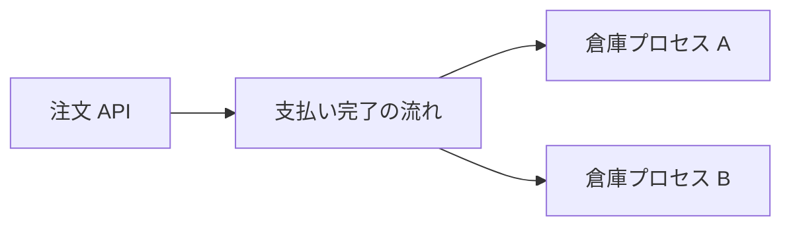
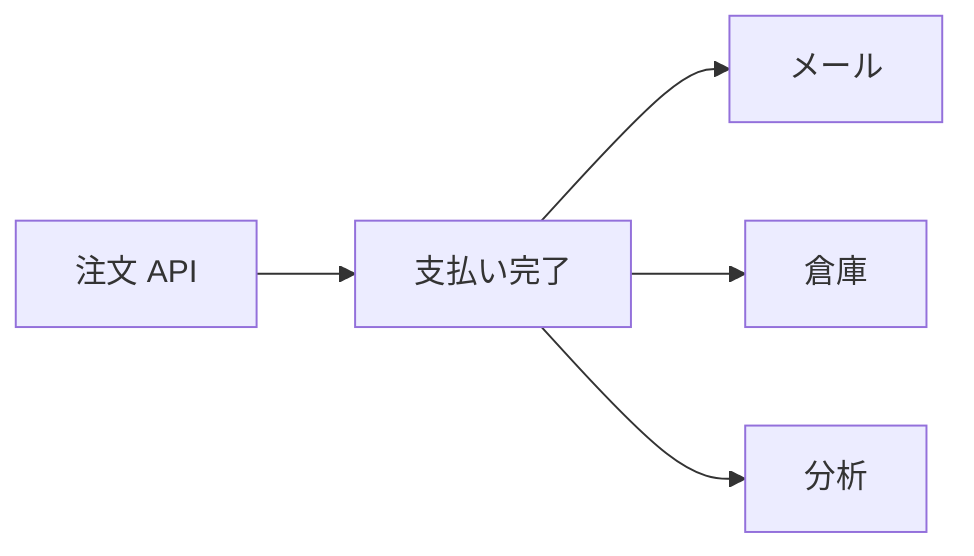

# キューと Pub/Sub

ブローカーへ渡したあと、読み手が何人いるかで、欲しい動きが分かれます。  
このページでは、**一件を一人が処理する** 聞き方と、**同じ知らせを複数がそれぞれ処理する** 聞き方を押さえます。

## このページで分かること

- キュー（仕事の分担）が向く場面
- Pub/Sub（扇形の配信）が向く場面
- 同じ製品でも、聞き方を取り違えると何が起きるか

## 一件を一人が取る（キュー）

倉庫の出荷のように、「この注文は誰か一人が処理すればよい」仕事があります。  
読み手が 2 プロセスいても、同じ注文が二重に梱包されては困ります。

この聞き方を、この章では **キュー** と呼びます。  
並んだ仕事を、空いている担当が引き取っていくイメージです。

A が一件取ったら、その一件は B には渡りません。  
処理を速くしたいときに担当を増やす、という向きです。

## 同じ知らせを複数が取る（Pub/Sub）

「支払いが完了した」は、倉庫だけのものではありません。  
メールも分析も、**同じ一件を、自分の仕事として** 受け取りたいことがあります。

この聞き方を **Pub/Sub**（Publish / Subscribe、出版と購読）と呼びます。  
書いた側は購読者の人数を知らなくてよく、購読を増やすたびに注文 API を直さなくて済みます。

メールが遅れても、倉庫の受け取りは止まりません。  
新しい購読（ポイント付与）を足すときも、書く側のコードは「同じトピックへ出す」ままにできます。

:::tip[先に聞き方を決める]

「担当を増やして一件の処理を速くしたい」のか、「別の種類の仕事にも同じ知らせを渡したい」のか。  
同じ「支払い完了」でも、欲しい形が違います。

:::

## 取り違えると何が起きるか

| 欲しかったこと           | 実際の聞き方     | よく起きる結果                             |
| ------------------------ | ---------------- | ------------------------------------------ |
| 倉庫だけが処理する       | 扇形になっていた | テスト用の購読が本番の注文まで処理する     |
| メールと倉庫の両方が動く | 一件を奪い合った | メールは来たが倉庫に届かない、またはその逆 |
| 読み手を増やして速くする | 全員が全件読む   | 同じ梱包が二重に走る                       |

現場の会話では「Pub/Sub」が製品名（Cloud Pub/Sub）を指すことも、この扇形の聞き方を指すこともあります。  
混乱したら、「一件を一人が取る話か、同じ知らせを複数系統が取る話か」を先に確認します。

Kafka も Cloud Pub/Sub も、**どちらの聞き方も** 表現できます。  
製品を選ぶ前に、欲しい聞き方がどちらかを言語にできると、設定の意味が追いやすくなります。

<QuizChoice
title="聞き方の違い"
options={[
{ id: 'a', label: 'キューは同じ一件をメールと倉庫の両方が必ず受け取る聞き方である' },
{ id: 'b', label: 'Pub/Sub は、同じ知らせを複数の系統がそれぞれ処理する聞き方である' },
{ id: 'c', label: '読み手を増やせば、いつでも一件は一度しか処理されない' },
]}
answer="b"
explanation="扇形（Pub/Sub）は系統ごとにコピーを受け取ります。一件を一人が取るのはキュー側の聞き方です。"

>

  
支払い完了をメール・倉庫・分析がそれぞれ処理したいときの説明として、正しいものはどれですか。

</QuizChoice>

## よくあるつまずき

- 「メッセージキュー」とだけ言って、扇形なのか奪い合いなのかが席で決まっていない
- テスト用の読み手が本番の流れに繋ぎ、本番の仕事を奪う（キューのとき）または本番と同じメールを送る（扇形のとき）
- 製品名の Pub/Sub と、聞き方の Pub/Sub が会話の途中で入れ替わる

## まとめ

- キューは、一件を一人（一プロセス）が処理する聞き方である
- Pub/Sub は、同じ知らせを複数の系統がそれぞれ処理する聞き方である
- 欲しい聞き方を先に決めると、製品の設定が読みやすい

次は [接続と Kafka](./connect-and-kafka) で、実際に一行送って一行受け取ります。
