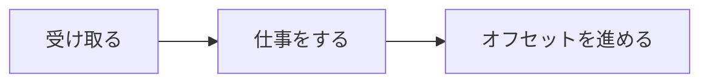

# 再配信と二重処理

コンシューマが途中で止まると、同じメッセージがもう一度来ることがあります。  
壊れたのではなく、**少なくとも一度は届ける** 側に振った結果です。このページでは、その届き方と、二重に処理しない備えを扱います。

## このページで分かること

- 処理のあとで「ここまで終わった」と印を付ける流れ
- 同じメッセージが二度来る理由
- 何度処理しても結果が同じ、という備え方

## 読む・処理する・印を付ける

アプリのコンシューマは、おおよそ次の順で動きます。

1. ブローカーからメッセージを受け取る
2. メール送信や倉庫 API など、自分の仕事をする
3. グループのオフセットを進める（ここまで終わった、と印を付ける）

3 の前にプロセスが落ちると、印は古いままです。  
再起動すると、同じメッセージをもう一度 2 からやり直します。

コンソールコンシューマは学習用で、印の付け方を細かくは制御しません。  
本番のクライアントでは、処理が成功してから印を進める、という順番を意識します。

:::info[少なくとも一度]

よくある設定では、届かないより、二度届く方が選ばれます。  
「メールが 0 通」より「確認のうえ 2 通」の方が、業務として追いやすいことが多いためです。  
二度来ても困らない仕事の書き方が、コンシューマ側の責任になります。

:::

## 二重に見える現場

支払い完了のメッセージでメールを送るサービスが、送信の直後に再起動したとします。  
オフセットはまだ進んでいないので、同じ `order_id` でもう一度メール処理が走ります。

利用者には「同じ注文のメールが 2 通」と見えます。  
ブローカーが壊れたのではなく、**印より先に仕事が終わっていた** だけです。

同じことは、処理が遅くて制限時間に間に合わず、ブローカーが「届いていない」と判断して再送する場合にも起きます。

## 何度やっても同じ結果にする

二度来てもよいように、仕事の結果を **同じ入力なら同じ状態** に揃えます。

例: メール送信の履歴を `order_id` で残す。

- まだ無ければ送って記録する
- 既にあれば送らずに終わる（オフセットだけ進める）

RDB の [主キー](../sql-rdb/tables-and-keys) と同じ発想です。  
「この注文のメールは一度だけ」を表で約束すると、メッセージが二度来ても行は増えません。

倉庫の出荷指示も同様で、`order_id` 単位の「既に受け付けた」を残します。  
メッセージの中身だけを信じて、毎回新しい出荷番号を切ると、二重梱包の温床になります。

どうしても処理できない一件

形式が壊れている、必須項目が無い、といった一件は、何度再送しても成功しません。  
同じレーンの後ろが詰まることがあるので、失敗を記録して印だけ進める、専用の置き場へ移す、といった運用を決めます。  
学習のうちは、「失敗したら黙って止める」と「無限に再送する」のどちらも、後ろの健全な一件を巻き込む、と知っておけば十分です。

<QuizChoice
title="同じメールが 2 通"
options={[
{ id: 'a', label: 'Kafka が同じ行をトピックに二重保存したことが原因である' },
{ id: 'b', label: '仕事のあとにオフセットが進む前に止まると、同じメッセージをもう一度処理することがある' },
{ id: 'c', label: 'コンシューマグループを分けると、二重処理は起きなくなる' },
]}
answer="b"
explanation="印（オフセット）より先に仕事が終わると、再起動後に同じ一件を再処理します。グループを分けても、各系統で同じことは起きます。"

>

  
支払い完了のメールが 2 通届いたときの説明として、このページに合うものはどれですか。

</QuizChoice>

## よくあるつまずき

- 再送を「バグ」とだけ切り、履歴も主キーも残さずに再発する
- 画面のボタン連打でプロデューサが同じ注文を二度書き、コンシューマの備えと原因が食い違う
- 失敗一件でコンシューマ全体を止め、後続の健全な注文まで止める

## まとめ

- よくある届き方は「少なくとも一度」で、同じメッセージが再処理されることがある
- オフセットは、仕事が成功してから進める
- 同じ `order_id` なら同じ結果になるよう、表側の約束と組み合わせる

次は [Cloud Pub/Sub](./cloud-pubsub) で、同じ聞き方を Google Cloud の用語に対応づけます。
