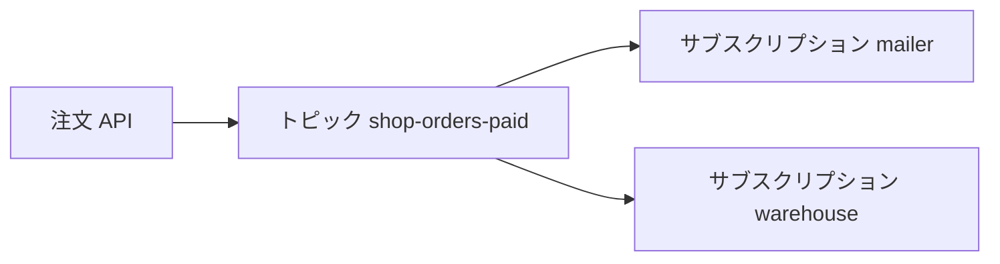

# Cloud Pub/Sub

Kafka で押さえた「名前付きの流れ」と「系統ごとの購読」は、クラウドでは別の製品名で出てきます。  
このページでは **Google Cloud Pub/Sub** のトピックとサブスクリプションを、ここまでの言葉に対応づけます。

## このページで分かること

- トピックとサブスクリプションの役割
- 確認応答（ack）と、Kafka のオフセットとの対応
- Pull と Push の違い

GCP の課金アカウントは使いません。用語と流れを、Kafka の操作と重ねて読みます。

## トピックへ書き、サブスクリプションで読む

Cloud Pub/Sub でも、書く先の名前は **トピック** です。  
読む側はトピックを直接奪い合うのではなく、**サブスクリプション** を作ります。

- トピック 1 つに、サブスクリプションを複数付けられる
- トピックへ出されたメッセージは、**各サブスクリプションへそれぞれ届く**
- 1 つのサブスクリプションに読み手を複数付けると、その中では一件を分担する

つまり、サブスクリプションが Kafka のコンシューマグループに相当します。  
`mailer` 用と `warehouse` 用を別サブスクリプションにすれば扇形、倉庫プロセスを同じサブスクリプションに複数付ければキューです。

| 考え方             | Kafka                | Cloud Pub/Sub          |
| ------------------ | -------------------- | ---------------------- |
| 書く先の名前       | トピック             | トピック               |
| 系統ごとの購読     | コンシューマグループ | サブスクリプション     |
| どこまで終わったか | オフセット           | 確認応答（ack）        |
| 一件の分担         | 同じグループ         | 同じサブスクリプション |

:::tip[系統はサブスクリプション]

Kafka で `--group mailer` と付けた名前が、Cloud Pub/Sub ではサブスクリプション名になります。

:::

## 確認応答（ack）

コンシューマはメッセージを受け取ったあと、仕事が終わったら **ack**（acknowledgement、確認応答）を返します。  
ack が届くと、そのサブスクリプションのその一件は済みになります。

ack しないまま制限時間を超えると、同じメッセージがもう一度届きます。  
[再配信と二重処理](./delivery) で見た「印より先に仕事が終わる」と同じ形です。  
ここでも、`order_id` 単位で何度処理しても同じ結果になる備えが要ります。

Pull と Push

**Pull** は、読み手が Pub/Sub に取りに行きます。Kafka のコンシューマに近いです。  
**Push** は、Pub/Sub が指定した HTTPS エンドポイントへ届けに行きます。  
どちらでも、処理後に ack する役割は読み手側です。配信の向きが違う、と覚えると混ざりにくいです。

## Kafka との違いで最初に効くこと

どちらも「書いて、系統ごとに読む」は同じです。  
運用と制約の言葉が違うので、最初は次だけ押さえると足りることが多いです。

- Cloud Pub/Sub はブローカーの台数やパーティション本数を自分で設計しない（マネージド）
- 既定ではメッセージ同士の到着順は保証されません。Ordering key を付けると、同じキーの範囲では順に届きます。キーが違う同士の順番は決まりません
- 保持期間を過ぎたメッセージは読めなくなります。監査や「昨日の注文は何か」は RDB 側です

手元の学習は Kafka のコンソールで足ります。  
現場の GCP プロジェクトでは、トピックとサブスクリプションの名前が、ここでの `mailer` / `warehouse` と同じ役割になります。

<QuizChoice
title="サブスクリプションの役割"
options={[
{ id: 'a', label: 'サブスクリプションはトピックの別名で、書くときだけ使う' },
{ id: 'b', label: '系統ごとにサブスクリプションを分けると、同じメッセージをそれぞれ受け取れる' },
{ id: 'c', label: 'ack を返すと、ほかのサブスクリプションのメッセージもまとめて消える' },
]}
answer="b"
explanation="サブスクリプションは系統ごとの購読です。ack はそのサブスクリプションの一件を済みにするだけで、別系統は残ります。"

>

  
Cloud Pub/Sub でメール用と倉庫用を分けるときの説明として、正しいものはどれですか。

</QuizChoice>

<QuizFill
title="済みの印"
answer="ack"
explanation="仕事が終わったら ack を返します。Kafka のオフセットを進める役割に相当します。"

>

  

    処理が終わったあとに Pub/Sub へ返す確認応答の短い名前を入れてください。
    <pre className="language-text"><code>{`受け取って仕事をする → ____ を返す`}</code></pre>
  

</QuizFill>

## よくあるつまずき

- トピックだけ作ってサブスクリプションが無く、「書いたのに誰も読まない」
- テストと本番で同じサブスクリプションを共有し、テストが本番の一件を ack してしまう
- Push の URL を検証用に向けたまま、本番トピックへ繋ぐ

## まとめ

- Cloud Pub/Sub では、トピックへ書き、サブスクリプションごとに読む
- サブスクリプションは Kafka のコンシューマグループに相当する
- ack は「この系統ではこの一件が終わった」という印である

次は [使い分けと限界](./when-to-choose) で、HTTP や RDB といつ分けるかを整理します。
