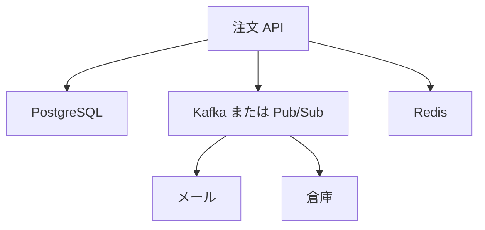

# 使い分けと限界

コマンドが打てても、「注文をトピックにだけ置けばよいか」が分からないと、障害のときに困ります。  
このページでは、HTTP、RDB、Redis、メッセージングの役割を一度に並べます。

## このページで分かること

- 同期の HTTP が向くこと / メッセージングが向くこと
- 正の状態をどこに置くか
- Redis のリストを待ち行列にしたときの限界

## 利用者が待っているかどうか

| やりたいこと                         | 向く渡し方      | 理由                                     |
| ------------------------------------ | --------------- | ---------------------------------------- |
| ログイン、注文内容の表示、在庫の確定 | HTTP などで同期 | その場の成功・失敗を画面に返す必要がある |
| メール、倉庫への知らせ、分析への連携 | メッセージング  | 注文の応答を、ほかシステムの遅延から外す |
| 注文の正、出荷済みかどうか           | RDB             | 条件検索と、まとめて確定したい           |
| セッション、短い画面コピー           | Redis           | 鍵で取り、消えてよい                     |

注文 API は、表へ `COMMIT` してからトピックへ「支払い完了」を出します。  
画面には表の結果を返し、メールはコンシューマが後から送ります。

書く順番を逆にすると、メッセージは届いたが表には無い、という隙間が生まれます。  
「表が正、メッセージは知らせ」を崩さないことが、調査の起点になります。

:::warning[トピックを注文の唯一の置き場にしない]

保持期間が過ぎる、コンシューマがいない間に消える、キーが分からず探せない、といった出来事で、コピーではないデータは戻りません。  
残したい注文は RDB に書き、メッセージは関係者への配達にします。

:::

<QuizChoice
title="注文の正"
options={[
{ id: 'a', label: '注文はトピックにだけ置けば、あとから何でも検索できる' },
{ id: 'b', label: '注文の正は RDB に置き、支払い完了の知らせをメッセージで配る' },
{ id: 'c', label: '画面の注文詳細も、ブローカーからの応答を待って描画する' },
]}
answer="b"
explanation="検索と状態の正は表、ほかシステムへの知らせはメッセージです。画面の即答にブローカーを挟まない方が追いやすいです。"

>

  
通販アプリでの置き場として、このページの説明に合うものはどれですか。

</QuizChoice>

## Redis のリストとの違い

[ハッシュ・リスト・セット](../nosql/hashes-lists-sets) のリストは、短い待ち行列にも使えます。  
一方で、次が同時に必要になるとブローカーの方が向きます。

- 同じ知らせを、メールと倉庫が **それぞれ** 最後まで読む
- 止まっていた系統が、あとから自分のオフセット（またはサブスクリプション）で追いつく
- 書き手と読み手が別プロセス・別チームで、名前付きの流れを契約にする

Redis のリストから取り出すと、その値はそこには残りません。  
Kafka のトピックはログとして残り、別グループが同じ期間を読み直せます。  
「消してよい作業キュー」と「複数系統が追いつく知らせ」は、道具が違います。

## よくある構成

最初から全部をメッセージングにする必要はありません。  
画面がほかシステムの遅延を待ち始めたところ、表のポーリングが増え始めたところ、といった **痛みのある箇所** から足す方が、障害の範囲も追いやすいです。

## よくあるつまずき

- 同期 API のタイムアウトを延ばしてメッセージングの代わりにする
- コンシューマが表を更新し、同じ内容をまたトピックへ出して、自分で自分のメッセージを増やす
- 順序が業務に必須なのに、パーティションや Ordering key の範囲（同じキーの中だけ）を確認せず、到着順だけを信じる

## まとめ

- 利用者が待っている応答は同期、ほかシステムへの知らせはメッセージング
- 注文の正は RDB、セッションや短いコピーは Redis、配達はブローカー
- リストの待ち行列と、複数系統が読み直せるログは別物である

これでデータの基礎ルート（表、キーバリュー、メッセージング）は一通りです。  
表側を固めるなら [SQL / RDB](../sql-rdb/) へ、キャッシュやセッションなら [NoSQL](../nosql/) へ戻ります。
