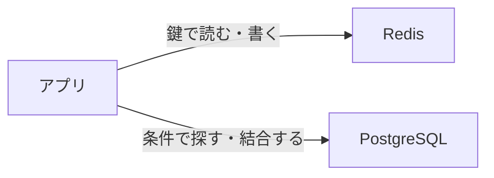

# NoSQL の考え方

コマンドの前に、「NoSQL が何を指し、RDB と何が違うか」を押さえます。  
ここが分かると、あとの Redis のキーも「表の代わり」ではなく「取り方の違う置き場」として読めます。

## このページで分かること

- NoSQL という名前の指す範囲
- よく出る四つの種類と、それぞれが向く読み書き
- この章で Redis を例にする理由

## 表に向かないデータもある

[RDB と SQL の考え方](../sql-rdb/concepts) では、注文のように同じ形のデータを表に並べ、条件で探し、まとめて更新する話をしました。  
一方で、次のようなデータは、表の得意技と噛み合いにくいことがあります。

- **鍵が分かれば即座に取りたい**（ログイン中のセッション、一時トークン）
- **数分で古くなり、消えてよいコピー**（商品ページの表示用データ）
- **商品ごとに項目が違う入れ子の情報**（ノート PC は CPU、カメラは焦点距離）

「NoSQL に載せ替えれば速くなる」と聞いて、注文も在庫も全部移そうとすると、結合や一貫した更新で困ることが多いです。  
NoSQL は RDB の上位互換ではなく、**向き不向きが違う道具** です。

## NoSQL は製品名ではない

**NoSQL** は、特定のソフトウェアの名前ではありません。  
歴史的には "Not only SQL" とも言われ、**表と SQL 以外の置き方** をまとめた呼び方です。

現場では「Redis を使う」「ドキュメント指向の DB を使う」のように、製品や種類で話します。  
「NoSQL だから SQL が一切使えない」でもありません。製品によっては SQL に近い問い合わせを持つものもあります。

:::info[覚えておく対比]

RDB は「どの表の、どの条件の行か」を聞きます。  
キーバリューは「この鍵の値は何か」を聞きます。  
先に鍵の付け方を設計する、という順番の違いです。

:::

## よく出る四つの種類

種類はもっと細かく分けられますが、最初は次の四つを地図にすると会話が追いやすいです。

| 種類             | ざっくりした取り方                      | 向くものの例                       | 製品の例       |
| ---------------- | --------------------------------------- | ---------------------------------- | -------------- |
| **キーバリュー** | 鍵を指定して、値を読み書きする          | セッション、キャッシュ、カウンター | Redis          |
| **ドキュメント** | JSON のような文書を、まとまり単位で置く | 形が商品ごとに違うカタログ         | MongoDB など   |
| **ワイドカラム** | 行キーの下に、列を柔軟に足して置く      | 書き込みが多く、鍵で足す記録       | Cassandra など |
| **グラフ**       | 点と線（関係）をたどって探す            | 推薦、権限の継承関係               | Neo4j など     |

この章の手を動かす部分は **キーバリューの Redis** です。  
四つの名前が出たときに、どの取り方の話かを切り分けられれば、このページの目標は達成です。

同じシステムで両方使うことも、よくあります。  
たとえば注文の正は PostgreSQL、画面用の短いコピーは Redis、という分担です。

値の中身は文字列だけとは限らない

キーバリューの「値」は、ただの文字列とは限りません。  
一つの鍵の下に複数の項目を持たせる型もあります。  
それでも入口は「どの鍵か」です。`WHERE status = 'paid'` のような、鍵を知らない横断検索は得意ではありません。

## この章の想定

- 製品: Redis（おおむね 7 以降を想定）
- 題材: 通販風のセッション、カート、閲覧履歴、人気商品
- ゴール: Redis の基本型を使い、RDB と役割を分けて説明できること

まずは 1 台の Redis で、読み書きと寿命の感覚を掴みます。

<QuizChoice
title="NoSQL の位置づけ"
options={[
{ id: 'a', label: 'NoSQL は Redis という製品の別名である' },
{ id: 'b', label: 'NoSQL は表と SQL 以外の置き方をまとめた呼び方で、種類や製品は複数ある' },
{ id: 'c', label: 'NoSQL に載せれば、RDB の結合やトランザクションは不要になる' },
]}
answer="b"
explanation="NoSQL は製品名ではありません。キーバリューやドキュメントなど種類があり、RDB の代わりに全部を任せるものでもありません。"

>

  
このページの説明として、正しいものはどれですか。

</QuizChoice>

## よくあるつまずき

- 「NoSQL」とだけ聞いて、MongoDB の話をしているのか Redis の話をしているのかが混ざる
- RDB が遅い原因（全件スキャン、インデックス不足）を、置き場の変更だけで解こうとする
- 鍵が分からないと取れない、という前提を忘れて、SQL と同じ検索を期待する

## まとめ

- NoSQL は製品名ではなく、表以外のデータの置き方の総称である
- 種類によって取り方が違い、キーバリューは「鍵 → 値」が入口になる
- この章では Redis を例に、速さ・寿命・役割分担の感覚を掴む

次は [接続と redis-cli](./connect-and-redis-cli) で、実際に Redis へつなぎます。
