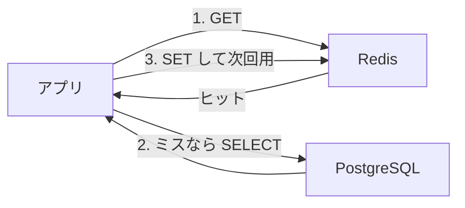

# TTL とキャッシュ

セッションもカウンターも、寿命を付けないと Redis のメモリに残り続けます。  
このページではキーの有効期限（TTL）と、RDB の前段として使うキャッシュの流れを扱います。

## このページで分かること

- `EXPIRE` / `TTL` と、`SET` 時の `EX`
- キャッシュとして読むときの順番（キャッシュアサイド）
- 期限切れと、更新あとに残る古いコピー

## キーに寿命を付ける

**TTL**（Time To Live）は、キーが自動的に消えるまでの残り時間です。  
セッションなら「最後の操作から 30 分」のように、業務の寿命と揃えます。

既にあるキーへ付けるなら `EXPIRE` です。単位は秒です。

```text
SET shop:session:abc123 10
EXPIRE shop:session:abc123 1800
```

成功時:

```text
OK
(integer) 1
```

`1` は期限を付けられた、という意味です。  
残り時間の確認は `TTL` です。

```text
TTL shop:session:abc123
```

例:

```text
(integer) 1797
```

秒が減っていきます。  
期限が切れるとキーは消え、`GET` は `(nil)` になります。

`SET` と同時に付けるなら `EX` です。

```text
SET shop:session:abc123 10 EX 1800
```

成功時:

```text
OK
```

書き込みと寿命を一回で済ませられるので、セッションではこちらが扱いやすいです。

:::info[TTL の特殊な戻り値]

`TTL` が `-1` なら、キーはあるが期限が付いていません。  
`-2` なら、キー自体がありません。  
「消えた」と「期限を付け忘れた」を、この二つの数字で切り分けます。

:::

<QuizFill
title="同時に寿命を付ける"
answer="EX"
explanation="SET のときに EX と秒数を付けると、書き込みと寿命を一度に設定できます。"

>

  <div>
    セッションを 1800 秒で消すには、空欄に何が入りますか。
    <pre className="language-text"><code>{`SET shop:session:abc123 10 __ 1800`}</code></pre>
  </div>
</QuizFill>

## キャッシュとして読む

商品ページのように、**正は PostgreSQL にあり、同じ結果を何度も読む** なら、Redis をコピー置き場にできます。  
よく使う流れは次です（キャッシュアサイドと呼ばれます）。

1. まず Redis を `GET` する
2. あれば、その値を返す（ヒット）
3. 無ければ PostgreSQL を `SELECT` し、結果を Redis に `SET`（TTL 付き）して返す



例（値は説明用の短い JSON です）:

```text
GET shop:product:1001:page
```

ミスのとき:

```text
(nil)
```

RDB から取ったあと:

```text
SET shop:product:1001:page '{"name":"mug","price":1200}' EX 60
```

成功時:

```text
OK
```

対話では JSON 全体を引用符で囲みます。  
次の 60 秒は Redis だけで足ります。  
TTL を付けることで、古いコピーが無限に残るのを防ぎます。

:::tip[正は RDB、Redis はコピー]

キャッシュの値は、最新である保証が TTL の長さまでしかありません。  
在庫の確定や決済のように、ずれると困るものは正の表を読みます。

:::

## 更新したらコピーを捨てる

価格を PostgreSQL で更新したあとも、Redis に古い JSON が残っていると、TTL まで画面が古いままです。  
更新に成功したら、対応するキーを消すか、新しい値で上書きします。

```text
DEL shop:product:1001:page
```

消した直後の読み取りはミスになり、次のリクエストで RDB から入り直します。  
「更新したのに画面が古い」と言われたら、キャッシュのキーが残っていないかを疑うと早いです。

<details>
<summary>INCR と EXPIRE を別コマンドにすると</summary>

ログイン試行回数のように `INCR` したあと、別コマンドで `EXPIRE` すると、その間にプロセスが落ちて期限だけ付かない、という穴があります。  
初めて `1` になったときだけ `EXPIRE` する、または `SET ... EX` で寿命付きの初期値を作る、といった順番を決めます。  
穴を残すと、カウンターキーが消えずに残り続けます。

</details>

<QuizChoice
title="キャッシュの読み順"
options={[
{ id: 'a', label: 'いつも PostgreSQL を先に読み、Redis は書き込み専用である' },
{ id: 'b', label: '先に Redis を読み、無ければ RDB を読んで Redis に載せる' },
{ id: 'c', label: 'TTL を付けなければ、RDB と Redis は常に同じ内容になる' },
]}
answer="b"
explanation="キャッシュアサイドは Redis が先、ミスなら RDB、その結果を TTL 付きで Redis に載せます。"

>

  <div>商品ページのコピーを Redis に置くときの説明として、正しいものはどれですか。</div>
</QuizChoice>

## よくあるつまずき

- `TTL` が `-1` のキーを「まだ生きているから問題ない」と思い、メモリだけが増える
- RDB を更新したのに `DEL` せず、TTL まで古い価格が表示される
- キャッシュに載せる JSON が肥大し、ヒットしても転送が重い

## まとめ

- TTL はキーの寿命。`EXPIRE` か `SET ... EX` で付ける
- キャッシュは Redis を先に読み、ミスなら RDB、結果を寿命付きで載せる
- 正を更新したら、コピーのキーを捨てるか差し替える

次は [使い分けと限界](./when-to-choose) で、何を Redis に置き、何を RDB に残すかを整理します。
