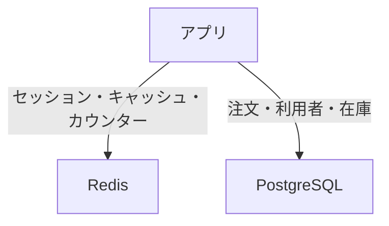

# 使い分けと限界

コマンドが打てても、「注文を Redis に移してよいか」が分からないと、障害のときに困ります。  
このページでは、正の置き場、メモリの制約、ドキュメント指向との見分けを扱います。

## このページで分かること

- Redis に向くもの / RDB に残すもの
- Redis がメモリ上であることの意味
- ドキュメント指向が効く形の違い

## 正はどこに置くか

ここまでの例を、置き場で分けると次です。

| データ                           | 向く置き場                       | 理由                                                           |
| -------------------------------- | -------------------------------- | -------------------------------------------------------------- |
| 注文、在庫、支払い               | RDB（PostgreSQL など）           | 条件検索、結合、まとめて確定したい                             |
| セッション、短い寿命の画面コピー | Redis                            | 鍵で取り、消えてよい                                           |
| 人気順の速報                     | Redis（正のログは RDB でも可）   | 表示は速く、監査は表に残せる                                   |
| 商品ごとに項目が違うカタログ     | ドキュメント指向、または表の工夫 | 列を増やし続けるより、文書のまま持った方が追いやすいことがある |

「速さ」だけで全部を Redis に寄せると、キーが分からない検索も、複数キーにまたがる一貫した更新も、自分で書くことになります。  
[トランザクション](../sql-rdb/transactions) で押さえた「片方だけ成功して残る」問題は、注文では今も RDB の担当です。

:::warning[注文の唯一のコピーを Redis にしない]

Redis のプロセスが落ちる、コンテナを消す、メモリ不足でキーが消える、といった出来事で、コピーではないデータは戻ってきません。  
残したい注文は RDB に書き、Redis は速く読むための複製にします。

:::

<QuizChoice
title="注文の置き場"
options={[
{ id: 'a', label: '注文は鍵で取れれば足りるので、Redis だけに置く' },
{ id: 'b', label: '注文の正は RDB に置き、Redis はセッションやキャッシュなど向く用途に使う' },
{ id: 'c', label: 'TTL を付ければ、Redis 上の注文も RDB と同じ耐久性になる' },
]}
answer="b"
explanation="TTL は寿命であり、耐久性の代わりではありません。条件検索や確定が必要な注文は RDB が向きます。"

>

  <div>通販アプリでの置き場として、このページの説明に合うものはどれですか。</div>
</QuizChoice>

## メモリに載る量だけ

Redis は、基本的にデータを **メモリ** に持ちます。  
ディスクの表のように「とりあえず何年分でも」とはいきません。

- キー名も値も、メモリを消費する
- リストを `LTRIM` しない、TTL を付けない、といった漏れが、じわじわ効いてくる
- 大きな JSON を商品の数だけキャッシュすると、ヒット率より先にメモリが先に尽きることがある

検証用コンテナを消すとデータも消える、というのも、メモリ中心だからこそ起きやすいです。

<details>
<summary>ディスクに残す仕組みについて</summary>

Redis には、定期的なスナップショットや、書き込みログ（AOF）でディスクに残す仕組みがあります。  
「再起動しても残る」設定は可能です。  
それでも、バックアップの運用、書き込み量、メモリ上限は PostgreSQL などの RDB とは別物です。  
ディスクへ残せるようにしたから注文の正にしてよい、という短絡にはなりません。

</details>

## ドキュメント指向が効くとき

キーバリューは「鍵が分かっている」が前提です。  
一方 **ドキュメント指向** は、JSON のような文書を 1 件として置き、文書の中身で探すことに向きます。

ノート PC とカメラでは、スペックの項目が違います。

```text
{
  "product_id": 1001,
  "name": "notebook-pc",
  "attrs": { "cpu_cores": 8, "memory_gb": 16 }
}
```

```text
{
  "product_id": 2001,
  "name": "camera",
  "attrs": { "megapixels": 24, "lens_mm": 50 }
}
```

これを一つの表に列として並べると、使わない列が増えたり、機種のたびに表の形を変えることになりやすいです。  
文書なら、その商品に必要な項目だけを持てます。  
MongoDB などがこの種類の代表です。

向き不向きの目安:

- 文書の形が一件ごとに違い、まとまりごと読み書きする → ドキュメント指向が候補
- 同じ形の行を条件で探し、表同士を結合する → RDB
- 鍵だけで足り、寿命が短い → Redis

問い合わせの書き方は製品ごとに違います。  
ここでは「JSON を列に無理やり詰めた表」で苦しんだら、文書として置く選択肢がある、と見分けられれば十分です。

## よくある構成

アプリから見ると、次の分担がよく出ます。



最初から全部を Redis にする必要はありません。  
遅くなった問い合わせ、サーバをまたいで共有したい状態、画面用の順位、といった **痛みのある箇所** から足す方が、障害の範囲も追いやすいです。

## よくあるつまずき

- 「NoSQL」とだけ言って、Redis のキャッシュ話と MongoDB の文書の話が席で混ざる
- 永続化オプションを見た瞬間に、RDB を外してよいと判断する
- キャッシュを消したつもりがキー名のプレフィックス違いで残っており、古い画面が続く

## まとめ

- 注文や在庫の正は RDB、セッションや短いコピーは Redis、と役割を分ける
- Redis はメモリ上の量と寿命が設計の一部になる
- 形が一件ごとに違うまとまりは、ドキュメント指向という別の種類がある

これで NoSQL の基礎ルートは一通りです。  
表側の操作を固めるなら [SQL / RDB](../sql-rdb/) へ戻ります。  
システム間で変更を届ける話は、[データ](../) カテゴリの案内を見てください。
