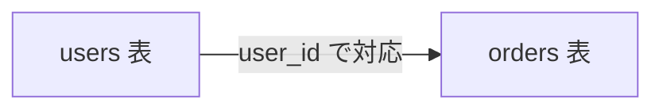

# RDB と SQL の考え方

コマンドや構文の前に、「RDB が何を約束していて、SQL が何を指示する言語か」を押さえます。  
ここが分かると、あとの `SELECT` やキーの話が「表のどこをどう触るか」として読めます。

## このページで分かること

- リレーショナルデータベースが向く課題
- 表・行・列・データベース・スキーマの関係
- SQL の役割と、この章での PostgreSQL の位置づけ

## なぜファイルだけでは足りないか

小さなメモならテキストファイルでも足ります。  
しかし注文や利用者のように、次が同時に必要になると、ファイルだけでは苦しくなります。

- 複数の処理から **同じデータを同時に** 読み書きする
- 「未出荷の注文だけ」「この利用者の注文一覧」のように **条件で探す**
- 途中で失敗したときに、在庫だけ減って注文が残らない、といった **中途半端な更新を避けたい**

RDB は、こうした要件を「表」と「関係」と「トランザクション」で扱う仕組みです。  
アプリ側の便利なライブラリも、多くの場合は最終的に RDB へ問い合わせています。

## 表・行・列

RDB ではデータを **表（テーブル）** に置きます。

| 用語   | ざっくり言うと                         | 注文の例                        |
| ------ | -------------------------------------- | ------------------------------- |
| **表** | 同じ形のデータを並べた入れ物           | `orders`                        |
| **列** | 表が持つ項目（名前と型がある）         | `order_id`、`user_id`、`amount` |
| **行** | 1 件分のデータ                         | 注文番号 1001 の 1 行           |
| **値** | ある行のある列に入っている具体的な中身 | `amount` が `3980`              |

イメージは次です。

```text
orders
+----------+---------+--------+
| order_id | user_id | amount |
+----------+---------+--------+
|     1001 |      10 |   3980 |
|     1002 |      11 |   1200 |
+----------+---------+--------+
```

「注文」と「利用者」のように意味が違うものは、別の表に分け、あとで **関係（キー）** でつなぎます。  
1 枚の巨大な表に全部詰め込むと、同じ利用者情報が何度もコピーされ、更新漏れの温床になります。



## データベースとスキーマ

言葉が混ざりやすいので、この章では次の意味で使います。

| 用語             | ざっくり言うと                                         |
| ---------------- | ------------------------------------------------------ |
| **データベース** | 表や権限などをまとめた管理単位（接続先として指定する） |
| **スキーマ**     | データベース内の名前空間。表の置き場を分ける箱         |
| **RDBMS**        | 表を管理するソフトウェア本体（PostgreSQL など）        |

現場では「DB」とだけ言って、接続先・製品・表全体を指すこともあります。  
混乱したら、「接続先の名前」なのか「製品」なのか「いま触っている表」なのかを確認するとよいです。

<details>
<summary>リレーショナルの「関係」とは</summary>

理論上は、表そのものが「関係（リレーション）」と呼ばれます。  
実務では「表同士をキーで結ぶこと」を関係と呼ぶことも多いです。  
この章では後者のイメージ（利用者と注文が `user_id` でつながる）を先に使います。

</details>

## SQL とは何か

**SQL**（Structured Query Language）は、RDB に対して「何を取り出すか・どう変えるか」を指示する言語です。  
プログラムの制御構文というより、**データの集合に対する宣言** に近い書き方をします。

代表的な分類（この章で触れるもの）:

| 分類       | 目的               | 例                             |
| ---------- | ------------------ | ------------------------------ |
| 問い合わせ | データを読む       | `SELECT`                       |
| 更新       | データを書き換える | `INSERT` / `UPDATE` / `DELETE` |
| 定義       | 表の形を決める     | `CREATE TABLE`                 |

「どうループするか」ではなく、「どの表から、どの条件の行を、どの列で返すか」を書きます。

:::info[SQL と製品差]

標準に近い構文は多くの RDB で通じますが、文字列型・日付関数・`LIMIT` の書き方などは差があります。  
この章の例は **PostgreSQL** を前提にします。別製品では公式ドキュメントで確認してください。

:::

## この章の想定

- 製品: PostgreSQL（おおむね 15 以降を想定）
- 題材: 通販風の `users` / `orders` など、汎用的な表名
- ゴール: 現場で発行 SQL を読み、簡単な問い合わせと更新の意図が説明できること

ORM や JDBC の詳細は言語側の章に任せます。  
ここでは「データベース側で何が起きているか」に集中します。

<QuizChoice
title="RDB の単位"
options={[
{ id: 'a', label: '列は 1 件分のデータ、行は項目の定義である' },
{ id: 'b', label: '表は同じ形のデータを並べた入れ物で、行が 1 件、列が項目である' },
{ id: 'c', label: 'SQL は OS のプロセスを起動するシェル言語である' },
]}
answer="b"
explanation="表に行（1 件）と列（項目）が並びます。SQL は RDB への問い合わせ・更新の言語です。"

>

  <div>次のうち、このページの説明として正しいものはどれですか。</div>
</QuizChoice>

## よくあるつまずき

- 表計算ソフトの「シート」と表を同じだと思い、キーや同時更新の話が繋がらない
- 「SQL を覚えればアプリは不要」と思い、接続・トランザクション・権限まで SQL だけで完結しようとする
- 製品差を無視して、別 RDB の構文をそのまま貼る

## まとめ

- RDB は、複数処理からの安全な読み書きと条件検索のための仕組みである
- データは表・行・列で表し、意味の違うものは分けてキーで結ぶ
- SQL は「何を取り出すか・どう変えるか」を RDB に指示する言語である

次は [接続と psql](./connect-and-psql) で、実際に PostgreSQL へつなぎます。
