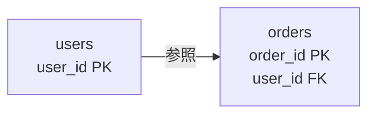

# 表とキー

`SELECT` で行を取る前に、表が「何を一意に指し、何を別表と結ぶか」を決めます。  
キーと制約が弱いと、存在しない利用者への注文や、同じ注文番号の二重登録が混ざります。

## このページで分かること

- よく使う列の型（PostgreSQL）
- 主キー・外部キー・`NOT NULL`
- 表を分けるときの基本的な考え方

## 列には型がある

各列は、入る値の種類（型）を持ちます。  
PostgreSQL で最初に触ることが多い型です。

| 型            | 向くもの                     | 例           |
| ------------- | ---------------------------- | ------------ |
| `BIGINT`      | 大きめの整数 ID              | `order_id`   |
| `INTEGER`     | 件数や金額（整数で持つ場合） | `amount`     |
| `TEXT`        | 長さが可変な文字列           | `user_name`  |
| `BOOLEAN`     | 真偽                         | `is_active`  |
| `TIMESTAMPTZ` | タイムゾーン付き日時         | `ordered_at` |
| `NUMERIC`     | 小数が必要な金額など         | `unit_price` |

金額を `REAL` / `DOUBLE PRECISION` で持つと、小数の誤差が業務上つらいことがあります。  
小数が必要なら `NUMERIC`、整数（円）だけでよいなら `INTEGER` / `BIGINT` を検討します。

<details>
<summary>VARCHAR と TEXT</summary>

PostgreSQL では `TEXT` と長さ制限なしの `VARCHAR` は実質同じ扱いに近いです。  
長さ制限が業務ルールなら `VARCHAR(n)` や `CHECK` で明示します。  
「とりあえず短く」で極端に小さい `VARCHAR` にすると、後から詰まります。

</details>

## 主キー（PRIMARY KEY）

**主キー** は、表の中で行を一意に指す列（または列の組み合わせ）です。  
注文なら `order_id`、利用者なら `user_id` が典型です。

```sql
CREATE TABLE users (
  user_id   BIGINT PRIMARY KEY,
  user_name TEXT NOT NULL
);
```

主キーがあると次がうれしいです。

- 同じ ID の行を二重に作れない（一意制約）
- ほかの表から「どの利用者か」を指し示せる

自然な意味のコード（メールアドレスなど）を主キーにすると、変更時に関連表まで巻き込みやすいです。  
業務で使う表示用コードと、内部の安定した ID を分けることも多いです。

## 外部キー（FOREIGN KEY）

**外部キー** は、「別の表の主キーを参照する」列です。  
注文の `user_id` は、必ず `users.user_id` に存在する、という約束にできます。

```sql
CREATE TABLE orders (
  order_id BIGINT PRIMARY KEY,
  user_id  BIGINT NOT NULL REFERENCES users (user_id),
  amount   INTEGER NOT NULL,
  status   TEXT NOT NULL
);
```

`REFERENCES users (user_id)` が外部キーです。  
存在しない `user_id` で注文を入れると、エラーになります。

```text
ERROR:  insert or update on table "orders" violates foreign key constraint ...
```

壊れた参照を DB が拒否してくれるので、アプリだけのチェックより漏れにくいです。



## NULL と NOT NULL

**NULL** は「値がない・未知」を表します。  
`0` や空文字 `''` とは別物です。

`NOT NULL` を付けると、その列を空のままにできません。  
注文金額のように「必ず入っていてほしい」列には付けます。  
まだ決まっていない配送日など、本当に未設定があり得る列だけ NULL を許します。

:::tip[NULL は比較に注意]

`WHERE status = NULL` では意図どおり拾えません。  
「NULL かどうか」は `IS NULL` / `IS NOT NULL` を使います。

:::

## 表を分ける目安

次のような情報は、別表に分けることが多いです。

- 利用者（氏名・メール）と注文（金額・状態）のように、寿命や更新タイミングが違う
- 1 人の利用者が複数の注文を持つ、のように **1 対多** になる

分けた表は、外部キーでつなぎます。  
逆に、注文 1 件に必ず 1 つだけ付く単純な属性は、同じ表の列に置く方が追いやすいこともあります。  
正規化の細かい段階は、まずは「重複して壊れやすいデータをコピーしない」を優先してください。

<details>
<summary>UNIQUE と CHECK</summary>

- `UNIQUE` … 主キー以外でも一意にしたい列（例: ログイン用メール）
- `CHECK` … 値の範囲や許可リスト（例: `amount >= 0`、`status IN (...)`）

```sql
CREATE TABLE users (
  user_id    BIGINT PRIMARY KEY,
  email      TEXT NOT NULL UNIQUE,
  user_name  TEXT NOT NULL,
  CONSTRAINT users_email_not_blank CHECK (email <> '')
);
```

制約名を付けておくと、エラーメッセージから原因を追いやすくなります。

</details>

<QuizChoice
title="キーの役割"
options={[
{ id: 'a', label: '主キーは行を一意に指し、外部キーは別表の行を参照する' },
{ id: 'b', label: '外部キーは同じ表の中だけで一意になればよく、別表は参照しない' },
{ id: 'c', label: 'NULL と 0 はデータベース上いつも同じ値である' },
]}
answer="a"
explanation="主キーは行の一意な識別、外部キーは他表参照です。NULL は 0 や空文字とは別です。"

>

  <div>主キーと外部キーの説明として、正しいものはどれですか。</div>
</QuizChoice>

## よくあるつまずき

- 表示用の名前やメールだけを頼りに結合し、改名や重複で行がずれる
- すべての列を `TEXT` にし、金額や日時の比較・集計で困る
- 外部キーを付けず、アプリだけで整合性を守り切れなくなる

## まとめ

- 列には型があり、用途に合わせて選ぶ
- 主キーで行を一意に指し、外部キーで表同士の参照を守る
- `NOT NULL` と制約で、入れてはいけないデータを拒否できる

次は [SELECT の基本](./select-basics) で、条件を付けて行を取り出します。
