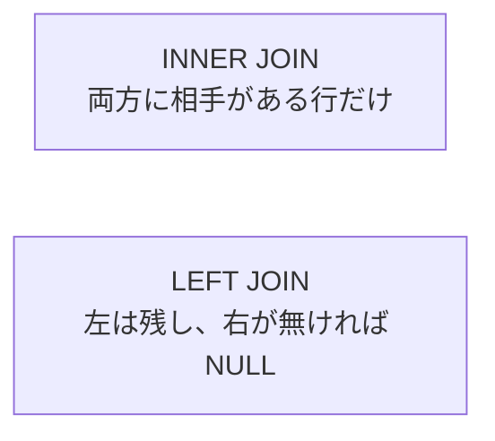

# JOIN

注文一覧に利用者名を出したいとき、注文表だけ見ても名前はありません。  
**JOIN** は、キーで結んだ別の表の列を、同じ結果セットに載せるための書き方です。

## このページで分かること

- `INNER JOIN` と `LEFT JOIN` の違い
- 結合条件を `ON` に書く理由
- 結合で行が増えるときの注意

## なぜ結合が必要か

サンプルでは、注文は `orders`、名前は `users` にあります。

```sql
SELECT o.order_id,
       u.user_name,
       o.amount
  FROM orders AS o
  INNER JOIN users AS u
    ON o.user_id = u.user_id
 ORDER BY o.order_id;
```

例:

```text
 order_id | user_name | amount
----------+-----------+--------
     1001 | hana      |   3980
     1002 | ken       |   1200
     1003 | hana      |    540
(3 rows)
```

`ON o.user_id = u.user_id` が「どの行どうしを対応させるか」です。  
アプリ側で注文を取ってから、件数分ユーザーを取りに行くやり方（N+1）と比べ、必要な関係を 1 回の問い合わせにまとめられるのがうれしい点です。

## INNER JOIN

**INNER JOIN** は、結合条件に合う組み合わせだけを残します。  
片方にしか無い行は結果に出ません。

```sql
SELECT o.order_id, u.user_name
  FROM orders AS o
  INNER JOIN users AS u
    ON o.user_id = u.user_id;
```

利用者に紐づかない注文（外部キーが守られていれば通常は起きにくい）や、注文の無い利用者は、この結果には現れません。

## LEFT JOIN

**LEFT JOIN**（`LEFT OUTER JOIN`）は、左側の表の行を基準に残します。  
右側に相手が無ければ、右側の列は NULL になります。

```sql
SELECT u.user_id,
       u.user_name,
       o.order_id
  FROM users AS u
  LEFT JOIN orders AS o
    ON u.user_id = o.user_id
 ORDER BY u.user_id, o.order_id;
```

「全利用者と、あればその注文」を一覧したいときに使います。  
注文が無い利用者も、`order_id` が NULL の行として残ります。



:::tip[どっちを使うか]

「対応が無い行は不要」→ `INNER JOIN`  
「左側は必ず残したい」→ `LEFT JOIN`

先に「残したい側はどちらか」を決めると選びやすいです。

:::

## 結合条件は ON に書く

次の 2 つは意味が違います。

```sql
-- 結合の相手を決める（こちらが基本）
FROM orders AS o
INNER JOIN users AS u
  ON o.user_id = u.user_id
WHERE o.status = 'paid';

-- WHERE に結合条件を書く書き方もあるが、LEFT JOIN では意味が壊れやすい
```

`LEFT JOIN` のあとに `WHERE right.col = ...` と書くと、右側が NULL の行が落ちて、結果的に `INNER JOIN` に近づくことがあります。  
絞り込みの意図（結合か、結合後のフィルタか）を分けて書きましょう。

<details>
<summary>同じ表を 2 回結合する</summary>

「注文した人」と「承認した人」のように、同じ `users` を役割違いでつなぐこともあります。  
別名を必ず付けます。

```sql
SELECT o.order_id,
       buyer.user_name AS buyer_name,
       approver.user_name AS approver_name
  FROM orders AS o
  INNER JOIN users AS buyer
    ON o.user_id = buyer.user_id
  LEFT JOIN users AS approver
    ON o.approver_id = approver.user_id;
```

（`approver_id` 列がある表の例です。）

</details>

## 行が増えるパターン

1 対多の関係を結合すると、左側 1 行が右側の件数分に増えます。  
利用者 1 人に注文が 3 件あれば、結果は 3 行です。  
集計と混ぜるときに「人数なのに注文数だけ増えている」ことがよくあります。  
まずは結果の件数を見て、想定の粒度（注文単位か利用者単位か）と合っているか確認します。

<QuizChoice
title="INNER と LEFT"
options={[
{ id: 'a', label: 'INNER JOIN は左の行を必ず残し、相手が無ければ右は NULL になる' },
{ id: 'b', label: 'LEFT JOIN は左の行を残し、相手が無ければ右の列は NULL になる' },
{ id: 'c', label: 'JOIN では ON を書かず、いつも直積ですべての組み合わせを返す' },
]}
answer="b"
explanation="LEFT JOIN は左側基準で残し、相手が無ければ右側は NULL です。INNER は双方に相手がある行だけです。"

>

  <div>結合の説明として正しいものはどれですか。</div>
</QuizChoice>

## よくあるつまずき

- `ON` を忘れ、想定より遥かに多い行（直積に近い結果）になる
- `LEFT JOIN` のあとに右表条件を `WHERE` へ書き、NULL 行まで落としてしまう
- 多対多を中間表なしで無理に結合し、意図しない重複が出る

## まとめ

- JOIN はキーで結んだ別表の列を同じ結果に載せる
- `INNER JOIN` は互いにある行だけ、`LEFT JOIN` は左を残す
- 結合後の件数と粒度（誰の 1 行か）を必ず確認する

次は [集計と GROUP BY](./aggregate-and-group) で、件数や合計をまとめます。
