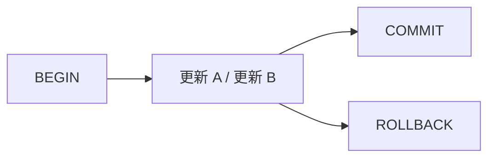

# トランザクション

在庫を減らしたあと決済が失敗し、在庫だけ減ったまま残る——。  
複数の更新を **まとめて成功させるか、まとめて取り消すか** を扱うのがトランザクションです。

## このページで分かること

- `BEGIN` / `COMMIT` / `ROLLBACK` の意味
- トランザクションが守るもの（ACID の実務的な読み方）
- アプリから使うときの境界の置き方

## まとめて確定する

PostgreSQL では、次のように囲みます。

```sql
BEGIN;

UPDATE orders
   SET status = 'paid'
 WHERE order_id = 1001;

UPDATE orders
   SET status = 'reserved'
 WHERE order_id = 1002;

COMMIT;
```

- `BEGIN` … トランザクション開始
- `COMMIT` … ここまでの変更を確定
- `ROLLBACK` … ここまでの変更を破棄

`COMMIT` 前に失敗したり、明示的に `ROLLBACK` したりすると、両方の `UPDATE` がなかったことになります。  
在庫更新と注文確定のように、片方だけ残る中途半端を避けられます。



:::tip[対話での確認]

`psql` で試すときは、わざと途中で `ROLLBACK` し、`SELECT` で値が戻ることを見ると腹落ちしやすいです。

:::

## オートコミットとの関係

多くのクライアントは、文ごとに自動で確定する **オートコミット** が有効です。  
`BEGIN` なしで `UPDATE` すると、その文が成功した時点で確定します。  
複数文を一体にしたいときだけ、明示的にトランザクションを張ります。

アプリでは、フレームワークが「メソッド単位でトランザクション」を張ることも多いです。  
その場合も、DB 側では同じ `BEGIN`〜`COMMIT` の考え方です。  
Java では [JDBC の基礎](../../languages/java/basics/jdbc-basics) で接続上の `commit` / `rollback` を扱います。

## ACID を現場の言葉で

教科書の ACID を、実務で効く言い方に落とします。

| 特性                  | 現場での意味の例                                       |
| --------------------- | ------------------------------------------------------ |
| Atomicity（原子性）   | まとめた更新は、全部成功か全部取り消し                 |
| Consistency（一貫性） | 制約（主キー・外部キーなど）を破る状態で確定しない     |
| Isolation（独立性）   | 同時に動く別処理から、未確定の中身が見え方を制御される |
| Durability（耐久性）  | `COMMIT` した内容は、障害後も残る前提で永続化される    |

分離レベル（どこまで他人の未確定を見るか）は製品と設定で差があります。  
最初は「同時更新がある画面では、読み取りと更新の順番・ロックを設計する」くらいを意識し、詳細は必要になったら掘ります。

<details>
<summary>長いトランザクションは避ける</summary>

`BEGIN` したまま画面入力を待つ、外部 API の応答を待つ、といった使い方は、ロックや接続の占有が長引きます。  
DB でまとめるべき更新だけを短く囲み、外側の待ち時間はトランザクションの外に出します。

</details>

## 失敗時の流れ

```sql
BEGIN;

UPDATE orders
   SET status = 'paid'
 WHERE order_id = 1001;

-- ここでエラーが起きたら
ROLLBACK;
```

`ROLLBACK` 後は、トランザクション内の変更は見えません。  
アプリでは例外を捕捉したらロールバックし、接続を閉じる／プールへ返す、が基本パターンです。

<QuizChoice
title="COMMIT と ROLLBACK"
options={[
{ id: 'a', label: 'ROLLBACK すると、COMMIT 済みの過去の変更もすべて消える' },
{ id: 'b', label: 'COMMIT はトランザクション内の変更を確定し、ROLLBACK は破棄する' },
{ id: 'c', label: 'BEGIN なしでも、複数の UPDATE は必ずまとめて取り消せる' },
]}
answer="b"
explanation="COMMIT で確定、ROLLBACK でそのトランザクションの変更を破棄します。すでに COMMIT したものは対象外です。"

>

  <div>次のうち正しいものはどれですか。</div>
</QuizChoice>

## よくあるつまずき

- 片方の更新だけ成功した状態を「アプリの再実行」で直し、かえって二重反映する
- トランザクションを張りっぱなしにして、ロック待ちや接続不足を起こす
- オートコミットのまま複数文を「まとまった処理」だと誤解する

## まとめ

- トランザクションは複数の更新をまとめて確定／取り消す単位である
- `BEGIN` / `COMMIT` / `ROLLBACK` で境界を明示できる
- 短く必要な更新だけを囲み、待ち時間の長い処理を中に入れない

次は [インデックスと実行計画](./indexes-and-explain) で、検索を速く保つ仕組みを見ます。
