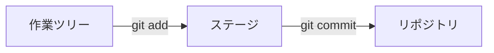
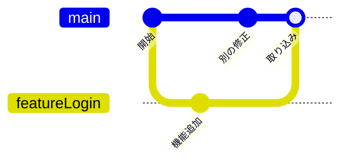

# Git の考え方

このページでは、コマンドを打つ前に「Git が何を覚えていて、何を覚えていないか」のイメージをつかみます。  
ここが分かると、あとから覚える操作の意味が一気につながります。

## なぜ先にイメージが必要か

Git は「ファイルをコピーして別名保存する」道具ではありません。  
**変更の履歴を、小さな記録（コミット）のつながりとして残す** 道具です。  
画面の見出しを直したつもりが、同じファイルを触っていた別の変更まで消えていた。  
保存したはずなのに、どのコピーが正なのか分からない。  
そんなとき、「正しいファイルを探す」より「どの時点に戻すか」を選べる方が、よほど気が楽です。  
例として、チームで `task-board` という小さな Web アプリを直している場面で考えます。  
見出しの文言だけ直したつもりが、隣の人が直したログイン処理まで巻き込まれて消える——。  
Git のイメージが頭にあると、こういう事故の「どこで食い違ったか」を追いやすくなります。

## リポジトリ（repository）

**リポジトリ** は、プロジェクトのファイルと、その変更履歴をまとめて置いておく場所です。  
多くの場合、プロジェクトフォルダの中に `.git` という隠しディレクトリができ、そこに履歴データが入ります。  
うれしい点は次です。

- 履歴がプロジェクトと一緒に持ち運べる（USB や別 PC へコピーしても履歴が付いてくる）
- 「いまのフォルダの中身」と「Git が覚えている履歴」を見比べられる

`.git` フォルダを直接いじってはいけない理由

`.git` の中身は Git 専用のデータベースです。  
エクスプローラーで中のファイルを消したり書き換えたりすると、履歴が壊れることがあります。  
日常の操作は、このあと学ぶ `git` コマンドや GUI ツール経由で行いましょう。

## コミット（commit）

**コミット** は、「この時点のスナップショット（写真のような記録）」です。  
ただの保存ではなく、だいたい次の情報付きで残ります。

- 何が変わったか（差分）
- いつ・誰が記録したか
- 短い説明文（コミットメッセージ）

目的は「あとから辿れること」です。  
1 週間後の自分や、初めてそのリポジトリを見る同僚が、メッセージを読んで意図を推測できるようにします。  
良いメッセージの例:

- `見出しの文言を修正する`
- `ログイン失敗時のエラー表示を追加する`

弱いメッセージの例:

- `修正`
- `update`
- `一旦コミット`

「修正」だけだと、何の修正か履歴一覧では分かりません。

## 3 つの場所：作業ツリー・ステージ・リポジトリ

Git を使い始めると、次の 3 つを行ったり来たりします。

| 名前                                       | ざっくり言うと                           | 何がうれしいか                     |
| ------------------------------------------ | ---------------------------------------- | ---------------------------------- |
| **作業ツリー**（作業ディレクトリ）         | いまエディタで触っているファイル群       | 自由に試せる                       |
| **ステージ**（ステージングエリア / index） | 「次のコミットに入れたい変更」の仮置き場 | 関係ない変更を混ぜずに記録できる   |
| **リポジトリ**（コミット済み履歴）         | 正式に残した履歴                         | チームの共有や巻き戻しの土台になる |

:::tip[三段の流れ]

編集は作業ツリー、残したいものだけ `git add`、記録は `git commit`。  
この順番が、このあとの操作すべての土台になります。

:::

流れのイメージはこうです。

1. ファイルを編集する（作業ツリーが変わる）
2. 残したい変更だけをステージに乗せる（`git add`）
3. ステージの内容をコミットする（`git commit`）

なぜ「全部まとめて保存」よりステージがうれしいか

ステージがあるおかげで、「文言修正」と「実験用のメモ追加」を別コミットに分けられます。  
あとからレビューする人・問題を調べる人が助かります。

「保存」と「コミット」は何が違う？

エディタの保存は、自分のディスク上のファイルを更新するだけです。  
コミットは、その変更を履歴として Git に残す行為です。  
保存していない内容はコミットできません。  
逆に、保存していてもコミットしていなければ、Git の履歴には現れません。

## ブランチ（branch）は「作業の線」

**ブランチ** は、履歴の分岐です。  
「本線を止めずに、別ラインで作業する」ための仕組みです。  
よくある本線の名前は `main`（昔は `master` も多かった）です。  
機能追加は `feature/login-message` のようなブランチで進め、問題なければ本線へ取り込みます。

まず、次の図を見ながら「線がどう分かれて、どう戻るか」だけ追ってみてください。

図の `featureLogin` は、実作業でよく使う `feature/login-message` のような作業ブランチのイメージです。

### この図の読み方

ここでの例で GitGraph は、左から右へ時間が進みます。  
上の行が本線（ここでは `main`）、下に分岐した行が作業用ブランチです。

1. **開始** … まだ 1 本の線。ここまではみんな同じ履歴です。  
2. **作業ブランチが分かれる** … 本線を止めずに、別ラインで作業を始めるイメージです。  
3. **機能追加** … その作業用の線の上にだけ、新しいコミットが載ります。本線はまだ動いていません。  
4. **別の修正** … 視点が本線に戻ると、本線側にも別のコミットが乗れます。同じ時期に 2 本の線が進める、ということです。  
5. **取り込み** … 作業用の線の内容を本線へ合流させます。

:::tip[つまずきやすいポイント]

次のコミットがどの線に載るかは、「いまどのブランチにいるか」で決まります。  
図の中では `checkout`、実作業では `git switch` がその切り替えです。

:::

表示の向きについて

ツールによっては、GitGraph が縦向き（下から上へ時間が進む）に見えることもあります。  
どちらでも、「線が分かれて、あとで合流する」こと自体は同じです。

解決できる課題の例:

- 本番向けの安定版を守りつつ、新機能を試したい
- 複数人が同時に別の作業を進めたい

ブランチの操作手順は [ブランチ](./branch) で扱います。  
ここでは「線を分けられる」ことだけ押さえてください。

## リモート（remote）は「共有用の控え」

自分の PC 上のリポジトリは **ローカル** です。  
GitHub など、ネット上にある共有リポジトリは **リモート** と呼びます。  
役割分担のイメージ:

- ローカル … 自分の作業机。試し書きや細かいコミットがしやすい
- リモート … チームの共有キャビネット。バックアップにもなる

Git 自体は GitHub 専用ではありません。  
ただし実務では GitHub（や GitLab などの類似サービス）とセットで使うことが多いです。  
リモート操作は [リモートと GitHub](./remote) へ進んでください。

## 用語のミニ辞典（この章で使うもの）

用語一覧を開く

| 用語 | 平易な言い方 |
| --- | --- |
| リポジトリ | 履歴付きのプロジェクト置き場 |
| コミット | 履歴に残す 1 回分の記録 |
| ステージ | 次のコミット候補の仮置き |
| ブランチ | 作業用に分けた履歴の線 |
| リモート | ネット上などの共有リポジトリ |
| クローン | リモートをローカルへ丸ごと複製すること |
| プッシュ | ローカルのコミットをリモートへ送ること |
| プル | リモートの更新をローカルへ取り込むこと |

## まとめ

- Git は「最終版ファイルを増やす」代わりに、**変更の履歴** を残す
- 作業ツリー → ステージ → コミット、の三段が基本
- ブランチで本線を守り、リモートでチームと共有する

次は手を動かします。  
[最初のコミットまで](./setup-and-first-commit) へ進みましょう。
