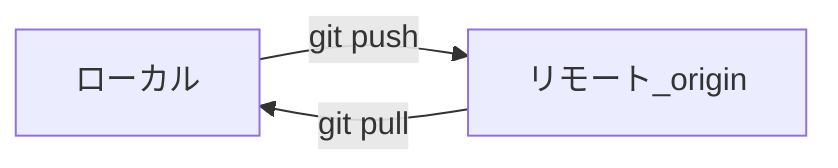

# リモートと GitHub

このページでは、ローカルの Git リポジトリを **リモート**（共有先）とつなぎ、送受信する基本を扱います。  
例として広く使われている [GitHub](https://github.com/) を使います。  
Git 自体は GitHub 専用ではありませんが、実務の入口として十分です。  
[ブランチ](./branch) までの操作ができる前提です。

## このページで分かること

- リモートが解決する課題（共有・バックアップ・レビュー）
- `clone` / `remote` / `push` / `pull` の役割
- Pull Request（プルリクエスト）の考え方の入口
- Squash and merge の利点・向き不向きと、分からないまま使わないこと

## なぜリモートが必要か

ローカルだけの Git でも履歴は残せます。  
ただし、PC が止まった瞬間に作業が消える、同僚が同じ履歴を持てない、「この変更、入れてよいか」をレビューする場がない、といった弱さは残ります。  
「手元では動いている」だけでは不十分で、共有できて初めてチームの成果です。

:::tip[リモートの役割]

リモートは、ネット上（や社内サーバ上）にある共有の控えです。  
目的は **チームの単一の正** を置き、レビューや CI などの仕組みにつなげることです。

:::



## 用語の整理

| 用語              | 意味                                                        |
| ----------------- | ----------------------------------------------------------- |
| リモート          | 共有先リポジトリ。よくある名前は `origin`                   |
| `git clone`       | リモートをローカルへ複製して作業を始める                    |
| `git push`        | ローカルのコミットをリモートへ送る                          |
| `git pull`        | リモートの更新をローカルへ取り込む                          |
| Pull Request (PR) | 「このブランチを本線へ取り込んで」と頼む仕組み（GitHub 上） |

## はじめ方は大きく 2 つ

### A. すでに GitHub 上にリポジトリがある

すでに共有されているリポジトリを、手元へ複製して作業を始めるパターンです。

```bash
git clone https://github.com/example/task-board.git
cd task-board
```

例:

```text
Cloning into 'task-board'...
remote: Enumerating objects: 42, done.
Receiving objects: 100% (42/42), done.
```

`Cloning into 'task-board'...` は、その名前のフォルダを作って複製している、という意味です。  
途中のパーセント表示は取得の進捗です。  
これでローカルに複製され、多くの場合リモート名 `origin` が最初から設定されています。

```bash
git remote -v
```

例:

```text
origin  https://github.com/example/task-board.git (fetch)
origin  https://github.com/example/task-board.git (push)
```

`origin` が共有先のニックネーム、右が URL です。  
`(fetch)` は取得用、`(push)` は送信用の設定行です。

### B. 手元のリポジトリを GitHub へ載せたい

[最初のコミット](./setup-and-first-commit) のように、手元で `git init` したあと、GitHub で空のリポジトリを作り、案内に従って `remote add` と `push` を行います。

```bash
git remote add origin https://github.com/example/task-board-notes.git
```

成功時は通常メッセージが出ません。  
`git remote -v` で `origin` が見えれば追加できています。

```bash
git push -u origin main
```

例:

```text
Enumerating objects: 3, done.
Writing objects: 100% (3/3), done.
To https://github.com/example/task-board-notes.git
 * [new branch]      main -> main
branch 'main' set up to track 'origin/main'.
```

読み方のポイント:

- `main -> main` … ローカルの `main` をリモートの `main` として送った
- `set up to track` … 以降、このブランチの送受信先を覚えた（`-u` の効果）

- `remote add origin ...` … 共有先に `origin` という名前を付ける
- `push -u origin main` … `main` を送り、以降の追跡関係も覚える

URL やデフォルトブランチ名は、GitHub の画面表示に合わせてください。  
認証（ログイン）は、パスワード直書きではなく、トークンや SSH など GitHub が推奨する方法を使います。  
画面の案内に従いましょう。

<details>
<summary>HTTPS と SSH の違い（ざっくり）</summary>

- **HTTPS** … URL が `https://github.com/...`。トークン等で認証することが多い
- **SSH** … URL が `git@github.com:...`。事前に鍵を登録する

どちらでも Git の考え方は同じです。  
チームの主流に合わせるのが早いです。

</details>

## 日々の送受信

自分の作業ブランチでコミットしたあと:

```bash
git push -u origin feature/heading-copy
```

例:

```text
* [new branch]      feature/heading-copy -> feature/heading-copy
branch 'feature/heading-copy' set up to track 'origin/feature/heading-copy'.
```

新しいリモートブランチが作られ、追跡設定が付いた、という意味です。  
初回に `-u` を付けておくと、以後そのブランチでは `git push` / `git pull` が楽になります。

他の人の更新を取り込むとき（本線の例）:

```bash
git switch main
git pull
```

例:

```text
Updating a1b2c3d..8c7b6a5
Fast-forward
 README.md | 1 +
 1 file changed, 1 insertion(+)
```

`pull` は、リモートの新しいコミットを取得して、いまのブランチへ取り込む操作です。  
`Fast-forward` などは [ブランチ](./branch) のマージと同じ見方で大丈夫です。  
作業開始前に `main` を最新にしておくと、あとでコンフリクトしにくいです。

## Pull Request でレビューしてもらう

GitHub では、ブランチを push したあと **Pull Request** を開けます。  
これは「`feature/...` の内容を `main` へ取り込んでほしい」と依頼し、差分をレビューしてもらうための仕組みです。

:::tip[PR で覚えること]

ブランチを push したあと、本線へ入れる前にレビューの箱を作る。  
作り方の細部は GitHub の UI が案内してくれます。

:::

うれしい点:

- マージ前に指摘をもらえる
- 変更の意図を文章で残せる
- 自動テスト（CI）を走らせるきっかけにできる現場が多い

<details>
<summary>直接 main に push する運用もある？</summary>

小さな個人リポジトリでは `main` へ直接 push することもあります。  
チーム開発では、`main` を保護して PR 必須にする運用が一般的です。  
参加したリポジトリのルールに従ってください。

</details>

## Squash and merge を使うとき

GitHub の Pull Request では、本線へ取り込む方法を選べることがあります。  
そのひとつが **Squash and merge**（スカッシュしてマージ）です。

ざっくり言うと、作業ブランチ上の複数コミットを **1 つのコミットにまとめて** 本線へ入れるやり方です。  
チームによっては、本線をきれいに保つ目的で標準にしていることもあります。

<details>
<summary>うれしい点・向き不向き</summary>

うれしい点:

- 本線の履歴が短く、読みやすくなりやすい
- 「試行錯誤の途中コミット」が本線に残りにくい
- あとから本線を見たときに、「何の変更だったか」が 1 メッセージで追いやすいことが多い

向いている例:

- 作業ブランチに「直した」「また直した」など、細かいコミットが多い
- 本線には「機能追加のまとまり」として 1 コミット残したい
- チームのルールで Squash and merge が指定されている

向いていない・慎重にした方がよい例:

- 作業ブランチの **個々のコミット自体を履歴として残したい** とき
- あとから「どのコミットで壊れたか」を本線上で細かく追いたいとき
- すでに共有している作業ブランチを、取り込み後も同じ履歴のまま使い続けたいとき

</details>

:::warning[分からないまま選ばない]

Squash and merge のあと、手元の作業ブランチと本線の履歴は一致しなくなります。  
「きれいに見える」ことと「細かく追える」ことはトレードオフです。  
仕組みが腹落ちしていないなら無理に選ばず、チームの既定の取り込み方に従いましょう。

:::

<details>
<summary>なぜ履歴が食い違うのか</summary>

本線に残るのが 1 コミットになるため、作業中に分けておいたコミット単位の説明は本線側では見えなくなります。  
「まだ作業ブランチがあるから」とそのまま `push` や追加作業を続けると、差分が噛み合わず、意図しないコンフリクトや force push の誘惑につながることがあります。  
自分で選ぶ立場なら、まずは通常の merge（履歴を残す取り込み）の意味を押さえてからでも遅くありません。

</details>

### 取り込み後は、マージ元ブランチを使い続けない

Squash and merge したあとは、**マージに使った作業ブランチをそのまま使い続けない**でください。  
本線に入ったのは「まとめた新しい 1 コミット」であり、作業ブランチ上のコミット列そのものではないからです。

追加の作業が必要なら、次のように切り直します。

1. 最新の本線を取り込む（例: `main` で `git pull`）
2. 本線から新しい作業ブランチを作る
3. そこで続きの変更をする

使い終わった作業ブランチは、チームの運用に合わせて削除して構いません。  
「同じブランチ名で続けたい」場合も、削除してから本線起点で同名を作り直す、または別名で作り直す方が安全です。

## やってはいけないことの例

- 秘密情報（API キー、パスワード、トークン）をコミットして push する  
  → 履歴に残ると、消したつもりでも残存することがあります。最初から `.gitignore` で避け、漏れたらすぐにキーを失効させる
- 分からないまま `git push --force` する  
  → リモートの履歴を上書きし、他の人の作業を巻き込んで消すことがあります。[戻り方](./recovery) も参照

## よくあるつまずき

| 症状                               | よくある原因                           | 方向性                                    |
| ---------------------------------- | -------------------------------------- | ----------------------------------------- |
| `rejected` で push できない        | リモートに自分の知らないコミットがある | まず `pull`（または指示された取り込み方） |
| 認証エラー                         | トークン期限切れ・権限不足             | GitHub の認証設定を見直す                 |
| どのブランチを push しているか不安 | ブランチ取り違え                       | `git status` / `git branch` で確認        |

## まとめ

- リモートは共有とバックアップとレビューの土台
- 入口は `clone`、日々は `push` / `pull`
- チームでは PR で本線へ入れる流れが多い
- Squash and merge は本線を整理しやすいが、履歴の形が変わる。分からなければ無理に使わない
- Squash and merge のあとはマージ元ブランチを使い続けず、必要なら本線から切り直す

最後に、失敗したときの安全な戻り方です。  
[つまずいたときの戻り方](./recovery) へ進みましょう。
