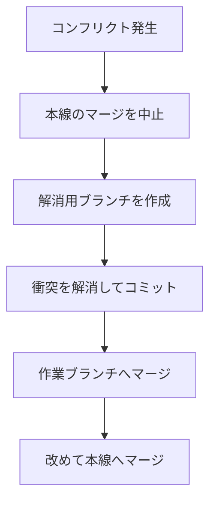

# ブランチ

このページでは、本線（多くの場合 `main`）を守りながら作業するための **ブランチ** を使います。  
[日常の操作](./daily-commands) でコミットの感覚がついている前提です。

## このページで分かること

- ブランチが解決する課題
- 作成・切り替え・取り込み（マージ）の基本
- コンフリクトを、解消用ブランチ経由で履歴を追いやすく直す流れ
- まだ触れない方がよい危険な操作の境界

## なぜブランチがうれしいか

動いていた画面を、試している途中の変更で壊したまま共有してしまった。  
急ぎの修正と、まだレビュー前の作業が同じ線に乗って、どれを戻していいか分からなくなった。  
本線で直接いじっていると、こういう困りごとは意外とすぐ起きます。  
ブランチを分けると、「安定していてほしい線」と「作業中の線」を同時に持てます。  
課題は **並行作業と安全性** です。  
目的は、チームが同じリポジトリで安心して進むことです。

## いまいる場所を確認する

```bash
git branch
```

例:

```text
* main
```

`*` が付いている行が、いまいるブランチです。  
多くの新規リポジトリでは最初から `main`（または `master`）にいます。

```bash
git status
```

先頭付近に `On branch main` のように表示されることも多いです（読み方は [最初のコミットまで](./setup-and-first-commit)）。

## 作業用ブランチを作って移る

例: 見出し文言を直す作業。

```bash
git switch -c feature/heading-copy
```

例:

```text
Switched to a new branch 'feature/heading-copy'
```

新しいブランチを作って、そのブランチへ移った、という意味です。

- `switch` … ブランチを切り替える
- `-c` … 新しいブランチを作って移る

古い Git では `git checkout -b feature/heading-copy` も同じ用途で使われます。  
社内や教材で `checkout` が出てきても、「ブランチ移動・作成に使っていた」と読み替えてください。

<details>
<summary>ブランチ名のつけ方</summary>

現場ごとにルールがあります。  
よく見るのは次のような形です。

- `feature/ログインメッセージ`
- `fix/日付表示のずれ`
- `chore/gitignore更新`

英数字とハイフンに揃えるルールのチームも多いです。  
まずはチームの既存ブランチ名を真似るのが安全です。

</details>

## ブランチ上でコミットする

いつもどおり編集してコミットします。

```bash
git add README.md
git commit -m "見出しの説明文を分かりやすくする"
```

このコミットは、いまいる `feature/heading-copy` 上に積み上がります。  
`main` にはまだ入りません。

## 本線へ取り込む（マージ）

作業が一段落したら、本線に戻って取り込みます。

```bash
git switch main
git merge feature/heading-copy
```

`git switch main` の例:

```text
Switched to branch 'main'
```

衝突がないときの `git merge` の例:

```text
Updating a1b2c3d..4e5f6a7
Fast-forward
 README.md | 2 +-
 1 file changed, 1 insertion(+), 1 deletion(-)
```

`Fast-forward` は、本線を前に進めるだけで取り込めた、という意味です。  
履歴の分岐が複雑なときは別の表示になることもありますが、「取り込まれた」こと自体は同じです。

`merge` は、「指定したブランチの変更を、いまいるブランチへ取り込む」操作です。  
うまくいくと、`main` にも見出し修正のコミットが反映されます。

## コンフリクト（衝突）が起きたら

別々のブランチで、同じファイルの同じあたりを違う内容に変えていると、Git が自動ではまとめられず **コンフリクト** になります。  
コンフリクトは「壊れた」状態ではないのであわてる必要はありません。  
Git が「どちらを残すべきか」を判断できず、「人の判断が必要」だと確認依頼出している状態です。

ここで作業ブランチや本線の上でそのままコンフリクトを直してしまうと、あとから見る時に困ります。  
機能の変更なのか、衝突をほどくための修正なのかが、履歴上で混ざって追いづらくなるからです。

この教材では、次の流れを基本にします。



1. コンフリクト解消用のブランチを作る
2. そこで衝突を解消してコミットする
3. その結果を作業ブランチへマージする
4. 改めて本線へマージする

### 手順の例

いま `feature/heading-copy` を `main` へ入れようとして衝突した、とします。  
本線上で解消を続けず、いったん作業ブランチ側へ戻ります。  
すでに `main` 上でマージを始めている場合は、先に中止します。

```bash
git merge --abort
```

例:

```text
fatal: There is no merge to abort (MERGE_HEAD missing).
```

すでに中止済み・マージ中でないときは、このような表示になることがあります。  
マージの途中であれば、作業ツリーがマージ開始前の状態に戻ります。

作業ブランチから、解消専用のブランチを切ります。

```bash
git switch feature/heading-copy
git switch -c resolve/heading-copy-with-main
```

解消用ブランチで本線を取り込み、衝突を直します。

```bash
git merge main
```

衝突しているファイルを開き、残すべき内容に手で直します（衝突マーカーを消す）。  
直し終わったらステージしてコミットします。

```bash
git add .
git commit -m "main とのコンフリクトを解消する"
```

このコミットは「衝突をほどいた記録」として残ります。  
機能そのものの意図と分けて読めるのが、この手順の利点です。

次に、解消結果を作業ブランチへ戻します。

```bash
git switch feature/heading-copy
git merge resolve/heading-copy-with-main
```

最後に、改めて本線へ取り込みます。

```bash
git switch main
git merge feature/heading-copy
```

<details>
<summary>ブランチ名の例と、レビューしてもらうとき</summary>

解消用ブランチの名前は、現場のルールに合わせてください。  
例としては `resolve/作業ブランチ名-with-main` のように、「何と何をすり合わせたか」が分かる形が扱いやすいです。

共有リポジトリでは、解消用ブランチや作業ブランチを Pull Request 経由でレビューしてもらう運用もよくあります。  
「衝突をどう判断したか」を見てもらいやすいのも、解消を別ブランチに分けておく効果です。

</details>

## よく使う確認

```bash
git log --oneline --graph --decorate -n 15
```

線がどうつながったかを目で追えます。  
ブランチの理解は、ログのグラフを見ると一気に深まります。

## まだやらなくてよいこと（境界線）

次は強力ですが、履歴を書き換えるため事故りやすいです。  
このページの範囲外として、名前だけ知っておいてください。  
くわしくは [戻り方](./recovery) も参照。

- 共有済みブランチの履歴書き換え
- `push --force`（強制上書き）
- よく分からないままの rebase

「共有する前の自分だけの線」なら比較的安全な操作もありますが、**すでに GitHub 上で他の人が見ている線** では特に慎重に。

## ミニ演習

1. `main` から `feature/notes-typo` を作る
2. ファイルを直してコミットする
3. `main` に戻って `merge` する
4. `git log --oneline --graph` で取り込みを確認する

## まとめ

- ブランチは「本線を守りながら並行作業する」ための線
- `switch -c` で作り、作業後に `main` へ `merge`
- コンフリクトは、解消用ブランチで直してから作業ブランチへ戻し、改めて本線へ入れる
- こうすると「機能の変更」と「衝突をほどいた変更」を履歴で追いやすい

一人で完結する作業ならここまででも足ります。  
チームで共有するにはリモートが必要です。  
[リモートと GitHub](./remote) へ進みましょう。
