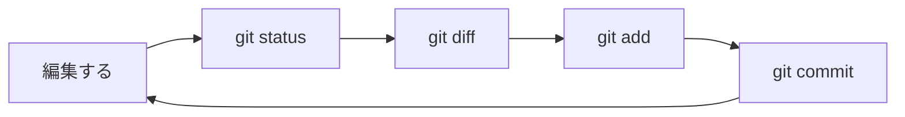

# 日常の操作

コミットはできた。  
でも次の日から、「何を残して、何を残さないか」で迷い始めます。  
デバッグ用の出力を消し忘れたまま残したり、関係ないファイルまでまとめて乗せたり。  
レビューで「この差分、意図したもの？」と聞かれて初めて気づく、というのもよくある話です。  
このページでは、すでにリポジトリがある前提で、毎日くり返す確認と記録の流れを身につけます。  
[最初のコミットまで](./setup-and-first-commit) が済んでいるとスムーズです。

## このページで分かること

- `status` / `diff` / `add` / `commit` / `log` の役割
- 「何をコミットに入れるか」を選ぶ感覚
- 無視したいファイル（`.gitignore`）の基本

## 基本ループ

実務の一日は、だいたい次のくり返しです。



1. コードや文書を直す
2. `git status` で何が変わったか見る
3. 必要なら `git diff` で中身の差分を見る
4. 残したいものだけ `git add`
5. `git commit` で意味のまとまりごとに記録する
6. `git log` で履歴を眺める（必要なとき）

目的は「たくさんコマンドを打つこと」ではなく、**あとから自分と仲間が追いやすい粒度で残すこと** です。

## いまの状態を見る：`git status`

`git status` の基本的な読み方は [最初のコミットまで](./setup-and-first-commit) で触れました。  
変更があるときの例も見ておきましょう。

```bash
git status
```

例:

```text
On branch main
Changes not staged for commit:
  (use "git add <file>..." to update what will be committed)
        modified:   README.md

Untracked files:
        notes.txt
```

読み方のポイント:

- `Changes not staged for commit` … 追跡中だが、まだステージしていない変更
- `modified:` … 既存ファイルが変わった
- `Untracked files` … まだ追跡していない新規ファイル

「いまコミットしていい状態か」を判断する健康診断だと思ってください。

## 差分を見る：`git diff`

作業ツリーと、最後のコミット（またはステージ）の違いを表示します。

```bash
# まだステージしていない変更
git diff
```

例:

```text
diff --git a/README.md b/README.md
index 1111111..2222222 100644
--- a/README.md
+++ b/README.md
@@ -1 +1,2 @@
 # task-board notes
+今日のメモを追記
```

読み方のポイント:

- `---` / `+++` … 比較している前後のファイル
- 行頭の `-` … 削除された行
- 行頭の `+` … 追加された行

ステージ済みの差分を見るときは次です。

```bash
git diff --staged
```

表示の見方は同じで、対象が「ステージに乗っている変更」になります。  
うれしい点は、「つもり」と「実際の差分」を照合できることです。  
デバッグ用の `console.log` や、消し忘れたテスト用コードが混ざっていないかを、コミット前に確認できます。

<details>
<summary>差分が長くて読めないとき</summary>

ファイル単位で見る、GUI の Diff ツールを使う、エディタの Git パネルを使う、などでも構いません。  
大事なのは「コミット前に一度は差分を見る習慣」です。  
表示手段は後から好みで選んで大丈夫です。

</details>

## ステージに乗せる：`git add`

```bash
git add README.md
git add src/app.js
```

まとめて乗せる例:

```bash
git add .
```

成功時は通常メッセージが出ません。  
乗ったかどうかは `git status` で確認します（[最初のコミットまで](./setup-and-first-commit)）。

`git add .` は便利ですが、**載せたくないものまで乗る** リスクがあります。  
秘密情報や生成物を誤って入れる事故は珍しくありません。  
次の `.gitignore` とセットで覚えてください。

### 一部だけ載せたいとき

大きなファイルの一部だけをステージする高度な方法もありますが、最初はファイル単位で分ける方が安全です。  
「文言修正」と「実験メモ」が同じファイルに混ざったら、いったん実験メモを消すか別ファイルに退避してから add する、でも十分です。

## 記録する：`git commit`

```bash
git commit -m "タスク一覧の空状態メッセージを分かりやすくする"
```

例（2 回目以降のコミット）:

```text
[main 9f8e7d6] タスク一覧の空状態メッセージを分かりやすくする
 1 file changed, 3 insertions(+), 1 deletion(-)
```

最初のコミットで見た `[ブランチ 短いID] メッセージ` と同じ読み方です。  
`insertions` / `deletion` は、追加行と削除行の目安です。

コミットの粒度の目安:

- **よい**: レビューする人が「ひとつの意図」として読める
- **粗い**: 「いろいろ直した」が 1 コミットに詰まりすぎ
- **細かすぎ**: 1 文字ごとにコミット（履歴が読みづらい）

最初は「チケットや作業メモの一文」くらいの大きさだと、あとで直しやすいです。

## 履歴を見る：`git log`

```bash
git log --oneline
```

例:

```text
9f8e7d6 タスク一覧の空状態メッセージを分かりやすくする
a1b2c3d 最初の README を追加する
```

上が新しく、下が古い並びです。  
ブランチの分かれを線で見たいときは、次も使います。

```bash
git log --oneline --graph --decorate -n 20
```

例:

```text
* 9f8e7d6 (HEAD -> main) タスク一覧の空状態メッセージを分かりやすくする
* a1b2c3d 最初の README を追加する
```

- `--oneline` … 1 行で見やすくする
- `--graph` … ブランチの分岐が線で見える
- `--decorate` … ブランチ名などの印が付く
- `-n 20` … 新しい方から 20 件
- `HEAD -> main` … いまの先端が `main` にある

問題調査のときは、「いつから壊れているか」を `log` と `diff` で狭めていくことが多いです。

## 無視リスト：`.gitignore`

ビルド成果物、依存パッケージ、OS のゴミファイル、ローカル設定などは、リポジトリに入れない方がよいことが多いです。  
無視したいパターンを `.gitignore` に書きます。  
例:

```gitignore
node_modules/
dist/
.env
.DS_Store
*.log
```

`.env` のように API キーや接続情報を置くファイルは、**絶対にコミットしない** 前提で扱う現場が多いです。  
サンプルが必要なら `.env.example` にダミー値だけを置く、などの運用にします。  
`.gitignore` 自体は通常コミットします（チームで無視ルールを共有するため）。

<details>
<summary>すでに追跡されているファイルは `.gitignore` に追加するだけでは外れない</summary>

一度コミットしたファイルは、あとから `.gitignore` に書いても追跡が続きます。  
外すには追跡解除が必要で、手順を誤ると消えたように見えることもあります。  
チームのリポジトリでやる前に、[戻り方](./recovery)とあわせて手順を確認してください。

</details>

## ミニ演習（手元で）

[最初のコミット](./setup-and-first-commit) で作ったリポジトリで試してください。

1. `README.md` に一行追記して保存する
2. `git status` → `git diff` を見る
3. `git add README.md` → `git commit -m "..."`
4. `git log --oneline` で 2 件以上並ぶことを確認する

ここで「確認してから残す」感覚がつかめれば十分です。

## よくあるつまずき

| 症状                           | よくある原因                 | 対処の方向                                                           |
| ------------------------------ | ---------------------------- | -------------------------------------------------------------------- |
| diff が何も出ない              | もうステージ済み / 変更なし  | `git diff --staged` も見る                                           |
| 関係ないファイルまで add した  | `git add .`                  | コミット前ならステージ解除（[戻り方](./recovery)）                   |
| コミットメッセージを間違えたい | まだ push していない直後など | 条件付きで直せますが、ルールが厳しいので [戻り方](./recovery) を参照 |

## まとめ

- 毎日の基本は `status` → `diff` → `add` → `commit`
- コミットは「意図の単位」で切る
- 秘密情報と生成物は `.gitignore` で守る

本線を汚さずに作業するための道具がブランチです。  
[ブランチ](./branch) へ進みましょう。
