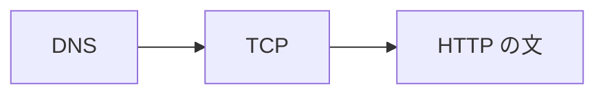

# HTTP の考え方

TCP の握手は終わっている。  
なのに画面は JSON の一部だけを出し、別の操作では「失敗」とだけ出る。  
届いたあとに、**何を頼み、何が返ったか** が揃っていないと、ネットワークの調査はここから先に進めません。

**HTTP**（Hypertext Transfer Protocol）は、Web と API の会話で使うアプリケーション層の約束です。  
このページでは、リクエストとレスポンス、ステートレス、TCP との役割分担を置きます。

## このページで分かること

- HTTP が TCP の上の会話であること
- リクエストとレスポンスの一往復
- ステートレスが意味すること
- この章で扱う範囲

## 届いたあとの言葉

[ネットワーク基礎](../network/) で見た旅のうち、HTTP が始まるのは次のあとです。

1. 名前が IP になる
2. そのホストのポート（多くは 443）へ TCP がつながる
3. HTTPS なら、その TCP の上で暗号化の準備が終わる（[HTTPS](./https)）

ここまで来て初めて、「GET で `/orders/42` をください」という **文** を送れます。  
文の前で止まっていれば、ステータスコードは存在しません。  
文のあとで止まっていれば、ステータスや本文があります。

:::tip[大きな分岐]

ステータスが無い失敗は、ネットワーク側の層を疑う。  
ステータスがある失敗は、この章の言葉で読む。

:::

## リクエストとレスポンス

HTTP は、クライアントが先に頼み、サーバが返事する形です。  
電話の「要件を言って、答えが返る」に近いです。  
サーバから突然本文が来る、という約束ではありません（その形が必要な処理は、別の仕組みになります）。

| 方向                  | 名前           | 中身のイメージ                           |
| --------------------- | -------------- | ---------------------------------------- |
| クライアント → サーバ | **リクエスト** | どの資源に、何をしたいか、付属情報       |
| サーバ → クライアント | **レスポンス** | 結果の番号（ステータス）、付属情報、本文 |

一回の操作は、原則としてこの一往復です。  
画面の「注文する」は、利用者からは一つのボタンでも、裏では一覧取得、在庫確認、作成、といった複数往復になっていることがあります。  
開発者は、画面のイベントと HTTP の往復を、ログで対応づけます。

たとえは窓口です。

- リクエスト … 伝票を出す（「この注文を見せて」「この注文を作って」）
- レスポンス … 受付番号と、渡す紙（JSON や HTML）

窓口が混んでいても、一枚の伝票ごとに返事が返る、という型が HTTP の基本です。

## ステートレス: 一往復では相手を覚えない

HTTP そのものは、前の往復をサーバが覚えていることを前提にしません。  
毎回のリクエストに、必要な情報を自分で載せます。

うれしい点は次です。

- サーバを増やしても、「さっき話した台」に戻らなくてよいことが多い
- 途中の負荷分散が、どの台へ振っても同じ処理を始められる

困る点は次です。

- 「ログインした人」を表すには、Cookie や Authorization ヘッダなど、**毎回載せる印** が要る
- 印が欠けると、サーバから見ると別人（未ログイン）になる

ログイン状態の設計は [ヘッダと本文](./headers-and-body) と、セキュリティの章へ続きます。  
ここでは「TCP の接続が残っていても、HTTP としては毎回が新規の依頼」と捉えてください。  
接続の使い回し（Keep-Alive）と、ログイン状態の記憶は、別の層の話です。

HTTP/1.1 と HTTP/2（いま知っておくこと）

HTTP/1.1 は、テキストに近い形でリクエストを並べます。  
HTTP/2 は、同じ意味の会話を効率よく運ぶ別の載せ方です。  
開発者がメソッドやステータスを読む仕事は、どちらでも同じです。  
ブラウザの開発者ツールに `h2` と出ても、壊れたわけではありません。

<QuizChoice
title="ステータスの有無"
options={[
{ id: 'a', label: 'connection timed out のときも、通常は HTTP ステータス 500 が付いている' },
{ id: 'b', label: 'TCP の前で失敗するとステータスは無く、HTTP として届いた失敗にはステータスがある' },
{ id: 'c', label: 'HTTP はサーバから先に本文を送る約束である' },
]}
answer="b"
explanation="ステータスは HTTP のレスポンスの一部です。接続自体が終わらないと番号は存在しません。HTTP はクライアント起点です。"

>

  
注文 API の失敗を見るときの説明として、適切なものはどれですか。

</QuizChoice>

## 何に使うか

業務システムで HTTP が担う典型です。

- ブラウザが HTML や CSS、スクリプトを取る
- 画面が JSON の API を呼ぶ
- サーバ同士が、注文や在庫の API を呼ぶ
- ヘルスチェックが、負荷分散から短い GET を受ける

同じ約束なので、切り分けの言葉も共通です。  
「フロントの問題」と「バッチの問題」に見えても、メソッド、URL、ステータス、ヘッダを並べると、同じ型で読めます。

扱わない（この章の外の）ものは次です。

- Java の DTO やレイヤ分け … [REST API と DTO](../../languages/java/applications/rest-and-dto)
- 各言語の HTTP クライアント実装 … 言語の章
- 認証プロトコルの詳細（OAuth など） … セキュリティ
- gRPC やメッセージング … 別の運び方。HTTP の代替ではなく、向きが違う

## よくあるつまずき

- ネットワーク断と HTTP の 500 を、同じ「通信エラー」にまとめる
- 画面の一操作を、必ず HTTP 一往復だと思い、ログの複数行と対応づけられない
- TCP が使い回されていることを、ログイン状態がサーバに記憶されていることと混同する

## まとめ / 次に学ぶとよいこと

- HTTP は、TCP（と HTTPS）のあとに始まるリクエスト／レスポンスの約束である
- クライアントが先に頼み、サーバがステータスと本文で返す
- 一往復では相手を覚えず、必要な印は毎回載せる

次は、宛先の書き方と、文の形です。  
[URL とメッセージ](./url-and-message) へ進みましょう。
