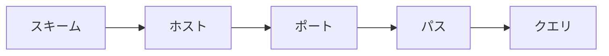

# URL とメッセージ

接続先を `https://shop.example.com/orders?status=OPEN` と書いたつもりが、アプリは 404 だけを返す。  
ホストは生きている。パスの一文字が違う。  
HTTP では、**どこへ何を書くか** が約束の一部なので、文字列の読み方が調査の入口になります。

このページでは URL の部品と、リクエスト／レスポンスのメッセージの形を扱います。  
メソッドの意味は次のページです。

## このページで分かること

- URL の部品（スキーム、ホスト、ポート、パス、クエリ）
- リクエスト行、ヘッダ、空行、本文の区切り
- レスポンスのステータス行
- よくある取り違え（フラグメント、エンコード、末尾のスラッシュ）

## URL は宛先の書き方

**URL**（Uniform Resource Locator）は、資源の場所を一行で書く形式です。  
ブラウザのアドレス欄も、アプリの設定も、同じ部品で読めます。

```text
https://shop.example.com:443/orders/42?status=OPEN
```

| 部品     | 例                 | 役割                                       |
| -------- | ------------------ | ------------------------------------------ |
| スキーム | `https`            | どの約束で話すか（HTTPS か、平文 HTTP か） |
| ホスト   | `shop.example.com` | どのコンピュータか（名前または IP）        |
| ポート   | `443`              | どの窓口か。省略時はスキームの既定         |
| パス     | `/orders/42`       | そのホストの中のどの資源か                 |
| クエリ   | `status=OPEN`      | 絞り込みなど、資源の追加パラメータ         |

`https` の既定ポートは 443、`http` は 80 です。  
書いていないときは、その既定が使われます。  
`:8080` のように書くと、開発用の窓口へ明示的に行きます。

**フラグメント**（`#section`）は、ブラウザがページ内の位置に使うことが多く、通常は **サーバへ送られません**。  
API の識別子を `#` の後ろに置くと、サーバ側には届かない、という事故になります。



パスは、ファイルパスに見えても、サーバが好きに解釈します。  
実ファイルが無くても、`/orders/42` を「42 番の注文」として返すのが API です。  
404 は「その解釈の結果、対象が無い」であり、「ディスクにファイルが無い」とは限りません。

:::tip[クエリに秘密を置かない]

パスワードやトークンはクエリに載せないでください。  
アクセスログ、ブラウザ履歴、紹介元ヘッダに残りやすいです。  
印は [ヘッダと本文](./headers-and-body) の側へ置きます。

:::

<QuizChoice
title="URL の部品"
options={[
{ id: 'a', label: 'フラグメント（# 以降）は、通常サーバへ送られるので API の ID に向く' },
{ id: 'b', label: 'スキームとホストとパスは別部品で、ホストが正しくてもパスが違えば別の資源になる' },
{ id: 'c', label: 'https の URL からポートを省略すると、常に 8080 が使われる' },
]}
answer="b"
explanation="404 の多くはホスト到達後のパス不一致です。https の既定ポートは 443、フラグメントはサーバへ行かないことが多いです。"

>

  <div>URL についての説明として、適切なものはどれですか。</div>
</QuizChoice>

## クエリとエンコード

クエリは `名前=値` を `&` でつなぎます。

```text
/orders?status=OPEN&page=2
```

値に空白や日本語、`&` 自身が入るときは、**パーセントエンコード** します。  
空白は `%20` や `+` になります。  
手で URL を連結すると、区切り文字が値に含まれた瞬間に壊れます。  
クライアントライブラリの `params` 相当に任せると、この事故が減ります。

<details>
<summary>パスの末尾スラッシュ</summary>

`/orders` と `/orders/` を別資源として扱うサーバがあります。  
一方を 301 で他方へ飛ばすサーバもあります。  
API を叩くときは、仕様書に書いてある方に合わせます。  
「どちらでも動くはず」で混ぜると、キャッシュや署名の計算がずれます。

</details>

## リクエストの形

TCP の上に流れる HTTP/1.1 のリクエストは、人間が読めるテキストに近いです。  
概念としては次の順です。

```text
GET /orders/42 HTTP/1.1
Host: shop.example.com
Accept: application/json

```

| 部分         | 役割                                               |
| ------------ | -------------------------------------------------- |
| リクエスト行 | メソッド、パス（とクエリ）、HTTP の版              |
| ヘッダ       | `名前: 値` の付属情報。`Host` はどのサイトかを示す |
| 空行         | 「付属情報はここまで」の区切り                     |
| 本文         | POST などで送る本体。GET では無いことが多い        |

`Host` は、同じ IP で複数サイトを受けているときに欠かせません。  
IP だけに `curl` して 404 になるのは、パスではなく Host ヘッダが原因のことがあります。

本文があるときも、空行のあとです。  
空行を入れ忘れる、`Content-Length` と本文のバイト数が食い違う、といった壊れ方は、自前で文字列を組み立てたときに出ます。  
日常はライブラリに任せ、壊れたときだけこの形を思い出してください。

## レスポンスの形

返事も同じ四段です。先頭がステータス行になります。

```text
HTTP/1.1 200 OK
Content-Type: application/json

{"id":"42","status":"OPEN"}
```

| 部分         | 役割                                |
| ------------ | ----------------------------------- |
| ステータス行 | 版、番号、短い理由句                |
| ヘッダ       | 本文の種類、キャッシュ、Cookie など |
| 空行         | 区切り                              |
| 本文         | JSON、HTML、空、など                |

番号の意味は [ステータスコード](./status-codes) です。  
ここでは「本文より先に、成功か失敗かの番号がある」と押さえてください。  
番号を見ずに本文だけを JSON として読むと、エラーページの HTML を注文データとして解析して落ちます。

<QuizChoice
title="メッセージの区切り"
options={[
{ id: 'a', label: 'ヘッダと本文のあいだには空行があり、本文の種類は Content-Type などで示される' },
{ id: 'b', label: 'GET リクエストでは、常に JSON の本文が必須である' },
{ id: 'c', label: 'Host ヘッダは、HTTPS のときだけ存在する' },
]}
answer="a"
explanation="空行がヘッダの終わりです。GET に本文は通常不要です。Host は HTTP/1.1 でどのサイトかを示す基本ヘッダです。"

>

  <div>HTTP メッセージについての説明として、適切なものはどれですか。</div>
</QuizChoice>

## よくあるつまずき

- ホストは正しく、パスやクエリだけが仕様と違う
- `#` 以降をサーバが見ていると思い込む
- クエリを手連結して、値が壊れる
- ステータスを見ずに本文を JSON として読む
- IP 直打ちで Host ヘッダが抜け、別サイトの 404 を見る

## まとめ / 次に学ぶとよいこと

- URL はスキーム、ホスト、ポート、パス、クエリに分解して読む
- フラグメントと秘密情報は、サーバへ届く／ログに残る経路を意識する
- リクエストもレスポンスも、行・ヘッダ・空行・本文の形である

次は、リクエスト行の先頭——何をしたいか——です。  
[メソッド](./methods) へ進みましょう。
