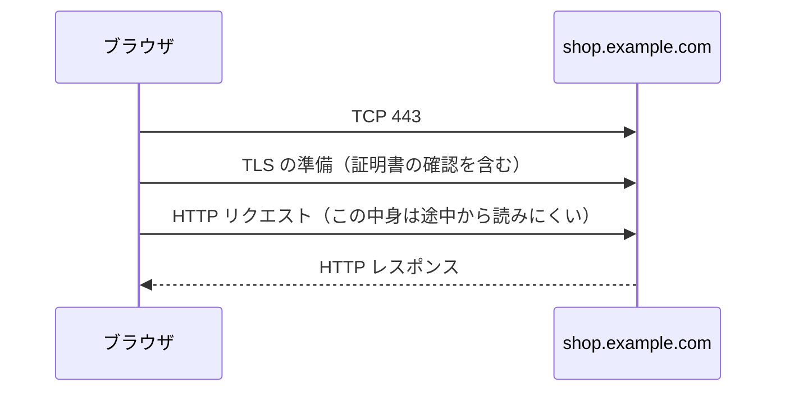

# HTTPS

オフィスの共用 Wi-Fi で、注文 API を `http://` のまま叩いていた。  
中身は JSON で、Authorization も載っていた。  
平文の HTTP は、途中の誰かが **文面を読める** 約束です。  
業務の会話をこれに載せない、というのが HTTPS の出発点です。

**HTTPS** は、HTTP の文を **TLS**（Transport Layer Security）で包んだ使い方です。  
メソッドやステータスの意味は同じです。変わるのは、途中経過の見え方と、証明書の確認です。

## このページで分かること

- TLS が守るもの（盗聴と、相手の取り違えの一部）
- 証明書とホスト名、期限
- 平文 HTTP と混合コンテンツ
- 負荷分散での終端

## 包んでから HTTP の文を話す

[ネットワークの旅](../network/from-browser) では、TCP のあとに HTTP が始まりました。  
HTTPS では、TCP のあとに **暗号化の準備** が入り、そのトンネルの中で HTTP の文を話します。



守られるのは、主に次です。

- **機密性**: 本文やヘッダを、経路の途中から平文で読みにくくする
- **完全性**: 途中で書き換えられたことに気づきやすくする
- **相手の確認**: 証明書のチェーンとホスト名で、「名乗っている店」かを見る

守られないものもあります。  
DNS の問い合わせは別経路ですし、サーバへ着いたあとの権限設計はアプリの仕事です。  
HTTPS にしたから 403 が消える、わけではありません。

:::tip[スキームが http なら平文]

URL の先頭が `http://` なら、文は包まれていません。  
開発の localhost でも、トークンを載せるなら `https://` か、そもそも外に出さない経路かを意識します。

:::

## 証明書: 名乗っている名前か

サーバは **証明書** を示します。  
中には、対象のホスト名（またはワイルドカード）と、期限、署名した発行者、が入っています。  
ブラウザや OS は、次を確認します。

1. 今つなごうとしているホスト名と、証明書の名前が一致するか
2. 期限が切れていないか
3. 自分が信頼している発行者まで、鎖がたどれるか

どれかが欠けると、画面に警告が出て、`curl` は失敗します。  
アプリが生きていても、利用者はそこで止まります。  
障害の夜に「サーバは 200 を返している」と「ブラウザは入れない」が同時に成立する定番です。

| 症状                 | よくある原因                                                     |
| -------------------- | ---------------------------------------------------------------- |
| 名前が一致しない     | 証明書が `shop.example.com` なのに、別名や IP 直打ちで開いている |
| 期限切れ             | 更新作業の漏れ                                                   |
| 発行者が信頼されない | 自署証明書を、信頼設定していないクライアントから開いている       |
| 鎖が途中で切れている | 中間証明書の入れ忘れ                                             |

`curl` の `-k`（証明書を検証しない）は、検証を捨てます。  
手元の一時しのぎでも、手順書に残すと本番の穴になります。  
原因を直すか、信頼する発行者を環境へ入れるか、です。

:::warning[検証を消して「直った」にしない]

証明書エラーは、TLS が「この相手でよいか」を止めている状態です。  
検証を切ると、通信は通っても、相手の取り違えに気づけなくなります。

:::

<QuizChoice
title="証明書エラー"
options={[
{ id: 'a', label: '証明書の期限切れは、アプリプロセスが落ちていることと同一である' },
{ id: 'b', label: 'ホスト名の不一致や期限切れでは、アプリが生きていてもクライアントが HTTPS の前で止まる' },
{ id: 'c', label: 'curl の証明書検証を切ることは、本番手順として推奨される' },
]}
answer="b"
explanation="TLS の確認は HTTP のステータスより前です。プロセス生存と、利用者が開けるかは別です。検証無効化は手順に残しません。"

>

  <div>HTTPS の失敗についての説明として、適切なものはどれですか。</div>
</QuizChoice>

## 平文と、ページの混在

公開の業務画面を `http://` のまま出すと、次が起きます。

- 認証の印や個人情報が、経路上で読まれ得る
- 途中の機器が、ページを差し替えやすい
- ブラウザが「保護されていない」と表示し、利用者の信頼を落とす

いまのブラウザは、**HTTPS のページの中から平文 HTTP のスクリプトや API を読む** ことを制限します（混合コンテンツ）。  
画面は `https://shop.example.com` なのに、API だけ `http://api.example.com`、という組み合わせは、開発者ツール上でブロックされます。  
「CORS のせい」と見えることもありますが、先にスキームの混在を疑ってください。

開発の `http://127.0.0.1:8080` は、自分のマシンの中だけ、という前提で使われることが多いです。  
同じ設定を検証の公開 IP へ出すと、前提が壊れます。

## どこで包みを解くか

クラウドでは、証明書を **負荷分散** に置き、後ろのアプリは VPC 内の HTTP で受ける構成がよくあります。  
これを TLS の終端と呼びます。

```text
利用者 --HTTPS--> 負荷分散 --HTTP--> アプリ
```

開発者が効く点は次です。

- 利用者から見た URL は常に `https://`
- アプリのログに `X-Forwarded-Proto` のような「元のスキーム」が出ることがある
- 証明書の期限切れは、アプリではなく入り口側の更新漏れ、という切り分け

終端の後ろが平文でも、**その区間が信頼できる網か** は設計の話です。  
インターネットに平文で出すことと、内側の短い区間は、同じではありません。  
ただし内側だからログに Authorization を出してよい、にもなりません。

<details>
<summary>自己署名証明書</summary>

検証で、公的な発行者を使わず自分で署名した証明書を置くことがあります。  
ブラウザは信頼しないので、警告か失敗になります。  
チームで使うなら、その証明書を検証用の信頼ストアへ入れるか、開発専用の発行手順に従います。  
警告画面を日常的に「詳細を見る」で飛ばす癖は、本物の警告も飛ばします。

</details>

## よくあるつまずき

- アプリは 200 なのに、利用者だけ証明書エラーで入れない
- 公開 URL を `http://` のまま案内し、混合コンテンツで API が止まる
- `curl -k` を CI に残し、期限切れに気づかない
- 証明書のホスト名と、利用者が打つ別名（`www` の有無）がずれている

## まとめ / 次に学ぶとよいこと

- HTTPS は TLS で HTTP を包む。途中から文面を読みにくくし、相手の名前を確認する
- 証明書はホスト名、期限、発行者の鎖が揃って初めて通る
- 公開の業務会話は `https://`。検証無効化は手順に残さない

次は、実際の会話を目で見る手段です。  
[観察する](./observe) へ進みましょう。
