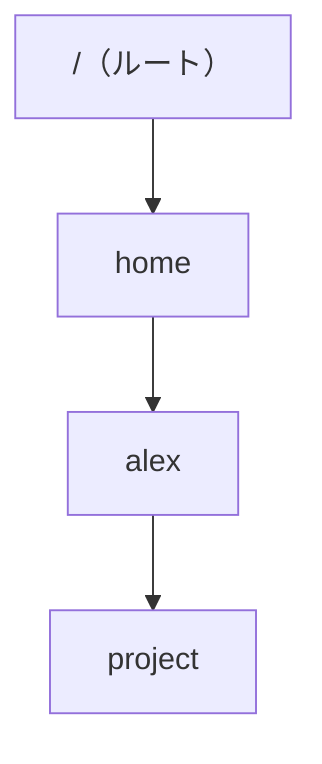

# 端末とパス

シェル操作の第一歩は、「いまどこにいるか」を常に把握することです。  
ここが狂うと、存在するファイルが見えなかったり、別ディレクトリの同名ファイルを触ったりします。

## このページで分かること

- 端末の開き方のイメージと、プロンプトの見方
- `pwd` / `ls` / `cd` の基本
- 絶対パスと相対パス、ホームディレクトリ

## なぜ現在地が大事か

「設定を直したのに反映されない」の原因が、実は別ディレクトリのファイルを編集していた、という話は珍しくありません。  
GUI ならパンくずリストがありますが、シェルでは自分で現在地を確認する習慣が必要です。

:::tip[迷ったらこれ]

分からなくなったらまず `pwd`、次に `ls`。  
Git でいう `git status` に近い「現在地確認」です。

:::

## 端末を開く

使っている環境のターミナルアプリ、またはエディタの統合ターミナルを開きます。  
ログイン直後は、だいたい自分の **ホームディレクトリ** にいます。

```bash
whoami
```

例:

```text
alex
```

`whoami` は、いまのログインユーザー名を表示するコマンドです。  
環境によって名前は違います。

```bash
pwd
```

例:

```text
/home/alex
```

`pwd`（print working directory）は、いまいるディレクトリのフルパスを表示します。  
Linux ではパスの区切りが `/` です（Windows の `\` とは違います）。

## 中身を見る：`ls`

`ls` は、ディレクトリの中身を一覧するコマンドです。

```bash
ls
```

例:

```text
Documents  Downloads  project
```

今いるディレクトリ直下の名前が出ます。  
詳細が欲しいときは次です。

```bash
ls -la
```

例:

```text
drwxr-xr-x  2 alex alex 4096 Mar  3 10:00 Documents
drwxr-xr-x  5 alex alex 4096 Mar  3 10:05 project
-rw-r--r--  1 alex alex   12 Mar  3 10:06 notes.txt
```

読み方の入口:

- 先頭が `d` … ディレクトリ、`-` … 通常ファイル
- 右側の名前がエントリ名
- 権限の細かい読み方は [権限](./permissions) で扱います

<details>
<summary>よく使う `ls` のオプション</summary>

- `-l` … 詳細表示
- `-a` … `.` で始まる隠しファイルも表示
- `-h` … サイズを人が読みやすい単位で（`-lh` と組み合わせることが多い）
- `-t` … 更新時刻順

`ls -la` は「全部・詳しく」の定番セットです。

</details>

## 移動する：`cd`

```bash
cd project
pwd
```

例:

```text
/home/alex/project
```

`cd`（change directory）で移動し、`pwd` で確認する、が基本セットです。

ひとつ上へ戻る:

```bash
cd ..
```

ホームへ一気に戻る:

```bash
cd
# または
cd ~
```

`~` はホームディレクトリの省略記法です。

## パスの二種類

| 種類         | 書き方の特徴                 | 例                                  |
| ------------ | ---------------------------- | ----------------------------------- |
| **絶対パス** | いつも `/`（ルート）から書く | `/home/alex/project/README.md`      |
| **相対パス** | いまいる場所から書く         | `project/README.md`、`../notes.txt` |



ルート `/` が木の根、その下に枝（ディレクトリ）が広がるイメージです。

:::info[絶対と相対の使い分け]

手順書やスクリプトでは、迷いを減らすために絶対パスを使うことがあります。  
対話的に探検しているときは相対パスの方が短いです。  
どちらでも、実行前に `pwd` で基準点を合わせるのが安全です。

:::

<details>
<summary>`.` と `..`</summary>

- `.` … いまいるディレクトリ自身
- `..` … ひとつ上のディレクトリ

`cd .` は実質なにもしませんが、「現在地」を表す記号として他のコマンドでも頻出します。

</details>

## 練習用の場所を決める

このあとのページでは、ホーム配下に練習用ディレクトリを作って進めます。  
本番サーバの重要なパス（`/etc` や他ユーザー配下など）は、まだ触らないでください。

```bash
mkdir -p ~/training-linux
cd ~/training-linux
pwd
```

例:

```text
/home/alex/training-linux
```

`mkdir` はディレクトリを作るコマンドです。  
`-p` を付けると、途中の階層がなくてもまとめて作れます。  
くわしいファイル操作は次のページです。

## よくあるつまずき

| 症状                         | よくある原因                        | まず試すこと                             |
| ---------------------------- | ----------------------------------- | ---------------------------------------- |
| あるはずのファイルが見えない | 別ディレクトリにいる                | `pwd` と `ls`                            |
| `No such file or directory`  | パスの打ち間違い / 現在地の取り違え | 絶対パスで試し、`ls` で親を確認          |
| タブ補完が効かない           | 名前の前方一致が複数 / シェル設定   | 数文字打ってから Tab、または `ls` で確認 |

## まとめ

- 端末は窓口、操作の基準は「いまいるディレクトリ」
- `pwd` → `ls` → `cd` が移動の基本セット
- 絶対パスと相対パスを意識して、基準点をずらさない

次は、ファイルとディレクトリを実際に操ります。  
[ファイルとディレクトリ](./files-and-directories) へ進みましょう。
