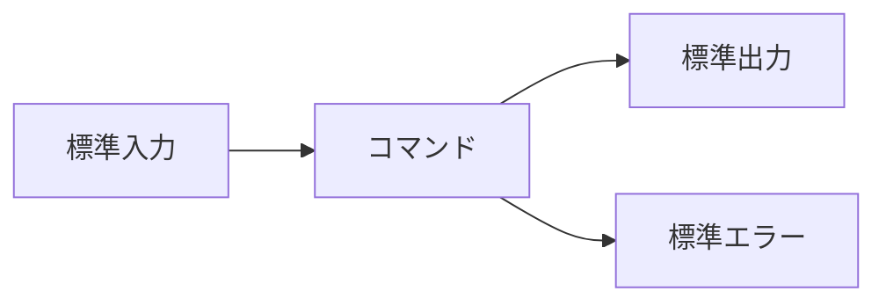

# パイプとリダイレクト

シェルが強い理由のひとつが、「小さなコマンドを組み合わせて大きな仕事にする」ことです。  
パイプとリダイレクトを覚えると、調査も日々の作業も一段早くなります。

## このページで分かること

- 標準入力・標準出力・標準エラーのイメージ
- `>` / `>>` / `<` の基本
- `|`（パイプ）でコマンドをつなぐ方法

## なぜ組み合わせが必要か

「ログから ERROR を抜き、件数を数え、ファイルに残す」。  
これを毎回エディタで手作業していると、再現性がなく、共有もできません。  
シェルでは、同じ意図を一行の組み合わせで残せます。

## 入出力の三本線

コマンドはだいたい次の三本を持っています。

| 名前                 | 番号 | ざっくり言うと                   |
| -------------------- | ---- | -------------------------------- |
| 標準入力（stdin）    | 0    | 受け取る入力（既定はキーボード） |
| 標準出力（stdout）   | 1    | 普通の結果（既定は画面）         |
| 標準エラー（stderr） | 2    | エラーメッセージ（既定は画面）   |



画面に全部出るので区別しにくいですが、行き先を変えられるのがポイントです。

## リダイレクト：行き先を変える

### 上書き保存 `>`

```bash
cd ~/training-linux
ls notes > notes/listing.txt
cat notes/listing.txt
```

`ls` の結果が画面ではなく `listing.txt` に入ります。

:::warning[`>` は上書き]

同名ファイルがあると内容が置き換わります。  
追記したいときは `>>` を使います。

:::

### 追記 `>>`

```bash
echo "----" >> notes/listing.txt
echo "done" >> notes/listing.txt
```

### 入力をファイルから `<`

```bash
grep ERROR < notes/app.log
```

`grep ERROR notes/app.log` と同じ目的になることも多いです。  
パイプや別コマンドとの組み合わせで効いてきます。

### エラーだけ別へ

```bash
ls notes missing-dir > notes/stdout.txt 2> notes/stderr.txt
```

- `>` … 標準出力をファイルへ
- `2>` … 標準エラーをファイルへ

成功時の一覧と、失敗メッセージを分けて残せます。

<details>
<summary>出力もエラーも同じファイルへ</summary>

```bash
ls notes missing-dir > notes/all.txt 2>&1
```

`2>&1` は「標準エラーを、いまの標準出力と同じ行き先へ」という意味です。  
ログをまとめて残したいときに使います。

</details>

## パイプ：`|` でつなぐ

パイプは、「左の標準出力を、右の標準入力へ渡す」接続です。

```bash
grep ERROR notes/app.log | wc -l
```

例:

```text
2
```

`grep` が見つけた行を、`wc -l` が行数として数えます。  
ERROR が 2 件、という意味です。

もう一段つなぐ例:

```bash
grep ERROR notes/app.log | sort | uniq
```

`sort` は行を並べ替え、`uniq` は隣り合った重複行をまとめるコマンドです。  
同じ内容の重複を整理したいときに使います。  
詳細は [テキスト加工](./text-processing) で扱います。

:::tip[パイプ思考]

大きな万能コマンドを探すより、  
「絞る → 数える → 並べる」のように小さなステップを `|` でつなぐ方が、読みやすく直しやすいです。

:::

## 画面にも残しつつ保存したい

```bash
grep ERROR notes/app.log | tee notes/errors.txt
```

`tee` は、受け取った内容を画面に出しつつファイルにも書きます。  
調査中に「見ながら残す」ときに便利です。

## よくあるつまずき

| 症状                 | よくある原因                        | 方向性                             |
| -------------------- | ----------------------------------- | ---------------------------------- |
| ファイルが空になった | `>` のつもりで消した                | 大事なファイルでは先に `cp` で控え |
| エラーが見えない     | 標準出力だけリダイレクトした        | `2>` や `2>&1` を検討              |
| パイプの結果が想定外 | 左の出力が空 / 別ファイルを見ている | パイプなしで左だけ実行して確認     |

## ミニ演習

1. `notes/app.log` から `INFO` 行だけを `notes/info.txt` に保存する
2. `ERROR` の件数を `grep` と `wc -l` のパイプで数える
3. 同じ結果を `tee` で画面表示しながら `notes/error-count-sample.txt` にも残す（件数そのものでなく行一覧でよい）

## まとめ

- 標準出力と標準エラーは分けて扱える
- `>` 上書き、`>>` 追記、`2>` でエラーの行き先
- `|` で「絞る・数える・並べる」を接続する

次は、操作そのものが拒否されるときに見る **権限** です。  
[権限](./permissions) へ進みましょう。
