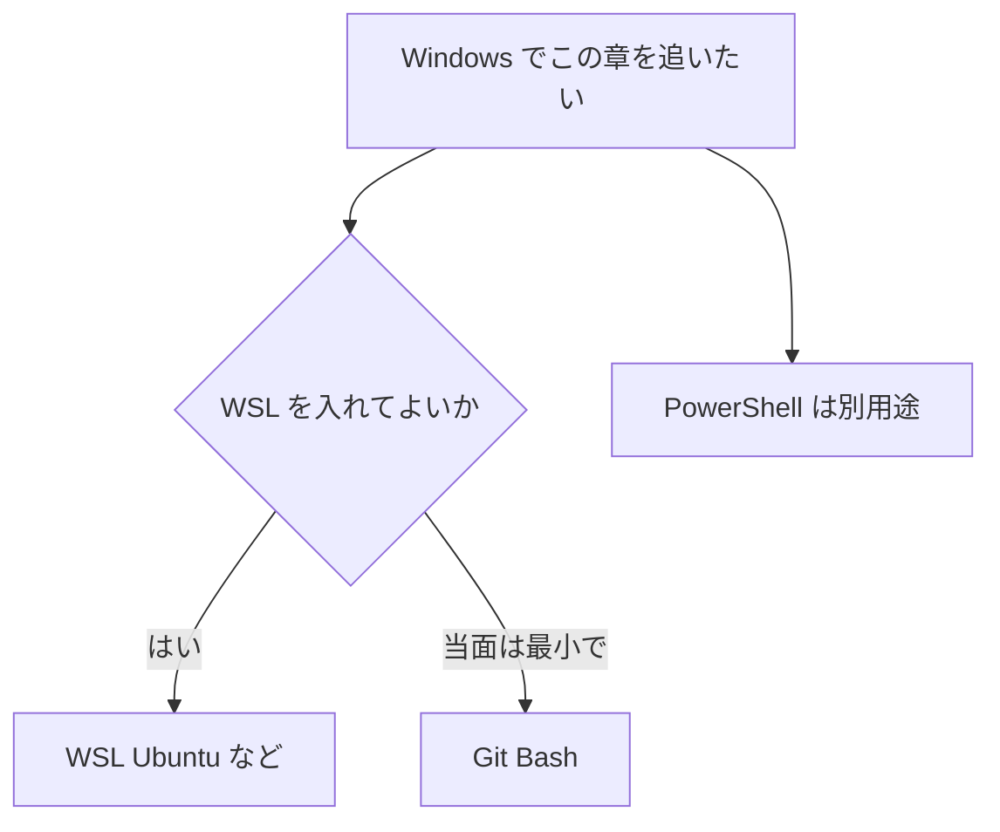

# Windows で Linux コマンドを使う

この章の多くの操作は、Linux サーバや macOS でも通じます。  
一方で、手元が Windows だけの人も多いです。  
ここでは、**Windows 上で Linux 寄りのコマンド環境をどう用意するか** を整理します。

## このページで分かること

- WSL（Ubuntu on Windows など）と Git Bash の違い
- それぞれで Linux コマンドを使う入口
- PowerShell / コマンドプロンプトとの関係（軽く）

## なぜ Windows でも Linux コマンドか

クラウドのサーバ、コンテナ、CI の多くは Linux 前提です。  
手元が Windows でも、同じ感覚で `ls` や `grep`、シェルスクリプトに慣れておくと、遠隔作業への移行が楽になります。

選択肢は大きく次です。

| 手段                          | ざっくり言うと                                  | Linux コマンドとの近さ                                        |
| ----------------------------- | ----------------------------------------------- | ------------------------------------------------------------- |
| **WSL**（Ubuntu など）        | Windows 上で Linux 環境を動かす公式寄りの仕組み | 高い（本物の Linux ユーザーランドに近い）                     |
| **Git Bash**                  | Git for Windows に付く bash 環境                | 中〜高（よく使うコマンドは揃いやすい。完全な Linux ではない） |
| **PowerShell**                | Windows 標準の強いシェル                        | 別物（似た名前のコマンドもあるが、思想が違う）                |
| **コマンドプロンプト（cmd）** | 伝統的な Windows の端末                         | 別物（この章の練習向きではない）                              |

:::tip[この教材でのおすすめ]

この章を手元の Windows で追うなら、まず **WSL（Ubuntu など）** がおすすめです。  
Git の練習だけ先にしたい、導入を最小にしたい、なら **Git Bash** でも多くのページは追えます。

:::

## WSL（Ubuntu on Windows など）

**WSL**（Windows Subsystem for Linux）は、Windows 上で Linux のディストリビューションを動かす仕組みです。  
Microsoft Store などから **Ubuntu** を入れると、「Ubuntu on Windows」と呼ばれる構成になります。  
ディストリは Ubuntu 以外（Debian など）も選べます。

### 何がうれしいか

- この章のコマンドを、ほぼそのまま練習できる
- `apt` などで追加パッケージを入れやすい（ディストリによる）
- VS Code / Cursor から WSL 内のフォルダを開いて開発する流れとも相性がよい

### 使い方の入口

バージョンや画面は Windows の更新で変わるので、導入手順は公式の [WSL のインストール](https://learn.microsoft.com/windows/wsl/install) を優先してください。  
入ったあとのイメージは次です。

1. スタートメニューから Ubuntu（や入れたディストリ）を開く  
   または、PowerShell / Windows Terminal で `wsl` と打つ
2. 初回は UNIX ユーザー名とパスワードを作る（Windows のパスワードとは別）
3. プロンプトが Linux 側になったら、この章どおり `pwd` や `ls` を試す

```bash
wsl
```

WSL 内での例:

```bash
pwd
whoami
```

例:

```text
/home/alex
alex
```

読み方のポイント:

- パスが `/home/...` なら、もう Linux 側にいる
- Windows の `C:\Users\...` とは別世界（後述のファイル共有はある）

<details>
<summary>Windows のファイルと行き来する</summary>

WSL からは、だいたい次のように Windows のドライブが見えます。

```bash
ls /mnt/c/Users/
```

`/mnt/c` が Windows の `C:` に相当するイメージです。  
逆に、重いプロジェクトを `/mnt/c/...` 直置きすると遅く感じることがあるので、普段の練習は WSL のホーム（`~`）配下が無難です。

</details>

<details>
<summary>WSL 1 と WSL 2</summary>

歴史的に WSL 1 と WSL 2 があります。  
いま新規に入れるなら、特別な理由がなければ WSL 2 系です。  
違いは仮想化の方式などで、この章のコマンド練習という目的では「Ubuntu が開いて bash が使えれば十分」です。

</details>

## Git Bash

**Git Bash** は、[Git for Windows](https://git-scm.com/download/win) を入れると付いてくる、bash 風の端末です。  
Git 操作のための環境、という位置づけですが、`ls` や `grep`、多くの UNIX 寄りのコマンドも使えます。

### 何がうれしいか

- Git を入れるついでに、手早く bash に触れられる
- 会社 PC で WSL が使えないときの代替になりやすい

### 向いていないこと

- 完全な Linux ディストリではない（サービスやパッケージの感覚がサーバと違う）
- 一部のコマンドやパスの挙動が、本物の Linux とずれることがある

### 使い方の入口

1. Git for Windows を入れる
2. スタートメニューや右クリックから **Git Bash** を開く
3. この章の `pwd` / `ls` / `cd` などを試す

```bash
pwd
ls
```

例（イメージ）:

```text
/c/Users/alex
Desktop  Documents  Downloads
```

読み方のポイント:

- `/c/Users/...` のように、Windows のパスが UNIX 風に見えることが多い
- プロンプトに `MINGW` などと出る環境もある（Git Bash 側にいる合図）

:::info[Git 編との関係]

[Git](../git/) の操作自体は、Git Bash・WSL・macOS・Linux のどれでも追えます。  
「Linux 章全体をサーバ相当で体験したい」なら WSL、「まず bash の感触と Git」なら Git Bash、が目安です。

:::

## PowerShell（簡単に）

**PowerShell** は、Windows に標準で入っている強力なシェルです。  
オブジェクトをパイプで渡すなど、bash とは思想が違います。

```powershell
Get-Location
Get-ChildItem
```

似た目的の例:

| やりたいこと | bash（この章） | PowerShell の例                                  |
| ------------ | -------------- | ------------------------------------------------ |
| 現在地       | `pwd`          | `Get-Location`（`pwd` という別名もある）         |
| 一覧         | `ls`           | `Get-ChildItem`（`ls` / `dir` という別名もある） |
| 移動         | `cd`           | `Set-Location`（`cd` でも可）                    |

読み方のポイント:

- 別名のおかげで `ls` が動いて見えることがあるが、**Linux と同じコマンドとは限らない**
- エラーメッセージやオプションは PowerShell 流儀
- Windows 管理や Microsoft 系ツールでは強みがある

:::tip[使い分け]

- この教材の Linux / シェル練習 … WSL または Git Bash
- Windows 自体の管理・社内スクリプト … PowerShell
- どちらも「端末で指示する」点は同じだが、方言が違う

:::

コマンドプロンプト（`cmd.exe`）は、さらに古い Windows の端末です。  
いま新規に Linux コマンド学習の場としては選びません。

## どれを選ぶか



- **いちばん近い体験** … WSL
- **導入が軽い / Git 中心** … Git Bash
- **Windows 管理** … PowerShell（この章の代替にはしない）

## よくあるつまずき

| 症状                                 | よくある原因                   | 方向性                                   |
| ------------------------------------ | ------------------------------ | ---------------------------------------- |
| PowerShell でこの章の例が動かない    | シェルが違う                   | WSL か Git Bash で開き直す               |
| WSL と Windows でファイルが見えない  | 別のファイルシステムを見ている | `/mnt/c/...` と `~` のどちらにいるか確認 |
| Git Bash と Linux サーバで挙動が違う | 完全互換ではない               | サーバ作業は WSL か本物の Linux で確認   |
| パスの区切りが混乱する               | `\` と `/` の混在              | 今いるシェルの流儀に合わせる             |

## まとめ

- Windows でも、WSL か Git Bash でこの章の多くを追える
- WSL（Ubuntu など）が Linux 体験に最も近い
- Git Bash は手軽。PowerShell は強力だが別物

これで Linux / Shell 章は一通りです。  
続けて遠隔のサーバへ進むなら [リモートアクセス](../remote-access/) へ。  
[章の入口](./) に戻っても構いません。
