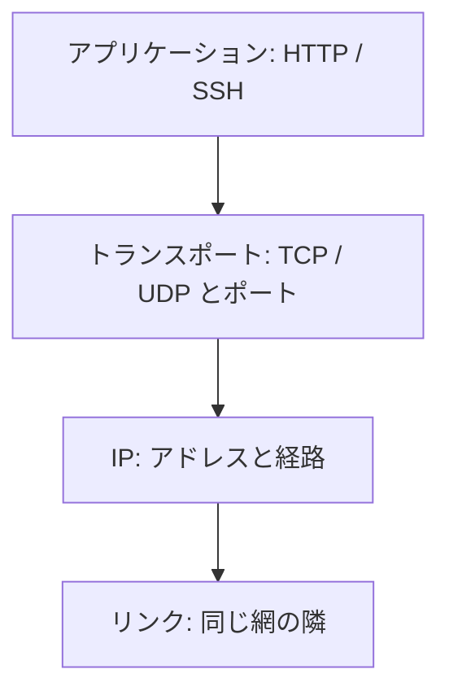

# ネットワークの考え方

手元の PC では `http://127.0.0.1:8080` で注文画面が開く。  
同じプログラムを検証サーバへ置いたら、ブラウザはくるくる回ったあと、何も出ない。  
ログには SQL エラーも例外も無い。変わったのはコードではなく、**会話の相手と、その間の道** です。

このページでは、コマンドの前に「誰が誰と話しているか」と、「繋がらない」を分解する見方を揃えます。

## このページで分かること

- クライアントとサーバの役割
- 通信が小さな塊（パケット）で運ばれること
- 「つながった」が指す条件
- 層に分けて疑う理由と、この章の範囲

## クライアントとサーバ

ネットワーク上の会話には、だいたい次の二人組が出ます。

| 役割             | ざっくり言うと       | 例                                   |
| ---------------- | -------------------- | ------------------------------------ |
| **クライアント** | 先に話しかける側     | ブラウザ、アプリ、`curl`             |
| **サーバ**       | 待ち受けて応答する側 | 注文 API、データベース、SSH の受け口 |

同じプログラムが、場面によって両方になります。  
注文 API はブラウザに対してはサーバです。  
一方で、データベースへ問い合わせるときはクライアントです。

「サーバに繋がらない」だけでは足りません。  
ブラウザと API の間なのか、API と DB の間なのかで、見る場所が変わります。

:::tip[先に二人組を置く]

障害の第一声は「アプリがおかしい」より、「誰が、誰へ、話しかけているか」です。

:::

## データは塊で運ばれる

写真や JSON を一度に一本の管で流している、というイメージだと、途中の失敗が説明しにくいです。  
実際には、データを **パケット**（小さな荷物）に分け、宛先を付けて送ります。  
荷物の一部が遅れたり、別の道を通ったり、途中の門で捨てられたりします。

開発者がパケットの中身を日常的に分解する必要はありません。  
押さえるのは次です。

- 相手まで届く保証は、使う約束（後の TCP など）によって違う
- 「一部だけ届いた」は、アプリのログより手前の層で起き得る
- 画面が固まるのは、返事の荷物がいつまでも帰ってこない、という形が多い

## 「つながった」は一つの状態ではない

会話の中で「繋がっている」は、次が揃ったときに初めて成立します。

1. **宛先が特定できる** … 名前や番号で、どのコンピュータかが分かる
2. **道がある** … 自分のネットワークから、その宛先へパケットが届く
3. **入り口が開いている** … 途中の門（ファイアウォールなど）が、その会話を通す
4. **誰かが待っている** … 宛先のプログラムが、その入り口で待ち受けている

どれか一つ欠けると、症状は似て見えます。  
ブラウザは「読み込めません」、アプリは `connection timed out`、監視は「ヘルスチェック失敗」。  
層を分けないと、全部をコードのバグとして夜更かしすることになります。

ローカルで動くのに、サーバだと動かない典型

手元では、ブラウザも API も DB も同じマシンです。  
宛先は `127.0.0.1`、門は自分の PC の中だけ、待ち受けも自分、で揃いやすいです。

検証では、ブラウザはオフィスの PC、API はクラウド、DB は別の内側のアドレス、という三人になります。  
コードが正しくても、名前・許可・待ち受けのどれかが手元と違うと、同じ URL では開きません。

## 層で疑う

全部を一度に見ると、用語が雪崩になります。  
実務では、下から（または上から）**層** に分けます。  
この章で使う地図は、次の四つで足ります。

| 層               | 見ているもの                         | 壊れたときの見え方（例）                     |
| ---------------- | ------------------------------------ | -------------------------------------------- |
| リンク           | 同じ LAN やケーブルの隣              | ケーブル抜け、Wi-Fi 切断、VPN 未接続         |
| IP               | どのコンピュータか（アドレス）       | 宛先 IP 誤り、別ネットワークへ送っている     |
| トランスポート   | どのプログラムか（ポートと約束）     | ポート違い、待ち受け無し、途中で破棄         |
| アプリケーション | 何を話しているか（HTTP や SSH など） | 届いたが 404、認証失敗、本文が JSON ではない |

下の層が壊れていると、上の層は始まりません。  
名前が引けないのに HTTP のステータスを疑っても、答えは出ません。

OSI 参照モデルの 7 層は暗記しなくてよいか

教科書では 7 層（物理、データリンク、ネットワーク、トランスポート、セッション、プレゼンテーション、アプリケーション）が出ます。  
試験や機器のマニュアルではその番号で話されます。

開発者の切り分けでは、上の四つの塊で十分なことが多いです。  
「レイヤ 4」「レイヤ 7」と聞いたら、それぞれポートの層、HTTP などのアプリの層、と対応づけてください。  
この教材では、番号の暗記より「どの層の失敗か」を先にします。

<QuizChoice
title="ローカルと検証の差"
options={[
{ id: 'a', label: '手元で動くプログラムなら、検証サーバへコピーした時点で同じ URL が必ず開く' },
{ id: 'b', label: '手元では同じマシン内の会話だったものが、検証では別ホスト・別の門・別の待ち受けになることがある' },
{ id: 'c', label: 'タイムアウトは、常にアプリケーションの例外処理の書き忘れである' },
]}
answer="b"
explanation="手元は 127.0.0.1 で揃いやすく、検証では宛先・経路・許可・待ち受けが分かれます。タイムアウトは門で捨てられていることも多いです。"

>

  
手元では注文画面が開き、検証では開かないとき、まず妥当な見方はどれですか。

</QuizChoice>

## この章で扱うこと・扱わないこと

扱うのは、開発者が毎日使う次の言葉です。

- 宛先の番号（IP）と範囲の書き方（CIDR）
- 入り口の番号（ポート）
- 接続の約束（TCP / UDP）
- 名前を番号にする（DNS）
- 道と門（経路、NAT、ファイアウォール）
- それを確認するコマンドの順番

扱わない（別の場所の）ものは次です。

- HTTP のメソッドやステータスの意味 … [HTTP](../http/)
- SSH で入る手順 … [リモートアクセス](../remote-access/)
- クラウド各社の VPC 画面 … [クラウドのネットワーク](../../cloud/fundamentals/networking)
- ルータの設計、ケーブルの規格、無線の電波 … ネットワーク専任の領域

## よくあるつまずき

- 「ネットワークがおかしい」で止め、クライアントとサーバのどちら側の話かを置かない
- 下の層（名前や到達）を確認せず、アプリのログだけを読む
- 手元の成功を「コードは正しい」の証明にして、検証の宛先を見ない

## まとめ / 次に学ぶとよいこと

- 会話には話しかける側と待つ側がいる。同じプロセスでも場面で役割が変わる
- 「つながった」は、宛先・道・門・待ち受けが揃った状態である
- 失敗は層に分けて疑う。下の層が壊れていると上は始まらない

次は、宛先の番号そのものです。  
[IP アドレス](./ip-addresses) へ進みましょう。
