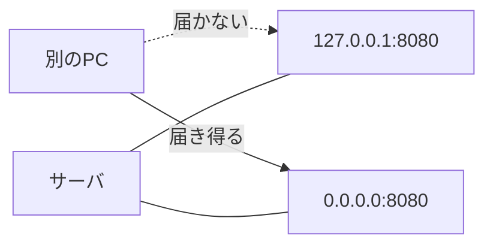

# ポート

注文 API を `8080` で起動したつもりが、ブラウザは古い画面のまま。  
よく見ると、先週試した別プロセスが同じ `8080` を掴んでいた。  
IP アドレスが建物の住所なら、**ポート** は建物の中の窓口番号です。  
同じホストに SSH、Web、データベースが同居できるのは、窓口が分かれているからです。

## このページで分かること

- ポート番号の役割と範囲
- よく使う窓口（22、443、5432 など）
- 待ち受け（LISTEN）と、接続する側
- `127.0.0.1` で待つと、ほかのマシンから届かない理由

## なぜ IP だけでは足りないか

一台の Linux には、同時にいくつものプログラムがいます。  
宛先を IP だけにすると、届いた荷物を誰が開けるか決まりません。

**ポート** は 0 から 65535 までの整数です。  
通信の宛先は、実務では次の組で書きます。

```text
10.2.8.41:5432
```

「そのホストの、その窓口」です。  
[SSH](../remote-access/ssh) の既定は **22**、HTTPS は **443**、PostgreSQL は **5432** といった具合に、用途ごとの慣習があります。

| ポート | よくある用途        | 開発者が見る場面         |
| ------ | ------------------- | ------------------------ |
| 22     | SSH                 | サーバへ入る             |
| 80     | HTTP（平文）        | 古い入口、リダイレクト元 |
| 443    | HTTPS               | ブラウザや公開 API       |
| 3306   | MySQL / MariaDB     | アプリから DB            |
| 5432   | PostgreSQL          | アプリから DB            |
| 6379   | Redis               | キャッシュ               |
| 8080   | アプリの開発用 HTTP | 手元やコンテナの待ち受け |

慣習であって、設定で変えられます。  
「SSH だから必ず 22」と決め打つと、環境が 2222 にしているときに切れます。  
チケットや構成図の番号を、記憶より優先してください。

:::tip[宛先はホストとポートのセット]

ログの `connection refused` を見たら、IP が正しいかだけでなく、**番号の窓口が合っているか** をセットで疑います。

:::

## 待つ側と話しかける側

ポートには、二つの出方があります。

| 役割         | 何をしているか                             | たとえ             |
| ------------ | ------------------------------------------ | ------------------ |
| **待ち受け** | その番号で「いらっしゃい」と座っている     | 窓口を開けている   |
| **接続元**   | 相手の番号へ話しかける側が使う一時的な番号 | 自分の呼び出し番号 |

サーバ側の設定で大事なのは待ち受けです。  
PostgreSQL が `5432` で待っていないのに、アプリが `5432` へ繋ぎに行くと失敗します。  
待っている番号は、プロセスの設定ファイルや起動オプションで決まります。

待ち受けの確認は、[調べ方](./inspect) で `ss` を使います。  
ここでは結果の読み方だけ先に置きます。

```text
State   Local Address:Port
LISTEN  0.0.0.0:8080
LISTEN  127.0.0.1:5432
```

`LISTEN` がその窓口を開けている、という意味です。  
`Local Address` が誰から見えるかを決めます。ここが次の落とし穴です。

## どこで待つか（バインド）

同じ `8080` でも、待つ口によって届く人が変わります。

| 待ち受け         | 届く人                         |
| ---------------- | ------------------------------ |
| `127.0.0.1:8080` | そのマシンの中だけ             |
| `10.2.8.41:8080` | その IP が付いた口経由         |
| `0.0.0.0:8080`   | そのマシンのどの IPv4 の口でも |

手元では `127.0.0.1` で十分です。  
同じマシンのブラウザやテストが話せます。  
その設定のままサーバへ出すと、同僚の PC からもロードバランサからも届きません。  
ファイアウォールを開けても、プログラムが自分の内側にしか座っていないからです。



:::warning[公開と待ち受けは別]

`0.0.0.0` で待つことは、「世界中に公開した」ではありません。  
まだファイアウォールと、その手前の経路があります。  
ただし、門が開いていれば誰でもその窓口を叩ける、という状態にはなります。  
データベースを `0.0.0.0` で待ち、許可を `0.0.0.0/0` にする組み合わせは、事故の定番です。

:::

<QuizChoice
title="127.0.0.1 での待ち受け"
options={[
{ id: 'a', label: '127.0.0.1:8080 で待っていれば、ファイアウォールを開けた時点で他ホストからも届く' },
{ id: 'b', label: '127.0.0.1:8080 は自分自身向けなので、他ホストからはその窓口に届かない' },
{ id: 'c', label: '127.0.0.1 は社内 LAN の代表アドレスである' },
]}
answer="b"
explanation="ループバックはマシンの外に出ません。他ホストから届けるなら、そのホストの実 IP または 0.0.0.0 での待ち受けが必要です。"

>

  <div>検証サーバのアプリが <code>127.0.0.1:8080</code> だけを待ち受けているとき、適切な説明はどれですか。</div>
</QuizChoice>

## 番号の取り合い

一つの待ち受けポートは、同じアドレス上では原則として一つのプロセスが占めます。  
先に座った側が勝ち、あとから起動した側は「すでに使われている」と失敗します。

開発中によくある形です。

- 前回の API が裏で残っていて、新しい起動が失敗する
- コンテナと手元のプロセスが、同じ `8080` を取り合う
- テストのたびに待っていたプロセスが残り、次のテストがポートを取れない

「起動したのに古い挙動」は、今見ているプロセスが、今見ているポートを持っているか、の確認に落ちることがあります。  
プロセスの見方は [Linux のプロセス](../linux/processes) です。

<details>
<summary>エフェメラルポート（接続元の一時番号）</summary>

話しかける側も、返事を受け取るために一時的なポートを使います。  
値は OS が空いている高い番号から選び、接続が終わると返します。  
アプリの設定に書くのは、通常は待ち受け側です。  
ログに `10.2.8.41:5432` と `10.2.1.20:53188` が並んでいたら、前者は DB の窓口、後者はアプリ側の一時番号、という読み方が多いです。

</details>

## よくあるつまずき

- IP は合っているのにポートが違い、別サービスへ話しかけている
- `localhost` 待ち受けのまま、別マシンからの接続をファイアウォールの問題だと思う
- 既定ポート（5432 など）を記憶で打ち、環境の実番号を見ない
- 起動失敗の「address already in use」をアプリのロジックエラーと混ぜる

## まとめ / 次に学ぶとよいこと

- 宛先は `ホスト:ポート`。ポートは同じホスト内の窓口である
- 慣習の番号はあるが、設定が正である
- 待ち受けのアドレスが `127.0.0.1` か `0.0.0.0` かで、届く人が変わる
- 同じ窓口は、同時に一つが占める

次は、その窓口で使う約束——届いたかどうかの見え方——です。  
[TCP と UDP](./tcp-and-udp) へ進みましょう。
