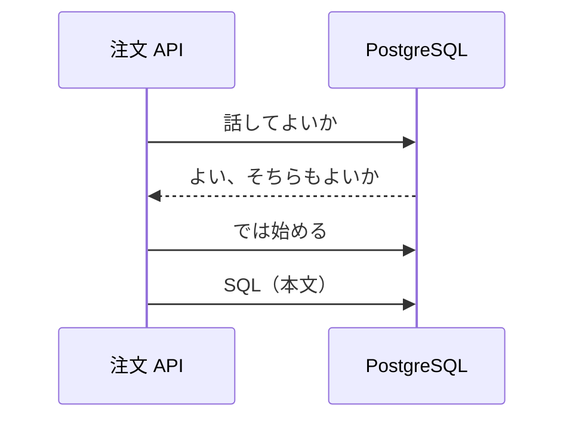

# TCP と UDP

監視ではホストに `ping` が通る。  
アプリのログには `connection timed out`。  
「ネットワークは生きている」と「注文 API はデータベースと話せない」が、同時に成り立ちます。  
ICMP の返事と、**TCP の 5432 番** は別の会話だからです。

このページでは、窓口の上で使う二つの約束——**TCP** と **UDP**——と、失敗の見え方を分けます。

## このページで分かること

- TCP が「接続してから話す」約束であること
- UDP が「送って終わり」に近い約束であること
- `timed out` と `connection refused` の違い
- ping 成功を、アプリ接続の成功と同一視しない理由

## TCP: 接続して、順番を守って届ける

業務システムのほとんど（HTTP、SSH、データベース接続）は **TCP** の上に乗っています。  
TCP は、話す前に相手と「これからこの窓口で話します」と合意し、そのあとデータを順番どおり、欠けないように運ぼうとします。

たとえは電話です。  
相手が出て、お互いに聞こえていることを確かめてから本文を話します。  
途中で欠けた文は、必要ならやり直しが入ります。

開発者として効く性質は次です。

- **接続がある**: 相手が待っていて、門が通してくれないと、本文は始まらない
- **信頼寄り**: 欠けや順番の乱れを、プロトコル側でかなり吸収する
- **失敗がアプリに見える**: 接続できなければ、ライブラリが例外やエラーを返す

合意のやり取りは「スリーウェイハンドシェイク」と呼ばれます。  
旗の名前（SYN など）を暗記する必要はありません。  
「座る前に、相手がいるか確認する」と捉えてください。

接続ができたあと、アプリは同じ接続の上で何往復も話せます。  
JDBC のコネクションプールが「使い回す」のは、この TCP の接続を毎回作り直すコストを避けるためです。

## UDP: 送って、返事は約束しない

**UDP** は、事前の接続合意がありません。  
手紙を投函するイメージです。届いたかの保証は、この層ではしません。

向くのは、次のような会話です。

- 少し欠けても、次の塊ですぐ上書きされる（音声や映像）
- 一往復が小さく、接続の準備の方が重い（**DNS** の問い合わせは UDP が多い）

業務 API の JSON を UDP で自前実装することは、ほぼありません。  
ログに UDP が出てきたら、「HTTP と同じ意味の接続ではない」と切り分けてください。

ICMP は TCP でも UDP でもない

`ping` が使うのは ICMP という、また別の約束です。  
「その IP まで、ICMP が通るか」だけを見ます。  
ICMP を門で捨てている環境は多いので、`ping` 失敗＝ホスト死亡、とは限りません。  
逆に `ping` 成功＝5432 が開いている、でもありません。

## 失敗の見え方: 拒否とタイムアウト

アプリや `curl` が出す文面は、だいたい次の二つに分かれます。  
ここを混ぜると、直す場所が逆になります。

| 見え方                   | 起きていることのイメージ                                                       | 疑う場所                                               |
| ------------------------ | ------------------------------------------------------------------------------ | ------------------------------------------------------ |
| **Connection refused**   | 荷物は相手ホストまで着いた。だがその窓口に誰もいない（または明示的に断られた） | 待ち受けポート、プロセス停止、バインド                 |
| **Connection timed out** | 返事が期限まで帰ってこない                                                     | 経路、ファイアウォールの破棄、宛先 IP 誤り、VPN 未接続 |
| **No route to host**     | 自分の側で、送り先への道が分からない                                           | ルート、VPN、インタフェース                            |

門が **拒否（RST を返す）** するのか、**黙って捨てる** のかで、見え方が変わります。  
多くのクラウドの許可ルールは、許可しない通信を捨てます。  
その結果、アプリから見るとタイムアウトです。  
「拒否なら設定が近い、タイムアウトなら遠い」と覚え、許可ルールを疑う材料にします。

:::tip[切り分けの一言]

届いて空席なら refused。  
途中で消える、または返事が封じられるなら timed out。  
`ping` はそのどちらも証明しません。

:::

<QuizChoice
title="timed out と refused"
options={[
{ id: 'a', label: 'connection timed out は、宛先ホストでそのポートのプロセスが確実に落ちていることを意味する' },
{ id: 'b', label: 'connection refused は、荷物が相手ホストまで届き、その窓口に待ち受けが無い（または断られた）ときに出やすい' },
{ id: 'c', label: 'ping が通れば、TCP 5432 も必ず通る' },
]}
answer="b"
explanation="refused は到達したうえで窓口が空席、という形が多いです。timed out は門での破棄など、返事が帰らない状況です。ICMP と TCP は別会話です。"

>

  
注文 API から PostgreSQL へつなぐときの説明として、適切なものはどれですか。

</QuizChoice>

## 開発者が触る「待ち時間」

TCP の接続そのものにも、アプリの読み書きにも、**タイムアウト** があります。  
相手が遅いのか、門が捨てているのか、SQL が重いのかで、どの時計が鳴るかが違います。

| 時計                 | 見ているもの                       |
| -------------------- | ---------------------------------- |
| 接続タイムアウト     | 握手が終わるまでの上限             |
| 読み取りタイムアウト | 接続後、応答データが来るまでの上限 |
| アイドル切断         | しばらく無言の接続を誰が切るか     |

「遅い」を全部 30 秒待ちにすると、スレッドやワーカーが埋まって、別の利用者まで止まります。  
値の決め方は [HTTP の実務](../http/api-practice) と、各言語のクライアントの話になります。  
ネットワークの層では、「返事が無い」と「返事は来たが中身が失敗」を混ぜない、が先です。

## よくあるつまずき

- `ping` 成功を、DB ポート到達の証明にする
- timed out をアプリのバグと決め、許可ルールを見ない
- refused なのに経路（VPN）ばかりを疑う
- UDP の DNS 失敗と、TCP の HTTP 失敗を一つの「通信エラー」にまとめる

## まとめ / 次に学ぶとよいこと

- 業務の多くは TCP。接続してから本文を話す
- UDP は接続合意が無く、DNS などで使われる
- refused は窓口、timed out は道や門、を先に疑う
- ping は ICMP であり、アプリのポートとは別である

次は、人が読む名前を番号へ変える仕組みです。  
[DNS](./dns) へ進みましょう。
