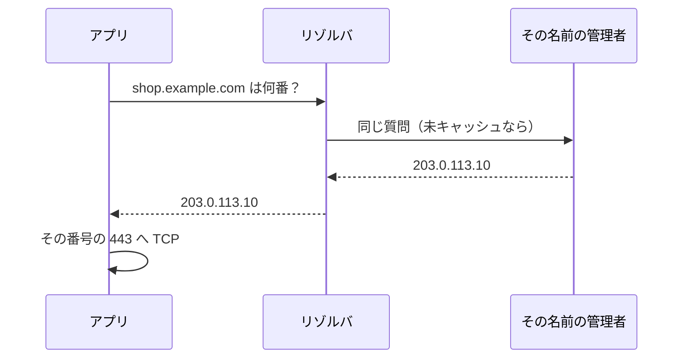

# DNS

接続先に `db.internal.example.com` と書いたらタイムアウト。  
番号の `10.2.8.41` なら、同じ PC から通る。  
プログラムも許可ルールも、まだ疑う段階ではありません。  
**名前が、別の番号を指している** か、**名前が引けていない** かを先に見ます。

人が覚えるのは名前、機械が使うのは IP アドレスです。  
その翻訳が **DNS**（Domain Name System）です。

## このページで分かること

- 名前解決の流れ
- A レコードと CNAME の読み方
- TTL とキャッシュで「直したのに古い」が起きる理由
- `hosts` ファイルと、社内向けの名前

## 名前は便利だが、別の失敗点になる

URL や JDBC の接続文字列には、番号より名前を書くことが多いです。  
理由は次です。

- サーバを入れ替えても、名前の指す先だけ変えればクライアントを配り直さなくてよい
- 人が読んで、検証と本番を取り違えにくい
- 証明書（後の HTTPS）は、名前に対して発行される

その代わり、次が起きます。

- 名前が引けない（解決失敗）
- 引けるが、古い番号や、別環境の番号を指している
- 自分の PC と、サーバ上のアプリで、同じ名前が別の番号になる

:::tip[番号で通って名前で失敗したら]

アプリのロジックより、先に名前解決を疑います。  
逆に、名前も番号も同じ失敗なら、DNS より経路やポートです。

:::

## 解決の流れ

ブラウザやアプリが `shop.example.com` に話すとき、だいたい次が起きます。

1. 自分の OS が、すでに覚えている答え（キャッシュ）を持っていないか見る
2. 設定された **リゾルバ**（翻訳を頼む相手。社内 DNS や、ISP、クラウドの DNS）へ尋ねる
3. 必要ならリゾルバが、その名前を管理しているサーバまでたどる
4. 返ってきた IP を使って、TCP の接続が始まる



翻訳に成功したことは、**その番号のポートが開いていること** を意味しません。  
DNS は住所を教えるだけです。建物の鍵は別です。

代表的なレコードの種類です。

| 種類      | 返すもの      | たとえ                     |
| --------- | ------------- | -------------------------- |
| **A**     | IPv4 アドレス | 建物の住所                 |
| **AAAA**  | IPv6 アドレス | 長い側の住所               |
| **CNAME** | 別の名前      | 「本名はこちら」という別名 |

CNAME は「`www.example.com` は `shop.example.com` と同じ」のように、名前を名前へたすき掛けします。  
最終的には A（や AAAA）へ着地します。  
途中の別名が古いと、見かけのホスト名は正しくても、着地が別環境、ということが起きます。

## 自分の環境で名前を引く

Linux では `getent` が、OS が見ている答えに近いです。

```bash
getent hosts shop.example.com
```

例:

```text
203.0.113.10    shop.example.com
```

何も出ない、またはエラーなら、そのマシンの名前解決が失敗しています。  
`dig` がある環境では、どのリゾルバに聞いたかまで見られます。

```bash
dig +short shop.example.com
```

例:

```text
203.0.113.10
```

Windows では `nslookup shop.example.com` がよく使われます。  
出力の「Address」がその名前の番号です。  
`nslookup` は OS のキャッシュと微妙に違う答えを出すことがあるので、アプリと同じ失敗を再現するなら、アプリが動くマシンで `getent` や言語の名前解決を見る方が近いです。

<details>
<summary>`/etc/hosts` は DNS より先に見ることが多い</summary>

Linux の `/etc/hosts`（Windows では `C:\Windows\System32\drivers\etc\hosts`）は、名前と番号の手元メモです。  
ここにある行は、DNS へ聞く前に使われることが多いです。

```text
10.2.8.41  db.internal.example.com
```

検証で「自分の PC だけ別の DB を見たい」ときに使われる一方、消し忘れると、全員が直した DNS と自分だけ食い違います。  
本番サーバの `hosts` を個人の都合で書き換えないでください。

</details>

<QuizChoice
title="名前解決の意味"
options={[
{ id: 'a', label: 'A レコードが返れば、そのホストの HTTPS は必ず 200 を返す' },
{ id: 'b', label: '名前が IP に引けることは、その IP のポートへ TCP が通ることとは別である' },
{ id: 'c', label: 'CNAME は、ファイアウォールの許可ルールそのものである' },
]}
answer="b"
explanation="DNS は住所の翻訳です。門と待ち受けと HTTP の成功は、そのあとです。"

>

  <div>DNS についての説明として、適切なものはどれですか。</div>
</QuizChoice>

## TTL と「直したのに古い」

DNS の答えには **TTL**（Time To Live）が付きます。  
「この答えを、何秒覚えていてよいか」です。  
リゾルバや OS、ブラウザは、その間はもう一度聞きに行きません。

そのため、次が起きます。

- レコードを新しい IP に更新した
- 自分の PC はまだ古い IP を覚えている
- 同僚の PC は TTL が切れて、新しい IP を見ている
- 「環境によって直った／直っていない」が同時に発生する

切り分けは、アプリが動いているマシンで今引ける番号を見ることです。  
自分のノート PC のブラウザだけ直っても、サーバ上の JVM が古い答えを持っている、はよくあります。

## 同じ名前が、場所によって別の番号になる

業務システムでは、**分割された DNS** が普通にあります。

| 見る場所          | `shop.example.com` が指しやすいもの   |
| ----------------- | ------------------------------------- |
| インターネット    | 負荷分散の公開アドレス                |
| 社内や VPC の内側 | 内側の負荷分散、またはプライベート IP |

オフィスの PC では開けるのに、クラウド上のバッチだけ失敗する。  
原因は許可ルールではなく、バッチ側の DNS が公開側の番号を返し、内側の経路ではその番号へ出られない、という形です。  
「同じ名前なのに、聞く場所で答えが違う」を知っていると、この手の票が早く終わります。

:::info[アプリの接続先は、アプリが動く場所の視点で書く]

手元の `localhost` も、サーバから見た内側のホスト名も、**そのプロセスの視点** の名前です。  
ブラウザが使う公開ホスト名を、サーバ間の接続先にそのままコピーすると、意図しない出口へ出ます。

:::

## よくあるつまずき

- 名前解決の失敗を、HTTP ステータスの問題として追う
- 自分の PC の `hosts` やキャッシュだけ直して、サーバ側の解決を見ない
- 検証と本番で同じホスト名を使い、レコードの付け替え忘れに気づかない
- `nslookup` の成功を、アプリと同じリゾルバの成功と同一視する

## まとめ / 次に学ぶとよいこと

- DNS は名前を IP に翻訳する。ポート到達や HTTP 成功の証明ではない
- A は番号、CNAME は別名。最終的な着地の IP を確認する
- TTL とキャッシュで、更新が場所によって遅れる
- 同じ名前でも、聞く場所で別の番号になり得る

次は、翻訳できた番号へ、実際に荷物が届くかどうかです。  
[経路・NAT・ファイアウォール](./path-nat-firewall) へ進みましょう。
