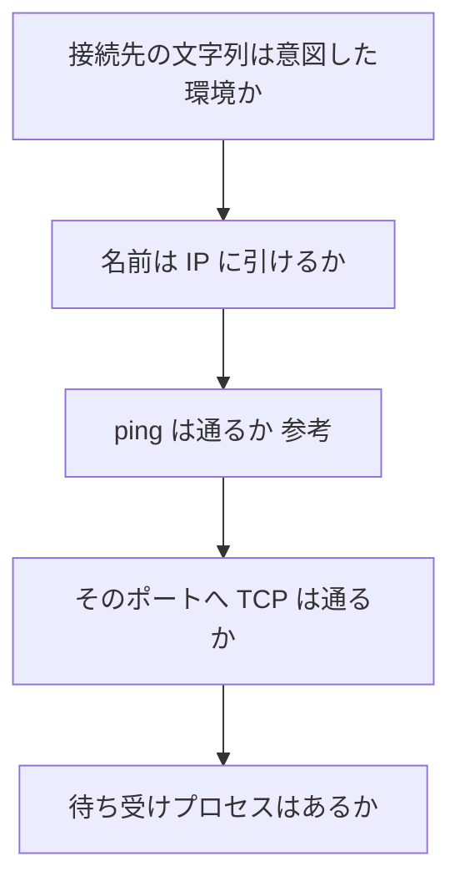

# 調べ方

金曜の夜、注文 API が DB に繋がらない。  
焦って `ping` と再起動と設定ファイルのコピペが同時に走ると、何が証明できたのか分からなくなります。  
このページでは、これまでの層を **上からでも下からでもよいので、一度に一つ** 確かめる順番にします。

新しい道具を増やすことが目的ではありません。  
「名前 → 番号の到達 → そのポートの TCP → 誰が待っているか」を、自分の言葉で回すことが目的です。

## このページで分かること

- 調査の順番と、各コマンドが見ている層
- `getent` / `dig`、`ping`、`curl`、`ss` の読み方
- ping だけに頼らない理由
- 相談するときに残す最小の事実

## 順番の型

対象が `db.internal.example.com:5432` なら、次の順が崩れにくいです。

1. **今見ている箱か** … 検証のアプリが、本番のホストを向いていないか
2. **名前は引けるか** … DNS
3. **その IP まで ICMP は通るか** … 通らなくても TCP は別。参考情報
4. **そのポートへ TCP は通るか** … アプリと同じ約束
5. **相手は待っているか** … 相手ホストへ入れるなら `ss`



コードのスタックトレースは、4 か 5 が失敗したあとの話です。  
1 と 2 を飛ばすと、正しいプログラムが間違った宛先へ誠実にタイムアウトします。

:::tip[事実を一行ずつ残す]

「DB に繋がらない」より、「`getent` は 10.2.8.41 を返す。`curl` 相当の TCP は 5432 で 5 秒タイムアウト」の方が、次の手が決まります。

:::

## 名前: `getent` と `dig`

アプリが動いているマシンで実行します。  
自分のノート PC の成功は、サーバ上の JVM の成功ではありません。

```bash
getent hosts db.internal.example.com
```

例:

```text
10.2.8.41    db.internal.example.com
```

この番号が、構成図の検証 DB と一致するかを見ます。  
本番の番号が出ていたら、以後の `ping` 成功はむしろ危険です。

`dig` があるときは、TTL や聞いたサーバも見られます。

```bash
dig db.internal.example.com
```

例（抜粋）:

```text
;; ANSWER SECTION:
db.internal.example.com. 30 IN A 10.2.8.41
```

`30` が TTL（秒）の目安です。  
名前解決そのものが失敗するときは、VPN、リゾルバ、ホスト名の誤記を疑います。

## 到達の参考: `ping`

`ping` は ICMP の応答を見るコマンドです。

```bash
ping -c 3 10.2.8.41
```

例（成功）:

```text
PING 10.2.8.41 (10.2.8.41) 56(84) bytes of data.
64 bytes from 10.2.8.41: icmp_seq=1 ttl=64 time=1.12 ms
64 bytes from 10.2.8.41: icmp_seq=2 ttl=64 time=0.98 ms
64 bytes from 10.2.8.41: icmp_seq=3 ttl=64 time=1.05 ms
```

読み方のポイント:

- `bytes from` … 少なくとも ICMP は往復した
- `time=` … 遅延の目安（アプリの SQL 時間とは別）

Windows の `ping` は `-c` ではなく回数指定の形が違います。  
Ctrl+C で止めるまで打ち続ける実装もあります。

:::warning[ping は合格証ではない]

ICMP を捨て、TCP 443 だけ通す構成は普通です。  
`ping` 失敗だけで「死んでいる」と断定せず、次のポート確認へ進みます。  
逆に `ping` 成功だけで「開いている」とも断定しません。

:::

経路の途中を見たいときは `traceroute`（Windows では `tracert`）があります。  
権限や ICMP の扱い生で最後まで出ないことも多いので、必須手順にはしません。  
「途中のどの hop で消えるか」の参考です。

## そのポートの TCP: `curl` など

HTTP のサービスなら、[Linux の実務](../linux/daily-ops) でも触れた `curl` で、TCP とその上の HTTP をまとめて叩けます。

```bash
curl -sS -o /dev/null -w "%{http_code}\n" --connect-timeout 5 https://shop.example.com/health
```

例（HTTP まで届いた）:

```text
200
```

`-w "%{http_code}"` は、応答のステータスだけを出す指定です。  
`000` やエラーメッセージになるときは、HTTP の前（名前、TCP、証明書）で止まっています。  
ステータスの意味は [HTTP](../http/) です。ここでは「数字が返った＝TCP の先に HTTP の相手がいた」と読みます。

HTTP ではないポート（5432 など）に `curl` を使うと、意味のある本文は出ません。  
「接続できた／拒否された／待たされた」だけが手がかりです。  
環境に `nc`（netcat）があるなら、次でも足ります。

```bash
nc -vz -w 5 10.2.8.41 5432
```

例（入れた）:

```text
Connection to 10.2.8.41 5432 port [tcp/postgresql] succeeded!
```

例（拒否）:

```text
nc: connect to 10.2.8.41 port 5432 (tcp) failed: Connection refused
```

`succeeded` は、握手が終わった、までです。  
PostgreSQL の認証や SQL の成功ではありません。  
それでも、門と待ち受けの切り分けには十分です。

<details>
<summary>bash だけの簡易確認</summary>

bash では、次で TCP の握手だけ試せることがあります。

```bash
timeout 5 bash -c 'echo >/dev/tcp/10.2.8.41/5432' && echo open || echo closed
```

成功時は `open`、失敗時は `closed` やタイムアウトです。  
環境によっては `/dev/tcp` が無効です。使えなければ `nc` や、アプリ自身の接続ログに戻します。

</details>

<QuizChoice
title="調査の順番"
options={[
{ id: 'a', label: 'まずアプリを再起動し、次に DNS、最後に接続先文字列を見る' },
{ id: 'b', label: '接続先が意図した環境か、名前が引けるか、そのポートへ TCP が通るかを順に見る' },
{ id: 'c', label: 'ping が通れば、TCP の確認は省略してよい' },
]}
answer="b"
explanation="宛先の取り違えを先に潰し、名前と TCP を分けます。ICMP 成功はポート到達の代替になりません。"

>

  <div>注文 API がデータベースへ繋がらないときの調べ方として、適切なものはどれですか。</div>
</QuizChoice>

## 待ち受け: `ss`

相手のホストへ [SSH](../remote-access/ssh) で入れるなら、待っている窓口を見ます。  
[便利なツール](../linux/handy-tools) でも触れた `ss` です。

```bash
ss -tlnp
```

例:

```text
State  Recv-Q Send-Q Local Address:Port  Peer Address:Port Process
LISTEN 0      128          0.0.0.0:22         0.0.0.0:*     users:(("sshd",pid=812,fd=3))
LISTEN 0      200        127.0.0.1:5432       0.0.0.0:*     users:(("postgres",pid=904,fd=6))
```

読み方のポイント:

- PostgreSQL が `127.0.0.1:5432` だけなら、別ホストのアプリからは届かない
- 行が無いなら、その番号では待っていない
- `Process` が空でも、権限の問題で名前だけ見えないことがあります

PaaS のように SSH が無い箱では、基盤の接続テストと、アプリの待ち受け設定（環境変数のポート）を見ます。

## 相談するときに残す最小セット

次が揃うと、インフラ担当も自分の続きも速くなります。  
秘密鍵、パスワード、トークンは含めません。

- いつ、どの環境で、どのプロセスが
- 接続先のホスト名とポート（設定値のまま）
- `getent` または同等の結果（引かれた IP）
- TCP 確認のコマンドと、refused / timed out / 成功
- 自分の経路（VPN の有無、送信元として相手に見えそうな IP が分かれば）

## よくあるつまずき

- 自分の PC でだけ調べ、アプリが動くマシンで名前解決しない
- `ping` の結果だけで許可ルールを「問題なし」にする
- 成功した古い `curl` の結果を、設定変更後の証明に使い回す
- エラー全文を残さず、「繋がりません」だけをチケットに書く

## まとめ / 次に学ぶとよいこと

- 箱 → 名前 →（参考の ping）→ そのポートの TCP → 待ち受け、の順が崩れにくい
- 各コマンドは見ている層が違う。合格を横流ししない
- 相談は、設定値と、引かれた IP と、TCP の文面をセットにする

次は、ブラウザのクリックからサーバまでの一連です。  
[ブラウザからサーバまで](./from-browser) へ進みましょう。
