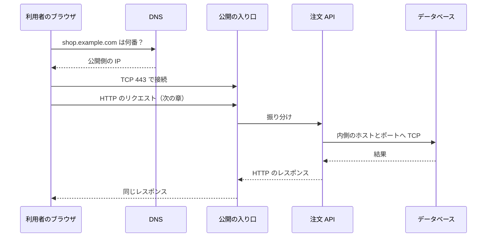

# ブラウザからサーバまで

利用者が注文一覧を開く。  
画面は白い。開発者はアプリの例外を探す。インフラは負荷分散を見る。  
同じ事象でも、層の地図が共有されていないと、並行して別の場所を直すことになります。

このページでは、ここまでの部品を一本の旅にします。  
HTTP の中身は次の章へ渡し、ここでは **どの駅で止まったか** を説明できることを目指します。

## このページで分かること

- クリックからアプリまでの層の順番
- 症状から、疑う層を選ぶ型
- 開発者として残す再現情報
- この章の次（HTTP）との境界

## 一本の旅

利用者が `https://shop.example.com/orders` を開くときの、開発者向けの最短地図です。



駅ごとの失敗は、似た白い画面でも中身が違います。

| 止まった駅         | よくある見え方                       | 先に確認すること                 |
| ------------------ | ------------------------------------ | -------------------------------- |
| DNS                | 名前解決エラー、NXDOMAIN             | ホスト名、VPN、`getent`          |
| 公開 IP への TCP   | ブラウザの接続タイムアウト           | 経路、門、VPN、宛先番号          |
| TLS（HTTPS）       | 証明書エラー、警告画面               | 名前と証明書の一致、期限（次章） |
| HTTP として到達    | ステータス 4xx / 5xx、本文のエラー   | メソッド、パス、認証（次章）     |
| アプリ → DB の TCP | 画面は出るがデータが無い、API が 500 | 内側の名前、門、待ち受け         |

利用者から見えるのは、多くの場合いちばん手前の失敗だけです。  
アプリが DB で止まっているときも、ブラウザには 504 や真っ白が出ます。  
「画面が白い」を HTTP のバグと決めない、がこの章の結論です。

## 症状から層を選ぶ

現場で使いやすい分岐です。

1. **同じ URL が、自分の PC では開き、同僚では開かない**  
   送信元 IP の許可、VPN、hosts、DNS キャッシュを疑う。アプリのコードより先。
2. **ブラウザでは開くが、サーバ上のバッチだけ失敗する**  
   バッチ視点の名前解決と、内側向けの宛先を疑う。公開 URL のコピーになっていないか。
3. **IP では通るが名前では失敗する**  
   DNS。レコード、TTL、分割 DNS。
4. **名前も ping も通るが、アプリだけタイムアウトする**  
   そのポートの TCP と門。ICMP と TCP は別許可。
5. **refused が出る**  
   待ち受けポートとバインド（`127.0.0.1` になっていないか）。
6. **HTTP のステータスが返る**  
   ネットワークの旅は一通り終わっている。以降は [HTTP](../http/)。

<QuizChoice
title="白い画面の切り分け"
options={[
{ id: 'a', label: 'ブラウザが白いときは、常に SQL の例外が原因である' },
{ id: 'b', label: '名前解決の失敗、公開口への TCP 失敗、HTTP の 5xx、DB への内側接続失敗は、症状が似ても層が違う' },
{ id: 'c', label: 'ping が通れば、HTTPS の証明書も問題ない' },
]}
answer="b"
explanation="利用者の画面は手前の失敗しか見せません。層を分けると、コード・DNS・門・証明書のどれに渡すかが決まります。"

>

  <div>注文一覧が開かないときの見方として、適切なものはどれですか。</div>
</QuizChoice>

## 開発者が話すときの型

専任のネットワーク担当がいる現場でも、開発者側の再現が無いと調査は往復します。  
次を、秘密情報なしで渡せると役割を果たせます。

```text
環境: 検証
操作: ブラウザで GET https://shop.example.com/orders
結果: 約 15 秒後にタイムアウト（ステータス無し）
自分: オフィス VPN 接続中
確認済み: getent は 203.0.113.10 を返す
確認済み: curl --connect-timeout 5 は失敗（timed out）
確認していない: 負荷分散の許可に、今の送信元が入っているか
```

「ステータス無し」と「502 が返る」は、渡す相手が変わります。  
前者は届く前、後者は届いたあとのアプリまたは上流です。

:::info[自分の担当範囲]

許可ルールの変更権限が無くても、**どの層の話かを特定する** のは開発者の仕事です。  
特定したあと、門の変更を依頼するのか、接続先文字列を直すのか、待ち受け設定を直すのかを選べます。

:::

## この章で揃った言葉

以後のクラウドや HTTP で、次を同じ意味で使えます。

- **クライアント / サーバ** … 話しかける側と待つ側。プロセスは両方になり得る
- **IP と CIDR** … 誰の番号か、どの範囲か。`0.0.0.0/0` は全部
- **ポートとバインド** … 窓口。`127.0.0.1` は内側だけ
- **TCP の refused / timed out** … 空席か、返事が無いか
- **DNS** … 名前の翻訳。到達の証明ではない
- **NAT とファイアウォール** … 外へ出る書き換えと、通す会話の選択

仮想ネットワークの商品名（VPC など）は、この言葉の上に載っています。  
先に層が読めると、画面の項目が「新しい魔法」ではなく「門と範囲の別名」に見えます。

## よくあるつまずき

- 画面の白さを、いちばん詳しいアプリのログだけで説明しようとする
- 公開 URL と、サーバ間の内側接続先を同じ文字列で済ませる
- 再現手順に環境名が無く、検証の失敗を本番の設定で直しに行く
- 証明書エラーをファイアウォールの問題として扱う（HTTP 章の範囲）

## まとめ / 次に学ぶとよいこと

- クリックから DB までは、翻訳・公開口の TCP・HTTP・内側の TCP、と駅がある
- 症状が似ても層は違う。ステータスの有無が大きな分岐になる
- 開発者の役割は、再現と層の特定である

届いたあとの会話——メソッド、ステータス、ヘッダ、HTTPS——は次です。  
[HTTP](../http/) へ進みましょう。
