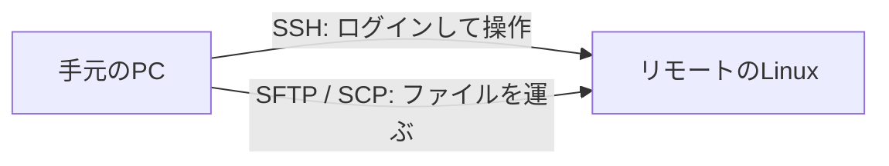

# リモートアクセスの考え方

コマンドを覚える前に、「何をしたい通信なのか」を分けます。  
ログインしたいのか、ファイルだけ動かしたいのか、暗号化されているのか——。  
ここが混ざると、古い手順や危険な手段を拾いやすくなります。

## このページで分かること

- リモートログインとファイル転送の違い
- SSH・SFTP・SCP・FTP の役割
- この章の範囲と、ネットワーク基礎との境界

## なぜリモートが必要か

ローカル PC だけで完結する仕事は減っています。  
ログも設定も、動いているプロセスも、向こう側のマシンにあることが多いです。  
「画面共有で誰かに操作してもらう」だけでは、再現も自動化もできません。

目的は、次を自分で安全に行えることです。

- 遠隔のシェルに入り、調査や作業をする
- 必要なファイルだけを、意図した場所へ運ぶ

## 登場人物の整理

| 名前     | ざっくり言うと                                 | 主な用途                               |
| -------- | ---------------------------------------------- | -------------------------------------- |
| **SSH**  | 暗号化された遠隔ログイン（＋その上のいろいろ） | サーバに入って操作する                 |
| **SFTP** | SSH の仕組みの上で動くファイル転送             | 安全にファイルを上げ下げする           |
| **SCP**  | SSH を使ったファイルコピー（コマンドが短い）   | 単発のファイル／ディレクトリコピー     |
| **FTP**  | 古くからあるファイル転送手順                   | レガシー連携。新規では避けることが多い |

:::info[HTTP との違い]

ブラウザや API で使う HTTP(S) も「遠隔と話す」手段ですが、目的が違います。  
この章は **シェルに入る・ファイルを置く** 側です。  
HTTP は別テーマとして後から深掘りします。

:::

## SSH が中心になる理由

現代の Linux サーバ運用では、遠隔操作の定番が SSH です。

- 通信が暗号化される（途中で中身を読まれにくい）
- 入ったあとは、普段のシェル操作がそのまま使える
- 鍵認証と組み合わせて、パスワードより運用しやすいことが多い
- その上に SFTP や SCP、トンネルなど派生がある

ポート番号の目安は **22** です（環境で変えていることもあります）。  
「ポートとは何か」はネットワーク基礎で整理します。  
ここでは「SSH 用の入り口の番号」くらいに捉えてください。

## FTP をどう捉えるか

FTP は File Transfer Protocol の略で、ファイル転送の古典です。  
いまなお古いシステム連携で残ることがありますが、次の弱点があります。

- パスワードや中身が暗号化されない形態が多い（平文になりやすい）
- ファイアウォール越しの挙動が分かりにくいことがある
- 同じ目的なら SFTP や HTTPS ベースの手段に置き換わっていることが多い

:::warning[新規では FTP を第一候補にしない]

「ファイルをサーバへ置きたい」だけなら、まず **SFTP / SCP**（またはチーム指定の手段）を確認してください。  
FTP が指定されているレガシー案件では、VPN 内か、暗号化付きの派生か、運用ルールを必ず確認します。

:::

FTPS / SFTP は名前が似ている

- **SFTP** … SSH の上のファイル転送（この章の推奨寄り）
- **FTPS** … FTP に TLS を被せたもの（別物）

用語が似ているので、手順書の略語は読み飛ばさないでください。

## この章で扱わないこと

- IP アドレス、DNS、ルーティングの詳細 … ネットワーク基礎（予定）
- HTTP / HTTPS の中身 … HTTP（予定）
- クラウド各社の専用接続方式の詳細 … 各クラウド章や公式手順
- ゼロトラスト製品やポータルの個別操作 … 参加した環境の案内を優先（踏み台の SSH としての型は [SSH](./ssh) で扱う）

## まとめ

- リモート作業の二本柱は「入る（SSH）」と「運ぶ（SFTP / SCP）」
- FTP は歴史的資産。新規の第一候補にはしない
- 入ったあとは [Linux / Shell](../linux/) の世界

次は、実際に SSH で接続します。  
[SSH で接続する](./ssh) へ進みましょう。
