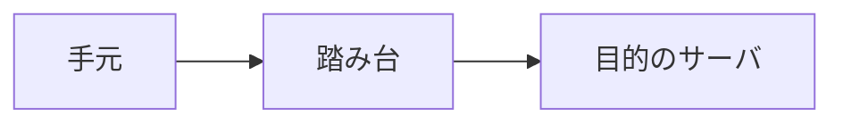

# SSH で接続する

遠隔の Linux に入る定番が **SSH**（Secure Shell）です。  
接続さえできれば、あとは [Linux / Shell](../linux/) で学んだ操作の延長です。

## このページで分かること

- `ssh` でのログインの基本形
- パスワード認証と鍵認証、公開鍵の置き方と権限
- 踏み台（Jump）経由の入り方の入口
- 初回接続の確認、切断、`ssh -v` での切り分け

## 基本の接続

`ssh` は、リモートのコンピュータに安全にログインするためのコマンドです。

```bash
ssh alex@203.0.113.10
```

読み方:

- `alex` … リモート側のユーザー名
- `203.0.113.10` … 接続先ホスト（IP またはホスト名）

例（イメージ）:

```text
alex@203.0.113.10's password:
```

パスワードを求められたら、リモート側のパスワードを入力します（画面には通常表示されません）。  
成功すると、リモートのシェルプロンプトに切り替わります。

```text
alex@app-server:~$
```

:::tip[入ったあと]

`pwd` や `ls` は、もうリモート側の世界です。  
手元のファイルと取り違えないよう、プロンプトやホスト名を意識してください。

:::

ポートが 22 以外のとき:

```bash
ssh -p 2222 alex@203.0.113.10
```

`-p` は、接続先のポート番号を指定するオプションです。

## 初回接続の確認

初めてのホストでは、次のような確認が出ることがあります。

```text
The authenticity of host '203.0.113.10 (203.0.113.10)' can't be established.
ED25519 key fingerprint is SHA256:xxxxxxxxxxxxxxxxxxxxxxxxxxxxxxxxxxxxxxxxxxx.
Are you sure you want to continue connecting (yes/no/[fingerprint])?
```

これは「このサーバの指紋を信頼してよいか」の確認です。  
正規の接続先だと分かっているときだけ `yes` とします。  
指紋の照会方法は、チームやクラウドの案内に従ってください。

<details>
<summary>`known_hosts` とは</summary>

一度信頼したホストの情報は、手元の `~/.ssh/known_hosts` に記録されます。  
サーバを作り直して指紋が変わると警告が出ることがあり、そのときは「なりすまし」の可能性と「正規の再作成」を切り分けます。  
安易に古い行を消す前に、環境の手順を確認してください。

</details>

## 鍵認証の考え方

パスワードの代わりに、**鍵のペア** で認証する運用がよくあります。

- **秘密鍵** … 手元に置く。他人に渡さない
- **公開鍵** … サーバ側の `~/.ssh/authorized_keys` などに登録する

```bash
ssh-keygen -t ed25519 -C "alex@example.com"
```

`ssh-keygen` は、SSH 用の鍵ペアを作るコマンドです。  
`-t ed25519` は鍵の種類、`-C` はコメント（識別用）です。  
保存場所を聞かれたら、慣れるまでは既定（`~/.ssh/id_ed25519`）で構いません。  
パスフレーズを付けると、鍵ファイルが盗まれたときの耐性が上がります。

成功すると、だいたい次の 2 つができます。

- `~/.ssh/id_ed25519` … 秘密鍵
- `~/.ssh/id_ed25519.pub` … 公開鍵

:::warning[秘密鍵は秘密]

秘密鍵をチャットやリポジトリに貼らない。  
渡してよいのは、原則として `.pub` の公開鍵だけです。

:::

## 公開鍵の置き方と権限

鍵を作っただけでは入れません。  
**公開鍵をサーバ側に登録する** 必要があります。  
方法は環境差が大きいので、チームやクラウドの案内があればそれを優先します。  
案内が薄いときの手動イメージは次です。

### 手元の公開鍵を確認する

```bash
cat ~/.ssh/id_ed25519.pub
```

例:

```text
ssh-ed25519 AAAAC3NzaC1lZDI1NTE5AAAAIExamplePublicKeyMaterial alex@example.com
```

1 行が公開鍵です。  
これをサーバへ渡します（中身をコピーする、など）。

### サーバ側へ登録する（手動の型）

すでにパスワードなどで一度入れる経路がある場合の例です。

```bash
# サーバ側で（リモートにログインした状態）
mkdir -p ~/.ssh
chmod 700 ~/.ssh
```

公開鍵を `~/.ssh/authorized_keys` に追記します（エディタでも可）。

```bash
# 例: 手元からパイプで送る（パスワードログインができるときの一例）
cat ~/.ssh/id_ed25519.pub | ssh alex@203.0.113.10 "mkdir -p ~/.ssh && chmod 700 ~/.ssh && cat >> ~/.ssh/authorized_keys && chmod 600 ~/.ssh/authorized_keys"
```

ポイントは権限です。  
緩すぎると、ssh 側が鍵を無視して `Permission denied` になることがあります。

| 対象 | よくある権限 |
| --- | --- |
| `~/.ssh` ディレクトリ | `700`（所有者だけ） |
| `~/.ssh/authorized_keys` | `600`（所有者だけ読み書き） |
| 手元の秘密鍵 | `600` またはより厳しい |

```bash
# 手元の秘密鍵（必要なら）
chmod 600 ~/.ssh/id_ed25519
```

<details>
<summary>`ssh-copy-id`（入っている環境なら）</summary>

```bash
ssh-copy-id -i ~/.ssh/id_ed25519.pub alex@203.0.113.10
```

`ssh-copy-id` は、公開鍵をリモートの `authorized_keys` へ追加しやすくするコマンドです。  
権限まわりもまとめて整えてくれることが多いです。  
使えない環境もあるので、なければ上の手動手順に従います。

</details>

<details>
<summary>クラウドコンソールで登録する場合</summary>

AWS / GCP / Azure などでは、インスタンス作成時やコンソールから公開鍵を登録する UI があります。  
その場合は、コンソールの案内に従い、手元では秘密鍵のパスだけ正しく指定すれば足ります。

</details>

## 踏み台（Jump）経由で入る

本番や社内サーバへ、手元から直接 SSH できないことがあります。  
途中に **踏み台**（ジャンプホスト / bastion）を置き、「まず踏み台 → そこから目的のサーバ」と経由する構成です。



製品ごとのポータル操作は環境の案内に任せ、ここでは SSH 標準の入口だけ押さえます。

```bash
ssh -J alex@bastion.example.com alex@10.0.0.20
```

`-J`（ProxyJump）は、「このホストを経由して先へ進む」指定です。  
`bastion.example.com` が踏み台、`10.0.0.20` が目的のサーバ、というイメージです。

`~/.ssh/config` に書く例:

```text
Host bastion
  HostName bastion.example.com
  User alex
  IdentityFile ~/.ssh/id_ed25519

Host app-internal
  HostName 10.0.0.20
  User alex
  ProxyJump bastion
  IdentityFile ~/.ssh/id_ed25519
```

以後は次で足ります。

```bash
ssh app-internal
```

:::info[ホスト名や鍵は環境の案内が正]

内部 IP、踏み台の名前、使う鍵は現場ごとに違います。  
ここでは「経由して入る」という型だけ覚えてください。

:::

## 切断する

リモートのシェルから抜けるときは、次のどちらかです。

```bash
exit
```

または Ctrl+D です。  
手元のプロンプトに戻れば切断できています。

## 接続を楽にする設定（入口）

`~/.ssh/config` にホストの別名を書けます。

```text
Host app-dev
  HostName 203.0.113.10
  User alex
  Port 22
  IdentityFile ~/.ssh/id_ed25519
```

以後は次で足ります。

```bash
ssh app-dev
```

:::info[設定ファイルも慎重に]

ホスト名・鍵のパス・ユーザーを間違えやすい場所です。  
チームのテンプレートがあれば、それを土台にするのが安全です。

:::

## うまくいかないとき：`ssh -v`

`Permission denied` や接続失敗のとき、詳細ログを出すと切り分けが早くなります。

```bash
ssh -v alex@203.0.113.10
```

`-v` は、接続の途中経過を詳しく表示するオプションです（もっと詳しくするなら `-vv` / `-vvv`）。

例（抜粋・イメージ）:

```text
debug1: Connecting to 203.0.113.10 [203.0.113.10] port 22.
debug1: Connection established.
debug1: Offering public key: /home/alex/.ssh/id_ed25519
debug1: Authentications that can continue: publickey,password
debug1: No more authentication methods to try.
alex@203.0.113.10: Permission denied (publickey).
```

読み方のポイント:

- `Connecting` / `Connection established` … ネットワーク的には届いている
- `Offering public key` … どの鍵を試したか
- `Permission denied (publickey)` … 鍵認証が通っていない（ユーザー名・authorized_keys・権限・鍵の取り違えを疑う）
- 途中で止まる / timeout … 宛先・VPN・FW・ポートを疑う

相談するときは、秘密鍵の中身は出さず、`-v` の末尾付近と実行したコマンド（ホスト・ユーザー）を共有すると伝わりやすいです。

## よくあるつまずき

| 症状 | よくある原因 | 方向性 |
| --- | --- | --- |
| `Connection refused` | SSH が聞いていない / ポート違い | ポートと起動状態を確認（環境担当へ） |
| `Connection timed out` | ネットワーク・FW・IP 誤り | VPN や許可 IP、宛先を確認 |
| `Permission denied (publickey)` | 鍵未登録・権限が緩い・別鍵を使っている | `authorized_keys`、`chmod`、`ssh -v` |
| `Permission denied`（password） | ユーザーやパスワードの不一致 | ユーザー名、認証方式の確認 |
| 指紋の警告 | サーバ再作成 or 別ホスト | 正規変更か確認してから更新 |
| 直接は入れない | 踏み台必須 | `-J` / `ProxyJump`、環境の接続手順 |

## まとめ

- 基本形は `ssh ユーザー@ホスト`
- 鍵認証は「作る・公開鍵を置く・権限を絞る」までがセット
- 踏み台経由は `-J` / `ProxyJump` の型を覚える
- 困ったら `ssh -v` で、ネットワーク切れか認証切れかを分ける

次は、ログインせずにファイルを運ぶ手段です。  
[ファイルを運ぶ](./file-transfer) へ進みましょう。
