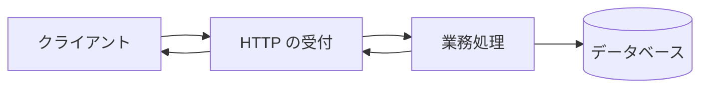

# エンタープライズ Java の全体像

業務アプリケーションは、Java のクラスを作るだけでは完成しません。  
HTTP リクエストの受付、データベース接続、トランザクション、認証、ログなどを組み合わせ、継続して運用できる形にする必要があります。

## このページで分かること

- エンタープライズ Java アプリケーションが担う処理の流れ
- アプリケーションサーバ方式と組み込みサーバ方式の違い
- ライブラリとプラットフォーム API の位置付け

## リクエストから応答まで

典型的な Web アプリケーションでは、次のように処理が進みます。

実際には、この流れに入力検証、認証・認可、トランザクション、例外処理、ログなどが加わります。  
Jakarta EE や Spring は、これらを毎回ゼロから実装せず、共通の仕組みとして組み立てるための選択肢です。  
アノテーションを付けるだけでは動かず、コンテナやフレームワークが読む点は [アノテーションとリフレクション](../basics/annotations-reflection) と同じです。

## アプリケーションサーバで動かす

アプリケーションサーバ方式では、サーバが HTTP、DI、トランザクション、データソースなどの実行基盤を提供し、アプリケーションを配備します。  
Jakarta EE の仕様に対応したサーバを使う構成が代表例です。

この方式では、複数アプリケーションの運用機能をサーバ側へまとめられます。  
一方で、サーバの設定、対応する Jakarta EE のバージョン、配備方法を理解する必要があります。

## サーバをアプリケーションへ組み込む

組み込みサーバ方式では、HTTP サーバなどを依存関係としてアプリケーションへ含め、実行可能な JAR として起動する構成がよく使われます。  
Spring Boot を使ったアプリケーションは、その代表例です。

アプリケーション単位で設定とバージョンを管理しやすく、コンテナ環境にも載せやすい特徴があります。  
一方で、各アプリケーションが実行基盤を含むため、依存関係や更新方針をそれぞれ管理します。

:::info[方式だけで優劣は決まらない]

既存の運用基盤、配備単位、組織の知識、更新頻度などによって適した方式は変わります。

:::

## Jakarta EE と Spring

Jakarta EE は、REST、DI、永続化、トランザクションなどの標準仕様をまとめたプラットフォームです。  
実装は対応するアプリケーションサーバやランタイムが提供します。

Spring Framework は、DI を中心に Web、データアクセス、トランザクションなどを組み合わせるフレームワークです。  
Spring Boot は、自動設定や組み込みサーバによって Spring アプリケーションの構成と起動を支援します。

両方とも企業システムで広く使われています。  
コードを読むときは製品名だけで判断せず、どの仕様や機能が実際に利用されているかを確認します。

## ライブラリとプラットフォーム API

ライブラリは、アプリケーションから明示的に呼び出して利用する部品です。  
JSON 変換ライブラリや HTTP クライアントなどが例です。

プラットフォーム API やフレームワークでは、決められたインターフェースやアノテーションに合わせると、実行基盤がアプリケーションコードを呼び出すことがあります。  
DI や REST のエンドポイント登録が代表例です。

:::tip[呼び出す側を確認する]

アプリケーションがライブラリを呼ぶのか、実行基盤がアプリケーションを呼ぶのかを見ると、設定やライフサイクルを理解しやすくなります。

:::

## よくあるつまずき

- Jakarta EE の仕様と、特定サーバの実装・設定を同じものとして扱う
- Spring Framework と Spring Boot の役割を区別しない
- 組み込みサーバなら運用設定が不要だと思い込む
- フレームワークが管理するオブジェクトを自分で `new` し、DI などを効かなくする

## まとめ

- 業務アプリケーションは HTTP、業務処理、永続化、横断機能を組み合わせて動く
- アプリケーションサーバ方式と組み込みサーバ方式には、それぞれ運用上の特徴がある
- Jakarta EE と Spring はどちらも一般的であり、プロジェクトの条件に合わせて使われる
- API を誰が呼ぶかを見ると、ライブラリと実行基盤の違いを捉えやすい

次は [レイヤーと DI](./layers-and-di) で、アプリケーション内部の責務と依存関係を整理します。
