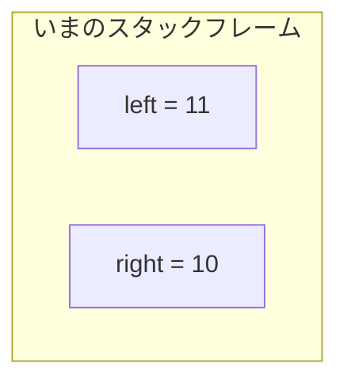
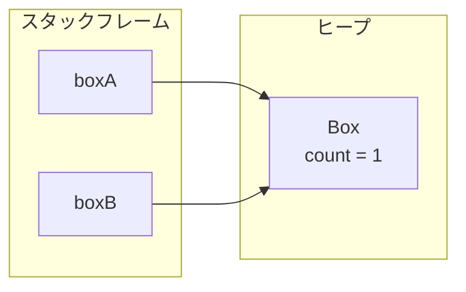
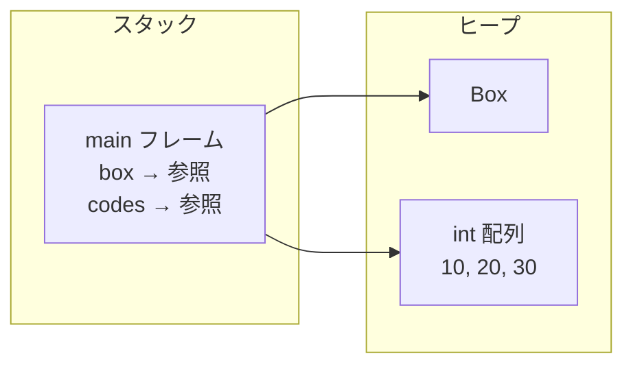
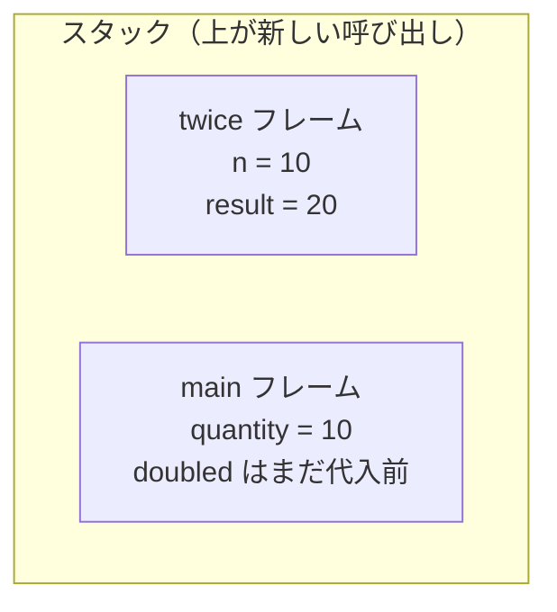
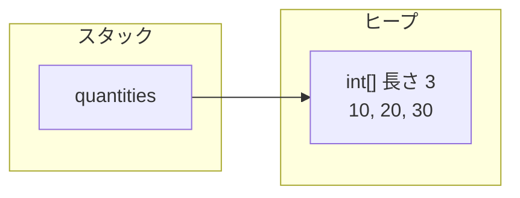
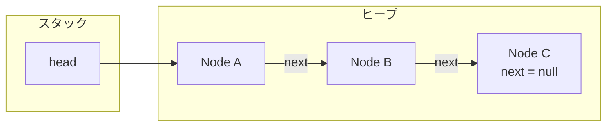
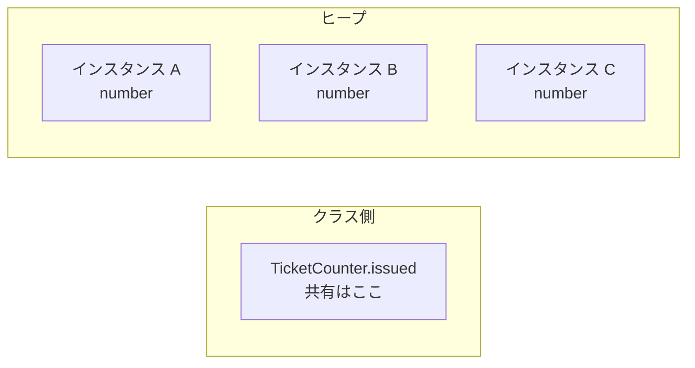

# 型とメモリ

このページでは、変数が持っているもの、メソッド呼び出しの作業場、オブジェクトの置き場を、図を描ける粒度まで落とします。  
「なんとなく GC があるから大丈夫」では、共有の事故もメモリ不足も説明できません。

## このページで分かること

- プリミティブと参照が、変数の箱の中で何を意味するか
- スタックフレームとヒープの役割、スコープやスタックトレースとの対応
- 引数・戻り値がコピーするもの（値そのものか、行き先か）
- 配列やノード構造が、ヒープ上でどうつながるか
- `static` が「インスタンスの外の共有」である理由

## メモリ管理は、ここで丁寧に押さえる

Java の文法は書けても、変数が「値」なのか「行き先」なのかを曖昧なまま進んでいる人は少なくありません。  
レビューで「このリストを渡したら呼び出し元まで書き換わる」と驚かれたり、逆に「数値を渡したのに反映されない」と混乱したりするのも、その取り違えから起きやすいです。

障害調査でも同じです。  
スタックトレース、`NullPointerException`、キャッシュが消えずに残る、テスト同士が干渉する——これらは別々の話題に見えて、帰着点は「そのデータはどこにあり、誰から見えて、いつまで生きるか」です。  
ここから数ページは、そのイメージを自分の言葉で説明できるところまで落とします。

:::tip[先に覚える問い]

迷ったら次の三つを紙に書いてください。  
スタックの話か、ヒープの話か。  
変数が持っているのは値か参照か。  
インスタンスごとの状態か、クラス全体の共有か。

:::

## 変数が持つのは「値」か「参照」か

Java の型は大きく二つです。

| 種類             | 例                                       | 変数が持っているもの           |
| ---------------- | ---------------------------------------- | ------------------------------ |
| **プリミティブ** | `int`, `long`, `boolean`, `double` など  | 値そのもの                     |
| **参照型**       | クラス、配列、`String`、コレクションなど | オブジェクトへの参照（行き先） |

### プリミティブはコピーすると値が分かれる

```java
int left = 10;
int right = left;
left++;
```

`right = left` でコピーされるのは **10 という値** です。  
あとから `left` を 11 にしても、`right` は 10 のままです。



プリミティブ同士に「同じ箱を見ている」関係はありません。  
別の変数は、別の値のコピーです。

### 参照型は実体ではなく行き先を持つ

```java
class Box {
    int count;
}

Box boxA = new Box();
Box boxB = boxA;
boxA.count = 1;
```

`new Box()` で作られる実体はヒープに置かれます。  
`boxA` と `boxB` が持っているのは、その実体への参照です。



コピーされたのは `Box` の中身ではなく、**同じ行き先** です。  
だから `boxA` 経由の変更は、`boxB` からも見えます。

```java
System.out.println(boxB.count); // 1
System.out.println(boxA == boxB); // true（同じ行き先）
```

ここで押さえるのは次の一行です。

> プリミティブ型は値を持つ。参照型は実体への参照を持つ。

`boxA` という箱にオブジェクト全体が入っている、と考えない方があとが楽です。

<QuizChoice
title="参照のコピー"
options={[
{id: 'a', label: 'boxB.count は 0 のまま'},
{id: 'b', label: 'boxB.count は 1'},
{id: 'c', label: 'コンパイルエラーになる'},
]}
answer="b"
explanation="boxB = boxA でコピーされるのは行き先です。同じ Box を共有するので、boxA.count への代入は boxB からも見えます。"

>

  <div>次のコードのあと、<code>boxB.count</code> はどうなりますか。</div>
  <pre className="language-java"><code>{`class Box {
    int count;
}

Box boxA = new Box();
Box boxB = boxA;
boxA.count = 1;
// boxB.count は？`}</code></pre>
</QuizChoice>

## スタックとヒープ

学習の第一歩では、次の二層で十分です。

- **スタック領域** … メソッド呼び出しの流れを管理する。ローカル変数や引数が乗る
- **ヒープ領域** … オブジェクトや配列の実体が置かれる。参照をたどって使う



厳密な物理配置は JVM の実装やバージョンで変わります。  
最初に必要なのは、「ローカルの作業場」と「共有されうる実体」が別だという感覚です。

### `new` はヒープに実体を作る

```java
Box box = new Box();
```

この 1 行は、次の三つがまとまったものです。

1. ヒープに `Box` の実体を確保する
2. コンストラクタで初期化する
3. その実体への参照を変数 `box` に入れる

| 部分      | 意味                                         |
| --------- | -------------------------------------------- |
| `Box box` | `Box` を指す変数を用意する                   |
| `new`     | 新しいインスタンスを生成する                 |
| `Box()`   | コンストラクタ呼び出し。生成した直後の初期化 |

変数の中にオブジェクト全部が入るわけではありません。

### 大きな実体をヒープに置く理由

メソッド呼び出しのたびに、大きなデータを丸ごとコピーするとコストが大きいです。  
Java は次の分担を取ります。

- 実体はヒープに置く
- スタックでは参照（行き先の情報）を扱う

これにより、同じ注文や同じリストを、コピーせずに複数のメソッドから扱えます。  
その代わり、**意図しない共有** も起きやすくなります。  
「渡したのに反映されすぎる」のは、この設計の裏返しです。

<QuizChoice
title="new の置き場"
options={[
{id: 'a', label: 'Box の実体はスタックに置かれ、参照はヒープに入る'},
{id: 'b', label: 'Box の実体はヒープに置かれ、変数 box は参照（行き先）を持つ'},
{id: 'c', label: '実体も参照も、すべてスタックにだけ置かれる'},
]}
answer="b"
explanation="new で作る実体はヒープ側です。ローカル変数 box が持つのはその行き先です。"

>

  <div>次の 1 行について、正しいものはどれですか。</div>
  <pre className="language-java"><code>{`Box box = new Box();`}</code></pre>
</QuizChoice>

## スタックフレームとスコープ

メソッドが呼ばれるたびに、スタックには **スタックフレーム** が積まれます。  
フレームには、その呼び出し専用のローカル変数と引数が入ります。

```java
public static void main(String[] args) {
    int quantity = 10;
    int doubled = twice(quantity);
}

static int twice(int n) {
    int result = n * 2;
    return result;
}
```

`twice(quantity)` を呼び出して、まだ戻っていない瞬間のイメージです。



`main` 側の `doubled` は、戻り値が入るまで未代入です。  
「不明」というより、**まだ代入前** と考える方が正確です。

メソッドが終わると、そのフレームは取り外されます。  
ローカル変数はそのフレームの寿命に縛られるので、メソッドを抜けたあとでは使えません。

例外時に見る **スタックトレース** は、この積み重ねの痕跡です。

```text
Exception in thread "main" java.lang.ArithmeticException: / by zero
    at Pricing.twice(Pricing.java:10)
    at Pricing.main(Pricing.java:4)
```

上にあるほど **いま実行していたフレーム**、下にあるほど **そこに至るまでに積まれていたフレーム** です。  
「スタック」トレースと呼ばれるのは、呼び出しの積み方がそのままログに出るからです。

:::info[スコープの実体]

スコープは文法ルールでもありますが、裏では「その変数が属しているフレームやブロックの寿命」に対応しています。

:::

```java
void sample() {
    int outer = 10;

    if (outer > 0) {
        int inner = 20;
    }

    // ここでは inner は使えない
}
```

`inner` が見えないのは、ブロックを抜けたあとその箱が用済みだからです。  
ヒープ上のオブジェクトは、参照が残っている限り別の話として生き続けます。

## 引数と戻り値はすべて値渡し

Java のメソッド引数は **常に値渡し（pass-by-value）** です。  
「参照渡しの言語」ではありません。

ただし、コピーされる値が

- プリミティブの値なのか
- 参照という値なのか

で、見た目の結果が変わります。

### プリミティブを渡す

```java
int quantity = 10;
bump(quantity);
System.out.println(quantity); // 10

static void bump(int n) {
    n = 99;
}
```

渡されるのは `10` のコピーです。  
`bump` 内の `n` を書き換えても、呼び出し元の `quantity` は変わりません。

### 参照を渡す

```java
class Order {
    String id;
    String status;
}

Order order = new Order();
order.id = "ORD-1";
order.status = "OPEN";
close(order);
System.out.println(order.status); // CLOSED

static void close(Order target) {
    target.status = "CLOSED";
}
```

呼び出し元と呼び出し先が、**同じオブジェクトを指す参照のコピー** を持っています。  
フィールドの変更は共有されます。

引数変数そのものを付け替えても、呼び出し元の変数は変わりません。

```java
static void replace(Order target) {
    target = new Order();
    target.id = "ORD-OTHER";
}
```

`replace` のあと、呼び出し元の `order.id` は元の `"ORD-1"` のままです。  
付け替えたのは、メソッド内のローカルな箱だけです。

:::tip[覚えておくこと]

プリミティブは中身のコピー。  
参照型は「行き先」のコピー。  
行き先のフィールド変更は共有され、変数の付け替えは共有されない。

:::

<QuizChoice
title="引数に渡したあとの値"
options={[
{id: 'a', label: 'x は 99 になる'},
{id: 'b', label: 'x は 1 のまま'},
{id: 'c', label: 'コンパイルエラーになる'},
]}
answer="b"
explanation="int の引数は値のコピーが渡されます。bump 内の n を書き換えても、呼び出し元の x は変わりません。"

>

  <div>次のコードを実行したあと、<code>x</code> はどうなりますか。</div>
  <pre className="language-java"><code>{`void bump(int n) {
    n = 99;
}

int x = 1;
bump(x);`}</code></pre>
</QuizChoice>

<QuizChoice
title="参照の渡し方"
options={[
{id: 'a', label: 'status は CLOSED、id は other'},
{id: 'b', label: 'status は CLOSED、id は ORD-1'},
{id: 'c', label: 'status は OPEN、id は ORD-1'},
]}
answer="b"
explanation="参照のコピーが渡るので status の変更は共有されます。一方 order = new Order() はメソッド内の変数の付け替えだけで、呼び出し元の order が指す先は変わりません。"

>

  <div>次のコードのあと、呼び出し元の <code>order</code> はどうなりますか。</div>
  <pre className="language-java"><code>{`class Order {
    String id;
    String status;
}

void touch(Order order) {
order.status = "CLOSED";
order = new Order();
order.id = "other";
}

Order order = new Order();
order.id = "ORD-1";
order.status = "OPEN";
touch(order);
// order.status と order.id は？`}</code></pre>
</QuizChoice>

### 戻り値はフレームが消える前に渡す

メソッド終了と同時にフレームは消えます。  
その直前に呼び出し元へ渡されるのが戻り値です。

```java
static int add(int a, int b) {
    int result = a + b;
    return result;
}
```

返るのは `result` の値です。  
オブジェクトを返す場合は、ヒープ上の実体への参照が返ります。  
コンストラクタも学習上は、「初期化が終わったオブジェクトへの参照が手元に来る」と捉えるとつながります。

## 配列はオブジェクトである

配列の実体もヒープに置かれます。

```java
int[] quantities = new int[3];
quantities[0] = 10;
quantities[1] = 20;
quantities[2] = 30;
```



ポイントは次です。

- 配列はオブジェクトなので、変数が持つのは参照
- 要素の型は揃える
- 長さは生成時に決まり、あとから伸ばせない

`quantities` を別メソッドに渡して要素を書き換えると、呼び出し元からも見えます。  
配列変数を `new int[5]` で付け替えても、呼び出し元の変数は元の配列を指したままです。

参照型の配列では、箱（配列）と中身（各要素のオブジェクト）が両方ヒープにあります。

```java
LineItem[] items = new LineItem[2];
items[0] = new LineItem("BOOK", 1);
```

`items` は配列オブジェクトを指し、`items[0]` はさらに `LineItem` を指します。  
「配列をコピーした」のか「要素のオブジェクトを共有している」のかは、別の話として切り分けます。

## リスト構造は参照でつなぐ

要素を増やせる構造は、ヒープ上のオブジェクトを参照でつないで作ります。



- 各ノードは別々のオブジェクト
- `next` が次のノードへの参照
- 新しいノードを足せば、配列と違って長さを先に決めなくてよい

標準ライブラリの `List` がすべてこの形というわけではありません。

- `ArrayList` は内部的には配列（必要に応じて大きい配列へ載せ替える）
- `LinkedList` はノードを参照でつなぐ

実装差より先に、「動的なコレクションも、ヒープ上のデータと参照の組み合わせ」と捉えてください。  
だからこそ、リストをメソッドに渡して `add` すると呼び出し元に見えるし、どこかから参照され続けると回収されません。

## `static` はインスタンスの外の共有

`static` が分かりにくいのは、オブジェクト指向の話とメモリの話が同時に出るからです。

結論から言うと、**`static` はインスタンスごとに増えません。クラスに属します。**

```java
class TicketCounter {
    static int issued;
    int number;
}
```

`new TicketCounter()` を 100 個作っても、

- `number` はインスタンスごとに 100 個
- `issued` はクラスに対して 1 個

です。



厳密な配置は JVM 実装に依存します。  
学習上は、「インスタンスごとのヒープ上データとは別に、クラスにひもづく共有がある」と置けば足ります。

クラスを初めて使うとき、JVM はクラスの定義情報をロードします。  
JDK 8 以降、クラスのメタデータは **メタスペース（Metaspace）** 側で管理されます。  
クラス定義と、各インスタンスの実データは別物です。  
`static` フィールドの値は「各インスタンスにコピーされるもの」ではありません。

`static` メソッドがインスタンスなしで呼べるのも、同じ理由です。

```java
int value = Integer.parseInt("123");
```

`parseInt` は `Integer` クラスに属する処理なので、`new Integer()` は不要です。  
インスタンスメソッドは、どのオブジェクトの状態を扱うかが必要なので、受け手が要ります。

共有の置き場は便利な一方、テスト同士の干渉や、リクエストをまたいだ値の残留につながります。  
文法の詳細は [static と final](./static-final) へ進み、ここでは「全体で一つ、参照が残れば長く生きる」と結び付けてください。

```java
static List<byte[]> cache = new ArrayList<>();
```

このようなフィールドは、プロセスが生きているあいだ参照を持ち続けます。  
「GC があるから消える」は、参照が切れたあとの話です。

<QuizChoice
title="static の共有"
options={[
{id: 'a', label: 'a.issued は 1、b.issued は 0'},
{id: 'b', label: 'a.issued も b.issued も 1'},
{id: 'c', label: 'コンパイルエラーになる'},
]}
answer="b"
explanation="static フィールドはクラス側の共有です。インスタンスが別でも同じ場所を見ます。"

>

  <div>次のコードのあと、<code>b.issued</code> はどうなりますか。</div>
  <pre className="language-java"><code>{`class TicketCounter {
    static int issued;
    int number;
}

TicketCounter a = new TicketCounter();
TicketCounter b = new TicketCounter();
a.issued++;
// b.issued は？`}</code></pre>
</QuizChoice>

## `null` は「行き先がない」

参照型の変数は、まだ行き先がないとき `null` を取れます。  
`null` のままフィールドやメソッドに触ると `NullPointerException`（NPE）になります。

```java
Order order = null;
order.id = "ORD-1"; // NPE
```

NPE は「Java が壊れた」のではなく、**存在しない行き先にアクセスした** 合図です。  
初期化漏れ、マップにキーが無い、外部 API が null を返した、などが典型です。

<details>
<summary>プリミティブに null は入らない</summary>

`int x = null;` はコンパイルエラーです。  
「無い」を表したい整数は、`Integer`（参照型のラッパ）や `OptionalInt` など、別の表現を検討します。  
ラッパは参照型なので、今度は NPE の対象になります。

</details>

<QuizChoice
title="null 参照"
options={[
{id: 'a', label: 'id に ORD-1 が入る'},
{id: 'b', label: 'NullPointerException になる'},
{id: 'c', label: 'コンパイルエラーになる'},
]}
answer="b"
explanation="order は null（行き先がない）なので、フィールドへのアクセスは実行時に NullPointerException になります。"

>

  <div>次のコードはどうなりますか。</div>
  <pre className="language-java"><code>{`class Order {
    String id;
}

Order order = null;
order.id = "ORD-1";`}</code></pre>
</QuizChoice>

## ここまで分かると何が変わるか

スタックが見えると、次が説明できます。

- ローカル変数がメソッドを抜けたら使えない理由
- 引数と戻り値が、どの呼び出し単位の箱なのか
- 例外ログの並びが、なぜその順番なのか

ヒープが見えると、次が説明できます。

- `new` したオブジェクトがメソッドをまたいで使える理由
- 複数の変数が同じ実体を見てしまう理由
- 配列やコレクションの実体がどこにあるのか

`static` が見えると、次が説明できます。

- 別インスタンスなのに値が共有される理由
- クラス名からメソッドを呼べる理由
- キャッシュやカウンタがプロセス全体に残る危険

コードの表面だけではなく、

> そのデータはどこにあり、誰から参照され、いつまで生きるのか

を追えるようになるのが、このページのゴールです。

Java にはガベージコレクションがあります。  
使わなくなったものが勝手に消える、ではありません。  
**どこかから到達できるオブジェクトは回収されません。**  
その仕組みは次の [ヒープとガベージコレクション](./heap-and-gc) で、回収の単位まで落とします。

## よくあるつまずき

- 参照型を「常にディープコピーされる」と思い、リストの中身変更に驚く
- 引数を `new` で付け替えて、呼び出し元が変わらないのを「値渡しじゃない」と解釈する
- スタックトレースの上下を、ファイル内の行番号の並びと混同する
- `static` を「定数の印」だけだと思い、共有寿命を見落とす
- NPE のメッセージだけ見て、どの参照が null かをログやデバッガで確認しない

## まとめ / 次に学ぶとよいこと

- プリミティブは値、参照型は行き先。どちらも引数は値渡し
- スタックは呼び出しの作業場、ヒープは実体の置き場
- メソッド終了でフレームは消えるが、ヒープ上の実体は参照が残れば残る
- `static` はインスタンスの外の共有。参照が切れるまで回収されない

次は [ヒープとガベージコレクション](./heap-and-gc) で、オブジェクトが「不要」と判定される条件と、世代別回収のイメージを見ます。
