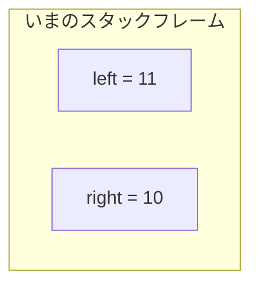
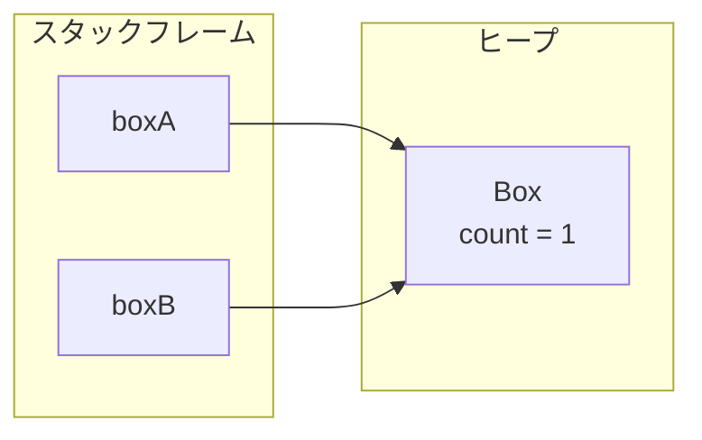
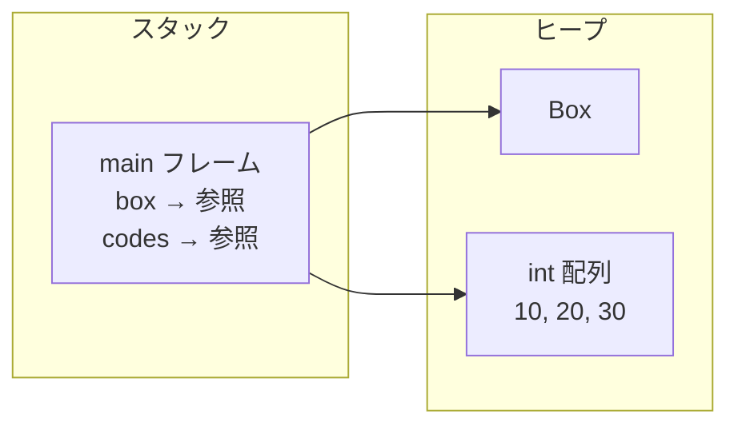
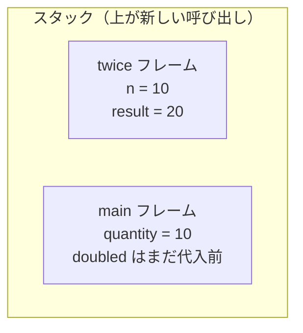
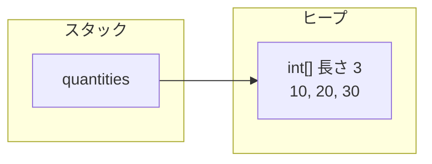

# 型とメモリ

ここから本編です。  
構文の最低限は [メソッドとクラス](./methods-and-classes) までで足ります。不安な書き方があれば戻って構いません。

このページでは、**値と参照・スタックとヒープ・引数の渡し方** を図にできるところまで落とします。  
世代別 GC やヒープダンプは、言語の骨格を一通り見たあとに厚く扱います。

## このページの地図

1. 変数の箱にあるのは値か、行き先（参照）か
2. メソッド呼び出しの作業場（スタック）と、オブジェクトの置き場（ヒープ）
3. 引数でコピーされるもの、軽い `static` と `null`

## このページで分かること

- プリミティブと参照が、変数の箱の中で何を意味するか
- スタックフレームとヒープの役割、スコープやスタックトレースとの対応
- 引数・戻り値がコピーするもの（値そのものか、行き先か）
- 配列はオブジェクトであること
- `static` が「インスタンスの外の共有」であること、`null` の意味

## なぜ先に「置き場」を見るか

Java の文法は書けても、変数が「値」なのか「行き先」なのかを曖昧なまま進んでいる人は少なくありません。  
レビューで「このリストを渡したら呼び出し元まで書き換わる」と驚かれたり、逆に「数値を渡したのに反映されない」と混乱したりするのも、その取り違えから起きやすいです。

このあと [String と equals](./string-equals) やコレクションを読むときも、同じ問いが効きます。  
GC の世代やダンプ調査は、骨格のあとの [ヒープとガベージコレクション](./heap-and-gc) へ回します。

:::tip[先に覚える問い]

迷ったら次の三つを紙に書いてください。  
スタックの話か、ヒープの話か。  
変数が持っているのは値か参照か。  
インスタンスごとの状態か、クラス全体の共有か。

:::

## 変数が持つのは「値」か「参照」か

Java の型は大きく二つです。

| 種類             | 例                                       | 変数が持っているもの           |
| ---------------- | ---------------------------------------- | ------------------------------ |
| **プリミティブ** | `int`, `long`, `boolean`, `double` など  | 値そのもの                     |
| **参照型**       | クラス、配列、`String`、コレクションなど | オブジェクトへの参照（行き先） |

### プリミティブはコピーすると値が分かれる

```java
int left = 10;
int right = left;
left++;
```

`right = left` でコピーされるのは **10 という値** です。  
あとから `left` を 11 にしても、`right` は 10 のままです。



プリミティブ同士に「同じ箱を見ている」関係はありません。  
別の変数は、別の値のコピーです。

### 参照型は実体ではなく行き先を持つ

```java
class Box {
    int count;
}

Box boxA = new Box();
Box boxB = boxA;
boxA.count = 1;
```

`new Box()` で作られる実体はヒープに置かれます。  
`boxA` と `boxB` が持っているのは、その実体への参照です。



コピーされたのは `Box` の中身ではなく、**同じ行き先** です。  
だから `boxA` 経由の変更は、`boxB` からも見えます。

```java
System.out.println(boxB.count); // 1
System.out.println(boxA == boxB); // true（同じ行き先）
```

ここで押さえるのは次の一行です。

> プリミティブ型は値を持つ。参照型は実体への参照を持つ。

`boxA` という箱にオブジェクト全体が入っている、と考えない方があとが楽です。

<QuizChoice
title="参照のコピー"
options={[
{id: 'a', label: 'boxB.count は 0 のまま'},
{id: 'b', label: 'boxB.count は 1'},
{id: 'c', label: 'コンパイルエラーになる'},
]}
answer="b"
explanation="boxB = boxA でコピーされるのは行き先です。同じ Box を共有するので、boxA.count への代入は boxB からも見えます。"

>

  <div>次のコードのあと、<code>boxB.count</code> はどうなりますか。</div>
  <pre className="language-java"><code>{`class Box {
    int count;
}

Box boxA = new Box();
Box boxB = boxA;
boxA.count = 1;
// boxB.count は？`}</code></pre>
</QuizChoice>

## スタックとヒープ

学習の第一歩では、次の二層で十分です。

- **スタック領域** … メソッド呼び出しの流れを管理する。ローカル変数や引数が乗る
- **ヒープ領域** … オブジェクトや配列の実体が置かれる。参照をたどって使う



厳密な物理配置は JVM の実装やバージョンで変わります。  
最初に必要なのは、「ローカルの作業場」と「共有されうる実体」が別だという感覚です。

### `new` はヒープに実体を作る

```java
Box box = new Box();
```

この 1 行は、次の三つがまとまったものです。

1. ヒープに `Box` の実体を確保する
2. コンストラクタで初期化する
3. その実体への参照を変数 `box` に入れる

| 部分      | 意味                                         |
| --------- | -------------------------------------------- |
| `Box box` | `Box` を指す変数を用意する                   |
| `new`     | 新しいインスタンスを生成する                 |
| `Box()`   | コンストラクタ呼び出し。生成した直後の初期化 |

変数の中にオブジェクト全部が入るわけではありません。

大きなデータをメソッド呼び出しのたびに丸ごとコピーするとコストが大きいので、Java は実体をヒープに置き、スタックでは参照を扱います。  
同じ注文や同じリストをコピーせずに共有できる一方、**意図しない共有** も起きやすくなります。

<QuizChoice
title="new の置き場"
options={[
{id: 'a', label: 'Box の実体はスタックに置かれ、参照はヒープに入る'},
{id: 'b', label: 'Box の実体はヒープに置かれ、変数 box は参照（行き先）を持つ'},
{id: 'c', label: '実体も参照も、すべてスタックにだけ置かれる'},
]}
answer="b"
explanation="new で作る実体はヒープ側です。ローカル変数 box が持つのはその行き先です。"

>

  <div>次の 1 行について、正しいものはどれですか。</div>
  <pre className="language-java"><code>{`Box box = new Box();`}</code></pre>
</QuizChoice>

## スタックフレームとスコープ

メソッドが呼ばれるたびに、スタックには **スタックフレーム** が積まれます。  
フレームには、その呼び出し専用のローカル変数と引数が入ります。

```java
public static void main(String[] args) {
    int quantity = 10;
    int doubled = twice(quantity);
}

static int twice(int n) {
    int result = n * 2;
    return result;
}
```

`twice(quantity)` を呼び出して、まだ戻っていない瞬間のイメージです。



メソッドが終わると、そのフレームは取り外されます。  
ローカル変数はそのフレームの寿命に縛られるので、メソッドを抜けたあとでは使えません。

例外時に見る **スタックトレース** は、この積み重ねの痕跡です。

```text
Exception in thread "main" java.lang.ArithmeticException: / by zero
    at Pricing.twice(Pricing.java:10)
    at Pricing.main(Pricing.java:4)
```

上にあるほど **いま実行していたフレーム**、下にあるほど **そこに至るまでに積まれていたフレーム** です。

:::info[スコープの実体]

スコープは文法ルールでもありますが、裏では「その変数が属しているフレームやブロックの寿命」に対応しています。  
ブロックを抜けたローカル変数は使えません。ヒープ上のオブジェクトは、参照が残っている限り別の話として生き続けます。

:::

## 引数と戻り値はすべて値渡し

Java のメソッド引数は **常に値渡し（pass-by-value）** です。  
「参照渡しの言語」ではありません。

ただし、コピーされる値が

- プリミティブの値なのか
- 参照という値なのか

で、見た目の結果が変わります。

### プリミティブを渡す

```java
int quantity = 10;
bump(quantity);
System.out.println(quantity); // 10

static void bump(int n) {
    n = 99;
}
```

渡されるのは `10` のコピーです。  
`bump` 内の `n` を書き換えても、呼び出し元の `quantity` は変わりません。

### 参照を渡す

```java
class Order {
    String id;
    String status;
}

Order order = new Order();
order.id = "ORD-1";
order.status = "OPEN";
close(order);
System.out.println(order.status); // CLOSED

static void close(Order target) {
    target.status = "CLOSED";
}
```

呼び出し元と呼び出し先が、**同じオブジェクトを指す参照のコピー** を持っています。  
フィールドの変更は共有されます。

引数変数そのものを付け替えても、呼び出し元の変数は変わりません。

```java
static void replace(Order target) {
    target = new Order();
    target.id = "ORD-OTHER";
}
```

`replace` のあと、呼び出し元の `order.id` は元の `"ORD-1"` のままです。

:::tip[覚えておくこと]

プリミティブは中身のコピー。  
参照型は「行き先」のコピー。  
行き先のフィールド変更は共有され、変数の付け替えは共有されない。

:::

<QuizChoice
title="引数に渡したあとの値"
options={[
{id: 'a', label: 'x は 99 になる'},
{id: 'b', label: 'x は 1 のまま'},
{id: 'c', label: 'コンパイルエラーになる'},
]}
answer="b"
explanation="int の引数は値のコピーが渡されます。bump 内の n を書き換えても、呼び出し元の x は変わりません。"

>

  <div>次のコードを実行したあと、<code>x</code> はどうなりますか。</div>
  <pre className="language-java"><code>{`void bump(int n) {
    n = 99;
}

int x = 1;
bump(x);`}</code></pre>
</QuizChoice>

<QuizChoice
title="参照の渡し方"
options={[
{id: 'a', label: 'status は CLOSED、id は other'},
{id: 'b', label: 'status は CLOSED、id は ORD-1'},
{id: 'c', label: 'status は OPEN、id は ORD-1'},
]}
answer="b"
explanation="参照のコピーが渡るので status の変更は共有されます。一方 order = new Order() はメソッド内の変数の付け替えだけで、呼び出し元の order が指す先は変わりません。"

>

  <div>次のコードのあと、呼び出し元の <code>order</code> はどうなりますか。</div>
  <pre className="language-java"><code>{`class Order {
    String id;
    String status;
}

void touch(Order order) {
order.status = "CLOSED";
order = new Order();
order.id = "other";
}

Order order = new Order();
order.id = "ORD-1";
order.status = "OPEN";
touch(order);
// order.status と order.id は？`}</code></pre>
</QuizChoice>

### 戻り値はフレームが消える前に渡す

メソッド終了と同時にフレームは消えます。  
その直前に呼び出し元へ渡されるのが戻り値です。  
オブジェクトを返す場合は、ヒープ上の実体への参照が返ります。

## 配列はオブジェクトである

配列の実体もヒープに置かれます。

```java
int[] quantities = new int[3];
quantities[0] = 10;
quantities[1] = 20;
quantities[2] = 30;
```



- 配列はオブジェクトなので、変数が持つのは参照
- 長さは生成時に決まり、あとから伸ばせない
- 要素を書き換えると、同じ配列を指す呼び出し元からも見える

参照型の配列では、箱（配列）と中身（各要素のオブジェクト）が両方ヒープにあります。  
「配列をコピーした」のか「要素のオブジェクトを共有している」のかは、別の話として切り分けます。

可変長の一覧や、ノードを参照でつなぐ構造は [コレクションとジェネリクス](./collections-generics) で扱います。

## `static` はインスタンスの外の共有

`static` フィールドはインスタンスごとに増えません。**クラスに属します。**

```java
class TicketCounter {
    static int issued;
    int number;
}
```

`new TicketCounter()` を 100 個作っても、`number` はインスタンスごと、`issued` はクラスに対して 1 個です。

共有の置き場は便利な一方、テスト同士の干渉や、リクエストをまたいだ値の残留につながります。  
文法・定数・寿命の話は [static と final](./static-final) へ進み、ここでは「全体で一つ」と結び付けてください。

<QuizChoice
title="static の共有"
options={[
{id: 'a', label: 'a.issued は 1、b.issued は 0'},
{id: 'b', label: 'a.issued も b.issued も 1'},
{id: 'c', label: 'コンパイルエラーになる'},
]}
answer="b"
explanation="static フィールドはクラス側の共有です。インスタンスが別でも同じ場所を見ます。"

>

  <div>次のコードのあと、<code>b.issued</code> はどうなりますか。</div>
  <pre className="language-java"><code>{`class TicketCounter {
    static int issued;
    int number;
}

TicketCounter a = new TicketCounter();
TicketCounter b = new TicketCounter();
a.issued++;
// b.issued は？`}</code></pre>
</QuizChoice>

## `null` は「行き先がない」

参照型の変数は、まだ行き先がないとき `null` を取れます。  
`null` のままフィールドやメソッドに触ると `NullPointerException`（NPE）になります。

```java
Order order = null;
order.id = "ORD-1"; // NPE
```

NPE は「Java が壊れた」のではなく、**存在しない行き先にアクセスした** 合図です。

<details>
<summary>プリミティブに null は入らない</summary>

`int x = null;` はコンパイルエラーです。  
「無い」を表したい整数は、`Integer`（参照型のラッパ）など別の表現を検討します。  
`int` と `Integer` の行き来（オートボクシング）は [コレクションとジェネリクス](./collections-generics) で一行触ります。

</details>

<QuizChoice
title="null 参照"
options={[
{id: 'a', label: 'id に ORD-1 が入る'},
{id: 'b', label: 'NullPointerException になる'},
{id: 'c', label: 'コンパイルエラーになる'},
]}
answer="b"
explanation="order は null（行き先がない）なので、フィールドへのアクセスは実行時に NullPointerException になります。"

>

  <div>次のコードはどうなりますか。</div>
  <pre className="language-java"><code>{`class Order {
    String id;
}

Order order = null;
order.id = "ORD-1";`}</code></pre>
</QuizChoice>

## よくあるつまずき

- 参照型を「常にディープコピーされる」と思い、リストの中身変更に驚く
- 引数を `new` で付け替えて、呼び出し元が変わらないのを「値渡しじゃない」と解釈する
- スタックトレースの上下を、ファイル内の行番号の並びと混同する
- `static` を「定数の印」だけだと思い、共有寿命を見落とす
- NPE のメッセージだけ見て、どの参照が null かをログやデバッガで確認しない

## まとめ / 次に学ぶとよいこと

- プリミティブは値、参照型は行き先。どちらも引数は値渡し
- スタックは呼び出しの作業場、ヒープは実体の置き場
- メソッド終了でフレームは消えるが、ヒープ上の実体は参照が残れば残る
- `static` はインスタンスの外の共有。`null` は行き先がないこと

次は [String と equals](./string-equals) で、参照の同一性と中身の同値を切り分けます。  
ヒープの回収やダンプ調査は、骨格を一通り見たあとに戻ってきます。
