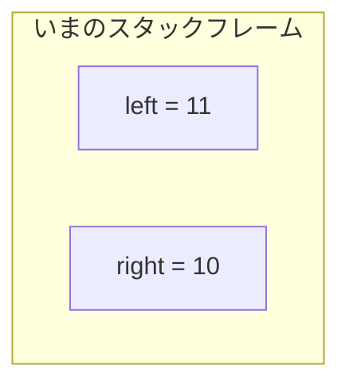
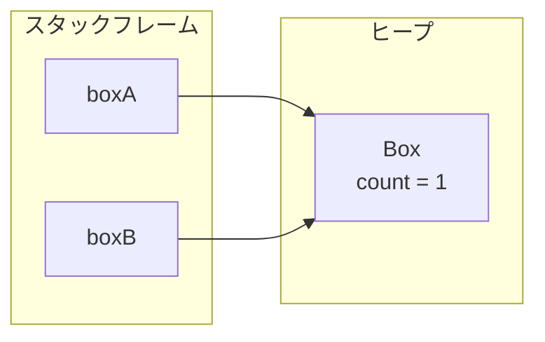
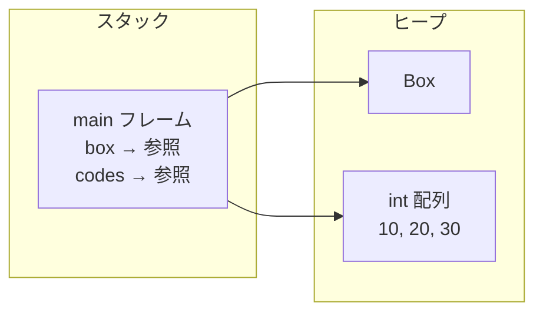
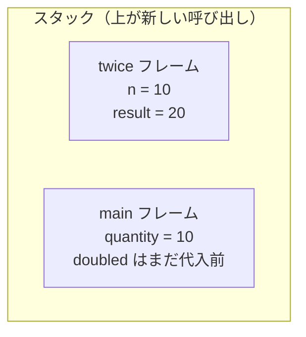
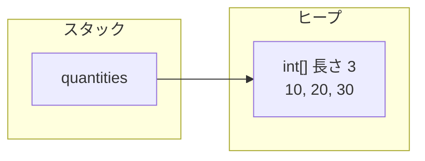

# 型とメモリ

リストを渡したら、呼び出し元まで中身が変わった。  
数値を渡したのに、呼び出し元は変わらなかった。

どちらも「おかしい」のではなく、**変数の箱に何が入っているか**が違うだけです。  
このページでは、その地図を描けるところまで落とします。

## このページの地図

1. 変数の箱にあるのは値か、行き先（参照）か
2. メソッド呼び出しの作業場（スタック）と、オブジェクトの置き場（ヒープ）
3. 引数でコピーされるもの、軽い `static` と `null`

## このページで分かること

- プリミティブと参照が、変数の箱の中で何を意味するか
- スタックフレームとヒープの役割
- 引数・戻り値がコピーするもの（値そのものか、行き先か）
- 配列はオブジェクトであること
- `static` が「全体で一つ」であること、`null` の意味

## なぜ「置き場」か

文法は書けても、箱の中身が曖昧なまま進むと、レビューで何度も同じ驚きが起きます。  
変わってほしくないものが変わる。変わってほしいものが変わらない。

迷ったら、次の三つを紙に書いてください。

:::tip[先に覚える問い]

スタックの話か、ヒープの話か。  
変数が持っているのは値か参照か。  
ひとつずつの状態か、全体の共有か。

:::

## 変数が持つのは「値」か「参照」か

Java の型は大きく二つです。

| 種類             | 例                                       | 変数が持っているもの           |
| ---------------- | ---------------------------------------- | ------------------------------ |
| **プリミティブ** | `int`, `long`, `boolean`, `double` など  | 値そのもの                     |
| **参照型**       | クラス、配列、`String`、コレクションなど | オブジェクトへの参照（行き先） |

### プリミティブは、コピーすると別物

たとえで言うと、**メモの写し**です。  
写したあとに片方を書き換えても、もう片方は変わりません。

```java
int left = 10;
int right = left;
left++;
```

`right = left` でコピーされるのは **10 という値** です。  
あとから `left` を 11 にしても、`right` は 10 のままです。



### 参照型は、住所のコピー

たとえで言うと、**倉庫の住所を書いた付箋**です。  
付箋をコピーしても、指している倉庫は同じ。  
片方の付箋から中身を書き換えると、もう片方からも見えます。

```java
class Box {
    int count;
}

Box boxA = new Box();
Box boxB = boxA;
boxA.count = 1;
```

`new Box()` で作られる実体はヒープに置かれます。  
`boxA` と `boxB` が持っているのは、その実体への参照です。



コピーされたのは `Box` の中身ではなく、**同じ行き先** です。

```java
System.out.println(boxB.count); // 1
System.out.println(boxA == boxB); // true（同じ行き先）
```

> プリミティブは値を持つ。参照型は行き先を持つ。

箱の中にオブジェクト全体が入っている、と考えない方があとが楽です。

<QuizChoice
title="参照のコピー"
options={[
{id: 'a', label: 'boxB.count は 0 のまま'},
{id: 'b', label: 'boxB.count は 1'},
{id: 'c', label: 'コンパイルエラーになる'},
]}
answer="b"
explanation="boxB = boxA でコピーされるのは行き先です。同じ Box を共有するので、boxA.count への代入は boxB からも見えます。"

>

  <div>次のコードのあと、<code>boxB.count</code> はどうなりますか。</div>
  <pre className="language-java"><code>{`class Box {
    int count;
}

Box boxA = new Box();
Box boxB = boxA;
boxA.count = 1;
// boxB.count は？`}</code></pre>
</QuizChoice>

## スタックとヒープ

学習の第一歩では、次の二層で十分です。

- **スタック** … メソッド呼び出しの作業机。ローカル変数や引数が乗る
- **ヒープ** … オブジェクトや配列の倉庫。住所（参照）をたどって使う



机の上に置くのは軽いもの。  
大きい実体は倉庫へ。住所だけ机に残す。  
だから同じ注文や同じリストを、コピーせずに共有できます。  
その代わり、**意図しない共有**も起きやすくなります。

### `new` は倉庫に実体を作る

```java
Box box = new Box();
```

この 1 行は、次の三つがまとまったものです。

1. ヒープに `Box` の実体を確保する
2. コンストラクタで初期化する
3. その実体への参照を変数 `box` に入れる

| 部分      | 意味                       |
| --------- | -------------------------- |
| `Box box` | 行き先を書く付箋を用意する |
| `new`     | 倉庫に新しい実体を作る     |
| `Box()`   | 作った直後の初期化         |

<QuizChoice
title="new の置き場"
options={[
{id: 'a', label: 'Box の実体はスタックに置かれ、参照はヒープに入る'},
{id: 'b', label: 'Box の実体はヒープに置かれ、変数 box は参照（行き先）を持つ'},
{id: 'c', label: '実体も参照も、すべてスタックにだけ置かれる'},
]}
answer="b"
explanation="new で作る実体はヒープ側です。ローカル変数 box が持つのはその行き先です。"

>

  <div>次の 1 行について、正しいものはどれですか。</div>
  <pre className="language-java"><code>{`Box box = new Box();`}</code></pre>
</QuizChoice>

## スタックフレームとスコープ

メソッドが呼ばれるたびに、スタックには **フレーム** が積まれます。  
呼び出し専用の作業机が、一段ずつ重なるイメージです。

```java
public static void main(String[] args) {
    int quantity = 10;
    int doubled = twice(quantity);
}

static int twice(int n) {
    int result = n * 2;
    return result;
}
```

`twice(quantity)` を呼び出して、まだ戻っていない瞬間です。



メソッドが終わると、そのフレームは取り外されます。  
机が片付くと、その机の上のメモも使えません。

例外時に見る **スタックトレース** は、この積み重ねの痕跡です。

```text
Exception in thread "main" java.lang.ArithmeticException: / by zero
    at Pricing.twice(Pricing.java:10)
    at Pricing.main(Pricing.java:4)
```

上にあるほど **いま実行していたフレーム**、下にあるほど **そこに至るまでに積まれていたフレーム** です。  
ログの並びは、呼び出しの積み方そのものです。

:::info[スコープ]

ブロックを抜けたローカル変数は使えません。  
倉庫側のオブジェクトは、住所を覚えた付箋が残っている限り、別の話として生き続けます。

:::

## 引数はすべて値渡し——中身が違う

Java のメソッド引数は **常に値渡し** です。  
「参照渡しの言語」ではありません。

ただし、コピーされる値が

- プリミティブの値なのか
- 参照（行き先）という値なのか

で、見た目の結果が変わります。  
同じ「コピー」でも、メモの写しと住所の写しは別物です。

### プリミティブを渡す

```java
int quantity = 10;
bump(quantity);
System.out.println(quantity); // 10

static void bump(int n) {
    n = 99;
}
```

渡されるのは `10` のコピーです。  
`bump` 内の `n` を書き換えても、呼び出し元の `quantity` は変わりません。

### 参照を渡す

```java
class Order {
    String id;
    String status;
}

Order order = new Order();
order.id = "ORD-1001";
order.status = "OPEN";
close(order);
System.out.println(order.status); // CANCELLED

static void close(Order target) {
    target.status = "CANCELLED";
}
```

呼び出し元と呼び出し先が、**同じ倉庫を指す住所のコピー** を持っています。  
倉庫の中身の変更は共有されます。

住所の付箋そのものを付け替えても、呼び出し元の付箋は変わりません。

```java
static void replace(Order target) {
    target = new Order();
    target.id = "ORD-OTHER";
}
```

`replace` のあと、呼び出し元の `order.id` は元の `"ORD-1001"` のままです。

:::tip[覚えておくこと]

プリミティブは中身のコピー。  
参照型は行き先のコピー。  
行き先のフィールド変更は共有され、変数の付け替えは共有されない。

:::

<QuizChoice
title="引数に渡したあとの値"
options={[
{id: 'a', label: 'x は 99 になる'},
{id: 'b', label: 'x は 1 のまま'},
{id: 'c', label: 'コンパイルエラーになる'},
]}
answer="b"
explanation="int の引数は値のコピーが渡されます。bump 内の n を書き換えても、呼び出し元の x は変わりません。"

>

  <div>次のコードを実行したあと、<code>x</code> はどうなりますか。</div>
  <pre className="language-java"><code>{`void bump(int n) {
    n = 99;
}

int x = 1;
bump(x);`}</code></pre>
</QuizChoice>

<QuizChoice
title="参照の渡し方"
options={[
{id: 'a', label: 'status は CANCELLED、id は other'},
{id: 'b', label: 'status は CANCELLED、id は ORD-1001'},
{id: 'c', label: 'status は OPEN、id は ORD-1001'},
]}
answer="b"
explanation="参照のコピーが渡るので status の変更は共有されます。一方 order = new Order() はメソッド内の変数の付け替えだけで、呼び出し元の order が指す先は変わりません。"

>

  <div>次のコードのあと、呼び出し元の <code>order</code> はどうなりますか。</div>
  <pre className="language-java"><code>{`class Order {
    String id;
    String status;
}

void touch(Order order) {
order.status = "CANCELLED";
order = new Order();
order.id = "other";
}

Order order = new Order();
order.id = "ORD-1001";
order.status = "OPEN";
touch(order);
// order.status と order.id は？`}</code></pre>
</QuizChoice>

### 戻り値は、机が片付く前に渡す

メソッド終了と同時にフレームは消えます。  
その直前に呼び出し元へ渡されるのが戻り値です。  
オブジェクトを返す場合は、倉庫への住所が返ります。

## 配列もオブジェクト

配列の実体もヒープに置かれます。  
卵パック（トレー）そのものが倉庫にあり、机の上には住所の付箋だけ、というイメージです。

```java
int[] quantities = new int[3];
quantities[0] = 10;
quantities[1] = 20;
quantities[2] = 30;
```



- 配列はオブジェクトなので、変数が持つのは参照
- 長さは生成時に決まり、あとから伸ばせない
- 要素を書き換えると、同じ配列を指す呼び出し元からも見える

## `static` は全体で一つ

`static` フィールドは、伝票を何枚切っても増えません。  
**掲示板に一枚だけ貼ってある共有メモ**です。

```java
class OrderSequence {
    static int issued;
    int number;
}
```

`new OrderSequence()` を 100 個作っても、`number` はインスタンスごと、`issued` はクラスに対して 1 個です。

便利な一方、テスト同士の干渉や、リクエストをまたいだ値の残留につながります。

<QuizChoice
title="static の共有"
options={[
{id: 'a', label: 'a.issued は 1、b.issued は 0'},
{id: 'b', label: 'a.issued も b.issued も 1'},
{id: 'c', label: 'コンパイルエラーになる'},
]}
answer="b"
explanation="static フィールドはクラス側の共有です。インスタンスが別でも同じ場所を見ます。"

>

  <div>次のコードのあと、<code>b.issued</code> はどうなりますか。</div>
  <pre className="language-java"><code>{`class OrderSequence {
    static int issued;
    int number;
}

OrderSequence a = new OrderSequence();
OrderSequence b = new OrderSequence();
a.issued++;
// b.issued は？`}</code></pre>
</QuizChoice>

## `null` は「行き先がない」

参照型の変数は、まだ行き先がないとき `null` を取れます。  
住所欄が空の付箋です。  
空のまま倉庫に行こうとすると、`NullPointerException`（NPE）になります。

```java
Order order = null;
order.id = "ORD-1001"; // NPE
```

NPE は「Java が壊れた」のではありません。  
**存在しない行き先にアクセスした** 合図です。

<details>
<summary>プリミティブに null は入らない</summary>

`int x = null;` はコンパイルエラーです。  
整数の付箋には「無い」を直接書けません。

</details>

<QuizChoice
title="null 参照"
options={[
{id: 'a', label: 'id に ORD-1001 が入る'},
{id: 'b', label: 'NullPointerException になる'},
{id: 'c', label: 'コンパイルエラーになる'},
]}
answer="b"
explanation="order は null（行き先がない）なので、フィールドへのアクセスは実行時に NullPointerException になります。"

>

  <div>次のコードはどうなりますか。</div>
  <pre className="language-java"><code>{`class Order {
    String id;
}

Order order = null;
order.id = "ORD-1001";`}</code></pre>
</QuizChoice>

## よくあるつまずき

- 参照型を「常に丸ごとコピーされる」と思い、リストの中身変更に驚く
- 引数を `new` で付け替えて、呼び出し元が変わらないのを「値渡しじゃない」と解釈する
- スタックトレースの上下を、ファイル内の行番号の並びと混同する
- `static` を「定数の印」だけだと思い、共有を見落とす
- NPE のメッセージだけ見て、どの参照が null かを確認しない

## まとめ / 次に学ぶとよいこと

- プリミティブは値、参照型は行き先。どちらも引数は値渡し
- スタックは呼び出しの作業机、ヒープは実体の倉庫
- メソッド終了でフレームは消えるが、倉庫の実体は参照が残れば残る
- `static` は全体で一つ。`null` は行き先がないこと

次は [String と equals](./string-equals) で、同じ行き先か・同じ中身かを切り分けます。
