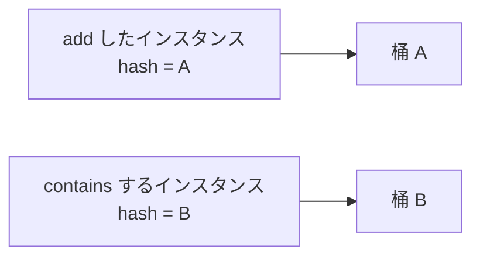

# String と equals

[文字列の基本](./string-basics) では、中身の比較に `equals` を使い、`==` は避ける、と覚えました。  
[型とメモリ](./types-and-memory) では、`String` の変数が持つのは文字そのものではなく **行き先** だと地図を引きました。

このページでは、そのふたつをつなぎます。  
画面から受け取った注文 ID と DB に保存された注文 ID が、どちらもログでは `"ORD-1001"` と表示されていても、`==` で比べると `false` になることがあります。  
Java が文字の並びではなく、**同じオブジェクトを指しているか**を確認しているためです。

文字の並びが同じかを確かめたいなら、使うのは `equals` です。  
なぜ `==` では期待どおりにならないのかを `String` の仕組みから整理し、文字列プールや `hashCode` を含めて安全な比較方法を身につけます。

## このページで分かること

- `String` が参照型であることと、不変であることの意味
- `==`（同一性）と `equals`（同値）の違い

## 文字列比較でつまずきやすい理由

テストデータが全部ソース上のリテラルだと、`==` でも通ってしまうことがあります。  
本番の入力やファイル由来では別オブジェクトになり、突然壊れます。  
中身が同じでも、**参照が同じか** と **中身が同じか** は別問題です。

## String は参照型で、中身は変えられない

`String` はクラスなので参照型です。  
リテラル `"hello"` も、内部的には文字列オブジェクトへの参照になります。

```java
String label = "SHIPPED";
```

`String` の重要な性質は **不変（immutable）** であることです。  
封をした手紙をあとから書き換えない、に近いです。  
`toUpperCase` や `substring` は、元のオブジェクトを書き換えず、別の `String` を返します。

```java
String status = "paid";
String upper = status.toUpperCase();
System.out.println(status); // paid
System.out.println(upper);  // PAID
```

不変なので、同じ文字列を複数箇所で共有しても、片方の「書き換え」で他方が壊れる心配がありません。  
キーやメッセージの受け渡しに向く理由のひとつです。  
逆に、大量の連結を `+` のループで行うと中間 `String` が増えます。繰り返し連結は `StringBuilder` を検討します。

<details>
<summary>文字コードと長さ</summary>

`length()` は UTF-16 のコードユニット数です。  
絵文字などでは「人が数える文字数」と一致しないことがあります。  
厳密な文字数や正規化が必要なら、用途に合った API（コードポイント単位など）を選びます。  
業務の ID 比較では、まず「同じ正規化規則か」（前後空白、大文字小文字）を揃える方が先です。

</details>

## `==` と `equals`

| 演算 / メソッド | 見ているもの                           | 文字列での使い方 | たとえ（ざっくり） |
| --------------- | -------------------------------------- | ---------------- | ------------------ |
| `==`            | 参照が同じか（プリミティブなら値）     | 原則使わない     | 同一人物か         |
| `equals`        | オブジェクトが「等しい」と定義した内容 | 中身の比較に使う | 名札の文字が同じか |

```java
String left = new String("task");
String right = new String("task");

System.out.println(left == right);      // false になりやすい
System.out.println(left.equals(right)); // true
```

ユーザー入力、ファイル、HTTP、DB から来た文字列は、ほぼ確実に別オブジェクトです。  
**中身の比較は `equals`**、と決めておくと事故が減ります。

参照の同一性を意図して見るときは `==` で構いません。  
「同じキャッシュエントリか」「検知したインスタンスが同一か」など、同値ではない問いのときです。

:::tip[覚えておくこと]

文字列の同値比較は `equals`。  
`==` は「同一インスタンスか」を見るときに限る。

:::

<QuizChoice
title="文字列の比較"
options={[
{id: 'a', label: 'A（==）'},
{id: 'b', label: 'B（equals）'},
{id: 'c', label: 'A と B は常に同じ結果'},
]}
answer="b"
explanation="中身の同値比較は equals です。== は参照の同一性で、入力由来の文字列では false になりやすいです。null の可能性があるなら Objects.equals や &quot;OPEN&quot;.equals(a) も検討します。"

>

  <div>中身が同じかを知りたいとき、使うべきなのはどれですか。</div>
  <pre className="language-java"><code>{`String a = readFromRequest(); // 外部入力
String b = "OPEN";

// A: a == b
// B: a.equals(b)`}</code></pre>
</QuizChoice>

## null と空白・大文字小文字

左側が null のとき `left.equals(right)` は NPE になります。

```java
import java.util.Objects;

"order".equals(left);        // left が null でも false
Objects.equals(left, right); // 両方 null なら true、片方だけなら false
```

見た目が同じでも、次で `equals` は false になります。

- 前後の空白（`"ORD-1"` と `"ORD-1 "`）
- 大文字小文字（`"Paid"` と `"paid"`）
- Unicode の見た目は近いが正規化が違う文字

入力境界では、trim やポリシーに沿った正規化を **比較の前に一度** 行うか、比較専用のメソッド（`equalsIgnoreCase` など）を明示します。  
「画面では同じに見える」を、ログにコードポイントや長さを出して疑う習慣があると早いです。

:::info[ここまでの核]

中身の比較は `equals`。`==` は同一性だけ。  
ここまで押さえれば、日常の文字列比較では足ります。

:::

## 文字列プールと `==`

```java
String a = "order";
String b = "order";
String c = new String("order");
String d = readFromRequest(); // 外部入力
```

JVM は同じ内容の文字列リテラルを、**文字列プール**上の同じインスタンスへまとめることがあります。  
クロークで「同じ内容のコート」を同じハンガーにまとめる、くらいのイメージです。  
そのため `a == b` が `true` になることはあります。  
一方 `c` は明示的に別オブジェクトを作りやすく、`d` は入力経路次第で別物です。

```java
System.out.println(a == b);      // true になりやすい（プール）
System.out.println(a == c);      // false になりやすい
System.out.println(a.equals(c)); // true
```

プールの挙動に頼った比較は危険です。  
コンパイラの最適化や実行経路で結果が変わり、**テストだけ通る** 典型になります。

<details>
<summary>String.intern()</summary>

`String.intern()` はプールへ載せる操作ですが、寿命と競合の副作用があるため、同値比較の代わりには使いません。  
中身の比較は常に `equals`（または `Objects.equals`）です。

</details>

## 次の段: equals と hashCode（Map / Set）

自作クラスを `HashMap` のキーや `HashSet` の要素にするとき、ここが必須になります。

### equals の契約

自作クラスで「同じ業務上の ID なら等しい」と決めたいとき、`equals` をオーバーライドします。  
契約（`Object` のドキュメントが求める性質）の要点です。

- **反射律** … `x.equals(x)` は true
- **対称律** … `x.equals(y)` と `y.equals(x)` は同じ結果
- **推移律** … 連鎖しても矛盾しない
- **一貫性** … 比較に使う情報が変わらないなら、結果も安定する
- **null** … `x.equals(null)` は false（NPE にしない）

```java
public final class UserId {
    private final String value;

    public UserId(String value) {
        this.value = Objects.requireNonNull(value);
    }

    @Override
    public boolean equals(Object o) {
        if (this == o) {
            return true;
        }
        if (!(o instanceof UserId other)) {
            return false;
        }
        return value.equals(other.value);
    }

    @Override
    public int hashCode() {
        return value.hashCode();
    }
}
```

継承階層で `equals` を拡張すると、対称律を壊しやすいです。  
値を表す型は `final` にする、または `record` にする方が安全です。

## hashCode とのセット（続き）

`Set` や `Map`（実装の例: `HashSet` / `HashMap`）のキーでは、次の流れで探します。  
倉庫のロッカー番号で区画を決め、区画の中で名札を突き合わせる、に近いです。

1. `hashCode` で桶（バケット）を決める
2. その桶の中で `equals` により同値を探す

契約の核心です。

> `equals` が true なら、`hashCode` も同じでなければならない。  
> `hashCode` が同じでも、`equals` は false でもよい（衝突）。

`equals` だけオーバーライドして `hashCode` を放置すると、次が起きます。

```java
Set<UserId> ids = new HashSet<>();
ids.add(new UserId("u-1"));
System.out.println(ids.contains(new UserId("u-1"))); // false になりうる
```

別インスタンスでも業務上は同じ ID なのに、ハッシュが食い違って別桶を見にいくためです。



桶が違うと、`equals` まで到達しません。

:::warning[片方だけ変えない]

`equals` を触ったら `hashCode` も揃える。  
`hashCode` だけ変えるのも同様に危険です。  
IDE や `Objects.hash(...)` で、比較に使うフィールドを同じ集合にします。

:::

<QuizChoice
title="HashSet で contains するために"
options={[
{id: 'a', label: 'equals だけオーバーライドする'},
{id: 'b', label: 'hashCode だけオーバーライドする'},
{id: 'c', label: 'equals と hashCode の両方を揃える'},
{id: 'd', label: 'toString をオーバーライドする'},
]}
answer="c"
explanation="HashSet / HashMap は hashCode で桶を決め、equals で同値を確認します。equals だけだと別インスタンスが別桶を見にいき、contains が false になりえます。"

>

  <div>次が true になるために、<code>UserId</code> へ必要な実装はどれですか。</div>
  <pre className="language-java"><code>{`Set<UserId> ids = new HashSet<>();
ids.add(new UserId("u-1"));
ids.contains(new UserId("u-1")); // true にしたい`}</code></pre>
</QuizChoice>

## Map のキーが可変だと壊れる

`hashCode` に使っているフィールドを、キーとして入れたあとに書き換えると、オブジェクトは別の桶にあるべき位置へ移りません。  
ロッカー番号を貼ったあとに番号札だけ付け替えると、倉庫が迷子になるのと同じです。

```java
// 悪い例: 可変なキー
class MutableCode {
    String code;
    // equals / hashCode が code 依存
}

MutableCode key = new MutableCode();
key.code = "A";
map.put(key, order);
key.code = "B"; // もう map から見つけにくい
```

キーにする型は、不変にするか、入れる前にコピーして二度と変えないかです。  
`String`、`record`、値オブジェクトが向くのはこのためです。

`enum` をキーにするのは安全で分かりやすい選択です。  
取り得る値が閉じている状態遷移などに向きます。

## record と生成コード

`record` は成分に基づく `equals` / `hashCode` / `toString` を生成します。  
手書きの契約を、言語に任せられる、と分かれば足ります。

```java
record UserId(String value) {
    UserId {
        Objects.requireNonNull(value);
    }
}
```

手書きする場合は、比較対象フィールドの追加漏れに注意します。  
生成ツールを使う場合も、フィールド追加のたびに再生成や差分確認が必要です。

<details>
<summary>配列・コレクションの equals</summary>

配列の `equals` は参照比較なので、中身を比べるなら `Arrays.equals` です。  
`List` などコレクションは、要素の `equals` に委譲する実装が多く、要素型の契約がそのまま効きます。

</details>

## 実務での目安

- 文字列の同値は `Objects.equals` または定数左側の `equals`
- 入力は比較前に正規化方針を決める（trim、大文字小文字）
- キーや Set の要素にする型は、不変＋`equals`/`hashCode` セット
- 「入れたのに取れない」は、まず契約と可変キーを疑う
- ログに出すときは、長さや引用符付きで空白差が見えるようにする

## よくあるつまずき

- テストが全部リテラルで、`==` でも通ってしまう
- `equals` だけ実装して Map / Set が壊れる
- 可変オブジェクトをキーにしたままフィールドを書き換える
- 大文字小文字や前後空白を、画面の見た目だけで同じだと思う
- `hashCode` に乱数や現在時刻を混ぜて、桶が安定しない

## まとめ / 次に学ぶとよいこと

- `String` は参照型で不変。中身の比較は `equals`
- `==` は同一性。プールの偶然に頼らない
- `equals` と `hashCode` はセット。ハッシュベースのコレクションの前提
- キーは不変に保つ

次は [ラッパ型と Integer キャッシュ](./wrappers-and-integer-cache) で、数字に見える参照型と、小さな整数の使い回しを見ます。
