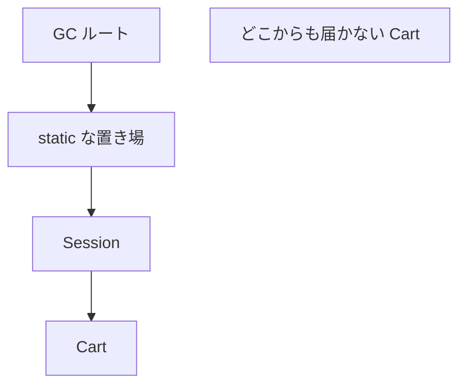
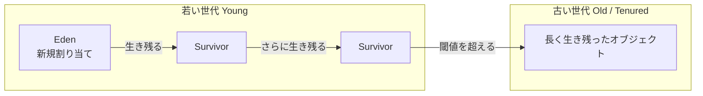

# ヒープとガベージコレクション

[型とメモリ](./types-and-memory) で、オブジェクトの実体はヒープに乗り、参照が残るかぎり使えることを見ました。  
言語の骨格（コレクションや Stream の入口）を一通り踏んだうえで、このページでは **いつ不要と判定され、どう回収されるか** を現場で会話できる粒度まで落とします。

「GC があるからメモリは気にしなくてよい」は、Java でいちばん高い誤解のひとつです。  
回収されるのは到達できなくなったオブジェクトだけで、到達できるままの「もう使わないデータ」は残り続けます。

## このページで分かること

- 到達可能性と GC ルート
- 若い領域と古い領域に分ける理由（世代別 GC の仮説）
- マイナー GC / フル GC、Stop-The-World の意味
- よく使われるコレクタの役割分担（G1 を中心に）
- 弱い参照、メタスペース、ネイティブメモリ、スタックとの切り分け
- ヒープサイズや `System.gc()` に対する実務的な態度

対象のイメージは **Java 17 以降のホットスポット JVM** です。  
コレクタの既定値やログ形式はバージョンで変わるので、本番の JDK では公式ドキュメントを確認してください。

## なぜ GC をきちんと見るか

注文処理が昼間だけ重い、夜のバッチでヒープが右肩上がり、デプロイのたびにメモリが戻らない——こうした症状を「たぶんリーク」で片付けると、次の一手が勘になります。

実際には、次のどれか（または複合）です。

- 一時オブジェクトを作りすぎて、若い領域の GC が忙しい
- キャッシュやセッションが参照を持ち続け、古い領域が埋まっていく
- ヒープではなくメタスペースやネイティブ側が足りない
- そもそも遅さの本体は DB や外部 API で、GC は巻き添え

コードを読む前に、**何が回収対象で、何がルートから見えているか** の語彙がないと、ダンプも GC ログも読めません。

:::tip[GC が約束すること]

GC は、到達不能になった Java オブジェクトのヒープメモリを回収します。  
ファイル、ソケット、DB 接続のような外部リソースのクローズまでは請け負いません。  
「不要だと人間が思っている」ことと、「ルートから到達できない」ことは別です。

:::

## 到達可能性が回収の判定基準

変数を `null` にしたから消える、ではありません。  
**GC ルートから参照をたどって届くか** が基準です。

```java
Cart cart = new Cart();
cart = null;
```

この `Cart` を指す経路が他になければ、回収候補になります。  
同じオブジェクトを `static` なマップや、別スレッドのキュー、未完了のリスナーが指していれば、ローカル変数を消しても残り続けます。



上図の `Cart` はルートから届くので生きています。  
`orphan` は届かないので、次の GC で回収され得ます。

### GC ルートの代表例

「誰が起点になってヒープを照らしているか」がルートです。  
学習上よく出るものは次です。

| ルートの種類                     | イメージ                                                     |
| -------------------------------- | ------------------------------------------------------------ |
| スタック上のローカル変数・引数   | いま動いているメソッドが握っている参照                       |
| `static` フィールド              | クラスに紐づく共有。クラスがアンロードされない限り残りやすい |
| JNI などネイティブが保持する参照 | Java 側から見えにくい保持                                    |
| 実行中スレッドそのもの           | スレッドが生きているあいだ、そのスタックはルートになる       |

調査で重要なのは、残っているインスタンスのクラス名より、**どのルート経由で照らされているか** です。  
その読み方は、並行処理のあとの [メモリリークとヒープダンプ](./memory-leaks-and-dumps) で扱います。

### 「生きている」の単位はオブジェクトグラフ

カートがラインアイテムのリストを持っているなら、カートが生きているかぎりラインアイテムも生きます。  
逆に、カートへの参照がすべて切れれば、そこからしか届かなかった子もまとめて不要になります。

```java
Order order = loadOrder();
process(order);
order = null; // このメソッド内の箱は切れた
```

`process` がフィールドやキャッシュに `order` を保存していれば、まだ届きます。  
ローカル変数の寿命と、オブジェクトグラフの寿命を分けて考えてください。

<QuizChoice
title="到達できないとは"
options={[
{id: 'a', label: 'A の pdf の方が回収候補になりやすい'},
{id: 'b', label: 'B の pdf の方が回収候補になりやすい'},
{id: 'c', label: 'どちらも同じタイミングで必ず回収される'},
]}
answer="b"
explanation="GC が見るのは到達可能かどうかです。A は static な置き場が照らし続けるので残りやすいです。B はメソッドを抜けて他から届かなければ回収候補になります。"

>

  <div>回収候補になりやすいのはどちらですか。</div>
  <pre className="language-java"><code>{`// A（static な置き場が照らし続ける）
static final Object[] hold = new Object[1];
void cache(byte[] pdf) {
    hold[0] = pdf;
}

// B（メソッドを抜けたら、他から届かなければ切れやすい）
void once() {
byte[] pdf = loadPdf();
send(pdf);
}`}</code></pre>
</QuizChoice>

## 世代別という仮説

多くのホットスポットの GC は、オブジェクトを年齢で分けて扱います。  
根拠は経験則です。

> ほとんどのオブジェクトはすぐに不要になる。  
> しばらく生き残ったものは、さらに長く生きやすい。

短い寿命のものを頻繁に、狭い領域で掃く方が、ヒープ全体を毎回なめるより安く済みます。  
これが **世代別 GC（generational GC）** の発想です。

学習用の地図は次です。



名前や領域の切り方はコレクタによって違います（G1 は領域を Region に分割します）。  
最初に持つイメージは次で足ります。

- **Eden** … 新しいオブジェクトがまず置かれる場所
- **Survivor** … Eden の回収を生き延びたものが一時的に退避する場所
- **Old** … 何度も生き延びたものが昇格（promotion）する場所

若い世代の回収を **マイナー GC**、古い世代を含む大きめの回収を **メジャー GC / フル GC** と呼ぶことがあります。  
用語はコレクタと資料で揺れるので、ログを読むときは「若い領域だけか、ヒープ全体に近いか」「アプリケーションスレッドを止めたか」を先に見ます。

### なぜ「すぐ死ぬ」が多いのか

リクエスト 1 件の処理では、DTO、一時リスト、文字列連結の中間結果、例外オブジェクトなど、メソッドを抜けたら不要になるものが大量に出ます。  
これらが Eden で生まれ、マイナー GC で消えるのが健全なパターンです。

問題になるのは、次のようなずれです。

- 一時のつもりがキャッシュに入り、Old へ昇格して残る
- 巨大な配列やバイト列を毎回割り当て、若い領域がすぐ埋まる
- 昇格が多すぎて Old が埋まり、重い GC が増える

「割り当てが速い」こと自体は正常です。  
Java のアロケーションは、スレッド専用の小さな塊（**TLAB: Thread-Local Allocation Buffer**）へ順番に領域を切り出す実装が多く、短い寿命のオブジェクトを量産する前提に近いです。

<details>
<summary>オブジェクトが必ずヒープに行くとは限らない</summary>

JIT は、メソッド内で完結し外へ漏れないオブジェクトを、ヒープに置かずレジスタやスタック側で済ませる最適化（エスケープ解析）を行うことがあります。  
学習の第一歩では「`new` はヒープ」で考えて問題ありません。  
プロファイラで割り当てが見えない一時オブジェクトがある、という話が出たら、この最適化を疑う、程度で十分です。

</details>

<QuizChoice
title="世代別 GC の発想"
options={[
{id: 'a', label: 'すべてのオブジェクトを毎回ヒープ全体から探すのが基本方針'},
{id: 'b', label: 'すぐ不要になるものが多いので、若い領域を頻繁に掃く'},
{id: 'c', label: 'Old に昇格したオブジェクトは、二度と回収されない'},
]}
answer="b"
explanation="ほとんどのオブジェクトはすぐに不要になる、という仮説のもと、若い世代を頻繁に掃きます。Old も回収対象になり得ます。"

>

  <div>次の説明のうち、世代別 GC の芯に近いものはどれですか。</div>
  <pre className="language-text"><code>{`Eden → Survivor →（生き延びる）→ Old`}</code></pre>
</QuizChoice>

## Stop-The-World と「止まったように見える」

多くの GC 作業では、アプリケーションスレッドを一時停止する区間があります。  
これを **Stop-The-World（STW）** と呼びます。

ユーザーから見ると、ある瞬間だけ応答が止まる、テールレイテンシが跳ねる、という形で出ます。  
「CPU は空いているのに遅い」ときに、GC 一時停止を疑う根拠のひとつです。

コレクタの進化は、この停止を短くする方向に寄っています。  
一方で、停止が短い代わりに CPU を常時使う、ヒープを大きめに要求する、といったトレードオフもあります。

:::warning[停止時間だけを最適化しない]

スループット（単位時間あたりの仕事量）と、一時停止の短さは両立しないことが多いです。  
バッチなら多少止まっても全体が速ければよく、対話的な API なら短い停止の方が価値があります。  
目的を決めずにコレクタやフラグをいじると、別の指標が悪化します。

:::

## コレクタの地図（中立に）

ホットスポットには複数の GC 実装があります。  
「どれが正解」ではなく、世代の扱いと停止特性の違いです。

| 系統                   | ざっくりした位置づけ                                                                   |
| ---------------------- | -------------------------------------------------------------------------------------- |
| Serial                 | 単一スレッドで回収。ヒープが小さい、クライアント的な用途向け                           |
| Parallel（Throughput） | 複数スレッドで若い世代などを回収。スループット重視の古典的な選択肢                     |
| G1（Garbage-First）    | ヒープを Region に分け、回収効果の高い領域から片付ける。近年のサーバ用途でよく使われる |
| ZGC / Shenandoah       | 超低一時停止を狙う系統。ヒープが大きい対話系で検討される                               |

Java 9 以降、サーバクラスのホットスポットでは **G1 が既定** になる構成が多いです。  
現場の JDK が何を使っているかは、起動オプションと GC ログで確認します。  
CMS は歴史的に語られることがありますが、新しい JDK では削除済みです。古い資料のフラグをそのまま貼らないでください。

G1 を頭に入れるときの要点は次です。

- ヒープをほぼ同じサイズの Region に分割する
- ごみが多い Region から回収する（名前の Garbage-First）
- 若い世代の Region と、古い世代の Region が混在しうる
- 目標の一時停止時間をヒントとして受け取り、その範囲で回収量を調整しようとする

「G1 なら停止しない」ではありません。  
STW の区間は残ります。ただし、ヒープ全体を毎回なめるフル GC を避ける方向で動きます。  
フル GC が出ているなら、サイズ設計か、リークか、巨大オブジェクトか、を疑う合図です。

<details>
<summary>巨大オブジェクト（Humongous）</summary>

G1 では、Region の半分を超えるような大きなオブジェクトは特別扱いされます。  
巨大な `byte[]` や、巨大なキャッシュエントリが連続すると、領域の断片化やフル GC の誘因になります。  
「小さなオブジェクトの量産」とは別の失敗モードとして覚えておくと、ダンプの Histogram で巨大配列が目立つときに説明できます。

</details>

## オブジェクトの見た目の大きさ

ヒープ使用量は「フィールドの合計」より大きくなりがちです。

- オブジェクトヘッダ（型やマーク用の情報）
- 参照フィールドは、圧縮されていても数バイト単位
- アライメント（パディング）で端数が切り上げられる
- 配列は長さ情報に加え、要素数 × 要素サイズ

`new byte[1024 * 1024]` は約 1MiB のペイロードに、配列オブジェクトのオーバーヘッドが乗ります。  
「レコードが 1 万件」でも、1 件がグラフ（子リスト、文字列、ラッパ）を抱えていれば、見た目の件数以上に膨らみます。

`String` は文字配列（またはバイト配列）を内部に持ちます。  
同じ文言でもインスタンスが分かれていれば、その分ヒープを使います。  
インターン（`String.intern()`）は共有の代わりに、文字列プール側の寿命と競合を持ち込みます。安易に使わない方が安全です。

## 参照の強さ：強参照以外もある

普段のフィールドやローカル変数は **強参照（strong reference）** です。  
強参照で届くオブジェクトは、GC の通常ルートから見て生きています。

それ以外に、キャッシュ向けの参照型があります。  
次の API 名は、ここでは「強参照以外もある」と分かれば十分です。詳細な使い方は後回しで構いません。

| 種類               | 回収されやすさのイメージ               | 使いどころの例                 |
| ------------------ | -------------------------------------- | ------------------------------ |
| `SoftReference`    | メモリが逼迫すると回収されやすい       | 再計算できるキャッシュ         |
| `WeakReference`    | 強参照がなければ比較的早く回収されうる | 正規化マップ、リスナーの弱登録 |
| `PhantomReference` | 到達不能になったあとの後始末用         | `Cleaner` と組み合わせた解放   |

<details>
<summary>キャッシュ用の置き場のイメージ</summary>

`Map` の使い方自体は [コレクションとジェネリクス](./collections-generics) で触れました。  
並行で触る版は [並行処理](./concurrency) です。  
ここでは「弱参照を値にしても、置き場のエントリ自体が強参照で残ると切れない」ことだけ見てください。

```java
// イメージ: キー → 弱めの参照
// Map<String, SoftReference<byte[]>> images = ...
```

「弱ければリークしない」ではありません。  
置き場のキーや値が強参照のままだと、エントリ自体が残り続けます。

</details>

<details>
<summary>finalizer は使わない</summary>

`finalize()` による後始末は、実行タイミングが遅延し、復活（resurrect）や順序の問題を起こしやすいため、現代のコードでは使いません。  
クローズが必要な資源は try-with-resources と `AutoCloseable` です。  
どうしても GC 連動の解放が必要なら、`java.lang.ref.Cleaner` など、用途が限定された API を検討します。

</details>

## ヒープ以外のメモリ

プロセスの RSS（OS から見た常駐メモリ）は、`-Xmx` より大きくなり得ます。  
ヒープ以外にも、まだ勘定に入れていなかった領域があるからです。

| 領域                      | 何が入るか                            | 足りないときの典型                                                   |
| ------------------------- | ------------------------------------- | -------------------------------------------------------------------- |
| Java ヒープ               | ほとんどのオブジェクト                | `java.lang.OutOfMemoryError: Java heap space`                        |
| メタスペース              | クラスメタデータなど                  | `OutOfMemoryError: Metaspace`                                        |
| スレッドスタック          | フレームの積み重ね                    | `StackOverflowError`（深さ）、スレッド過多によるネイティブメモリ逼迫 |
| ネイティブ / 直接バッファ | JNI、`ByteBuffer.allocateDirect` など | ヒープは空いているのに OS メモリが増える                             |

`StackOverflowError` はヒープ不足ではありません。  
再帰の深さや、巨大なローカル配列のイメージで、スタック側の話として切り分けます。

メタスペースはクラスのロード数に比例して伸びます。  
動的プロキシの量産、ホットリロード、アプリケーションサーバ上の再デプロイでクラスローダーが残ると、クラスがアンロードされずメタスペースが減らないことがあります。  
クラスローダー側の話は [JVM とクラスローディング](./jvm-and-classloading) で扱います。

:::info[GC は Java ヒープの話が中心]

直接バッファや一部のネイティブ割り当ては、Java の GC だけでは回収しきれないことがあります。  
「ヒープ使用率は低いのにプロセスメモリだけ増える」ときは、ヒープダンプだけでは足りません。

:::

## サイズ指定と GC ログの入口

起動時によく出る指定です。意味を取り違えないことが先です。

```text
-Xms512m
-Xmx2g
```

- `-Xms` … ヒープの初期サイズ
- `-Xmx` … ヒープの上限

初期と上限を揃える運用もあれば、起動を軽くするために差を付ける運用もあります。  
上限を上げればフル GC が減ることがありますが、一時停止が長引いたり、OS メモリを圧迫したりします。  
根拠なく倍にするのは調査ではありません。

GC の詳細ログは JDK のバージョンでフラグ名が変わります。  
近年は `-Xlog:gc*` 系で統一されていることが多いです。  
読むときは次を拾います。

- どの世代・どのフェーズか
- 停止時間（`Pause`）
- 回収前後の使用量
- フル GC や evacuation failure の有無
- 割り当て速度（allocation rate）の傾向

数字の暗記より、「普段より停止が長い」「Old が増え続けている」「フル GC が連続している」といった変化に気づくことが先です。

```java
System.gc();
```

これは GC を「必ず今すぐ完全に行う」約束ではありません。  
JVM へのヒントに近く、本番コードから常用するものではありません。  
ベンチマークで明示的に空にしたい、など用途が限られます。

## 性能と GC を同時に見る

遅い原因の候補は、CPU、ヒープ、ロック、I/O、DB、ネットワーク、外部サービスと多様です。  
GC が多いときは次の二系統に分けます。

1. **作りすぎ** … 若い世代の GC が頻繁。一時オブジェクト、無駄なボクシング、巨大な中間リスト
2. **持ちすぎ** … Old が減らない。キャッシュ、セッション、`static`、キューの滞留、リスナー

前者は処理量と割り当ての見直し、後者は参照の切断と寿命設計です。  
切り分けの実務は次ページです。

:::tip[計測が先、フラグはあと]

変更前のヒープ使用量、GC 回数と停止時間、応答時間を残し、変更は一つずつにして同じ条件で測ります。  
開発ノート PC の短い測定だけで、本番相当のヒープ挙動は判断できません。

:::

## よくあるつまずき

- `null` 代入やローカル変数の終了だけで、共有キャッシュ上のオブジェクトが消えると思う
- GC があるのでファイルやコネクションも自動で閉じると考える
- ヒープ使用量が増えた瞬間を、すべてメモリリークと呼ぶ（スパイクと右肩上がりは別）
- `-Xmx` を上げて症状が隠れたことを、根本対応だと思う
- コレクタ名や古い CMS の知識を、いまの JDK にそのまま当てる
- `System.gc()` を定期実行して「掃除している」気になる

## まとめ / 次に学ぶとよいこと

- 回収対象は「到達不能」であり、「もう使わないつもり」ではない
- 若いオブジェクトを頻繁に掃き、生き残ったものを古い領域へ上げる、という仮説が世代別 GC の芯
- STW は応答のテールに出る。スループットとのトレードオフを先に決める
- ヒープ以外（メタスペース、スタック、ネイティブ）の不足は別エラーとして切り分ける
- 作りすぎと持ちすぎでは、次に見る場所が違う

次は [ジェネリクスと現代的な型](./generics-and-modern-types) で型パラメータを厚くします。  
「誰が照らしているか」をダンプで追う手順は、[並行処理](./concurrency) のあとの [メモリリークとヒープダンプ](./memory-leaks-and-dumps) へ進みます。
