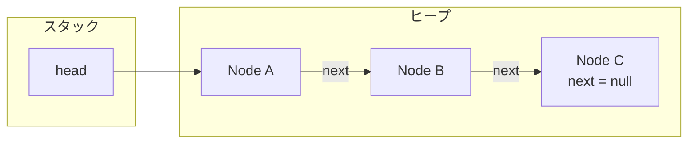

# コレクションとジェネリクス

業務データはほとんど「1 件」ではなく「まとまり」で扱います。  
このページでは、`List` / `Set` / `Map` の使い分けと、ジェネリクスの入口、空と null の違いを整理します。

## このページで分かること

- List / Set / Map を、用途に合わせて選ぶ感覚
- `<String>` のような型引数が何を守るか
- 空コレクションと null は別物であること

## なぜコレクションが中心になるか

未完了ではなく、カートの明細行、注文に紐づく商品、ユーザー ID から表示名への対応。  
配列だけでも表現はできますが、追加・検索・一意制約など、用途に合う型を選ぶ方が安全です。  
標準ライブラリのコレクションは、その選択を型で示してくれます。

倉庫の棚に「並び用」「重複なし用」「番号から探す用」のトレイを分けて置くイメージです。  
用途が違うのに一つの箱に押し込むと、あとで探す手間とミスが増えます。

## List / Set / Map

| インタフェース | 向き                      | 典型ユース                     |
| -------------- | ------------------------- | ------------------------------ |
| **List**       | 順序あり、重複可          | 注文の明細行、タイムライン     |
| **Set**        | 重複なし（相等は equals） | クーポンコード、許可 ID の集合 |
| **Map**        | キー → 値                 | 商品 ID → 在庫数、設定テーブル |

```java
List<String> lineItems = new ArrayList<>();
lineItems.add("mug");
lineItems.add("notebook");

Set<String> coupons = new HashSet<>();
coupons.add("WELCOME10");
coupons.add("WELCOME10"); // 実質ひとつ

Map<String, Integer> stock = new HashMap<>();
stock.put("mug", 3);
```

実装クラス（`ArrayList`, `HashSet`, `HashMap` など）は性能特性が違います。  
まずはインタフェース型で変数を持ち、必要になったら実装を選ぶ、が無難です。

```java
List<String> lineItems = new ArrayList<>(); // 左はインタフェース、右は実装
```

[継承とインタフェース](./inheritance-interface) で見たように、`List` は「一覧として使える契約」、`ArrayList` はその契約を満たす実装のひとつです。  
変数の型をインタフェースにしておくと、あとから実装を差し替えやすくなります。

<details>
<summary>参照でつないで伸ばす一覧（LinkedList のイメージ）</summary>

要素を増やせる構造の一例は、ヒープ上のノードを参照でつないだものです。



- 各ノードは別々のオブジェクトで、`next` が次への参照
- 新しいノードを足せば、配列と違って長さを先に決めなくてよい

標準の `List` がすべてこの形というわけではありません。

- `ArrayList` は内部的には配列（必要に応じて大きい配列へ載せ替える）
- `LinkedList` はノードを参照でつなぐ

どちらも「動的なコレクションは、ヒープ上のデータと参照の組み合わせ」です。  
だからリストをメソッドに渡して `add` すると呼び出し元に見えます。

</details>

<QuizChoice
title="List / Set / Map"
options={[
{id: 'a', label: '順序ありの明細行 → Set、クーポンの重複なし → List'},
{id: 'b', label: '順序ありの明細行 → List、クーポンの重複なし → Set、商品 ID 対応 → Map'},
{id: 'c', label: 'どれも Map で足りるので、List と Set は使わない'},
]}
answer="b"
explanation="List は順序と重複可、Set は重複なし、Map はキーから値です。用途に合うインタフェースを選びます。"

>

  <div>次の用途に合う組み合わせはどれですか。</div>
  <pre className="language-java"><code>{`// 明細の行（順番あり）
// クーポンコード（同じ文字は一つ）
// 商品 ID → 在庫数`}</code></pre>
</QuizChoice>

## ジェネリクスの基本

`<String>` のように型引数を付けると、**入れられる型がコンパイル時に縛られます**。  
トレイに「文字列だけ」とラベルを貼る感覚です。

```java
List<String> names = new ArrayList<>();
names.add("Aiko");
// names.add(42); // コンパイルエラー
String first = names.get(0); // キャスト不要
```

昔の生の `List` は中身が `Object` 扱いで、取り出し時のキャストミスが実行時まで持ち越されました。  
ジェネリクスは、その失敗を前倒しにします。

`List` の要素に `int` をそのままは書けません。  
`List<Integer>` のようにラッパ型を使い、必要に応じて `int` ↔ `Integer` が自動で行き来します（オートボクシング／アンボクシング）。  
ラッパは参照型なので、`null` が入ると NPE の対象になります。

型パラメータを自分で設計する話や、関連する型をまとめて受け取る書き方は、[ジェネリクスと現代的な型](./generics-and-modern-types) で厚くします。

:::tip[覚えておくこと]

コレクション変数は `List<T>` のように型引数付きで持つ。  
取り出しのキャスト地獄を避けるのが第一の価値。

:::

<QuizChoice
title="ジェネリクスの効果"
options={[
{id: 'a', label: 'コンパイルでき、実行時に Integer が入る'},
{id: 'b', label: 'コンパイルエラーになる'},
{id: 'c', label: 'コンパイルは通るが、取り出し時に必ず例外になる'},
]}
answer="b"
explanation="List&lt;String&gt; には String 以外を入れられません。失敗をコンパイル時に止めます。"

>

  <div>次の 2 行目はどうなりますか。</div>
  <pre className="language-java"><code>{`List<String> names = new ArrayList<>();
names.add(42);`}</code></pre>
</QuizChoice>

<details>
<summary>ダイヤモンド演算子</summary>

```java
List<String> names = new ArrayList<>(); // 右辺の型引数は推論できる
```

右辺に同じ型を二度書かなくてよくなります。

</details>

## 変更できるか（ミュータブル）

多くのコレクション実装は、追加・削除で中身を変えられます。  
一方、`List.of` や `Collections.unmodifiableList` など、変更できないビュー／コピーもあります。

```java
List<String> fixed = List.of("a", "b");
// fixed.add("c"); // 実行時に例外
```

メソッドの戻り値を呼び出し側が勝手に `add` すると、想定外の共有変更になります。  
「返す瞬間に固定するか」「可変のまま渡すか」は設計の一部です。

## 空と null は別物

| 状態      | 意味                       | 呼び出し側の気持ち         |
| --------- | -------------------------- | -------------------------- |
| 空の List | 0 件だが「結果はある」     | `isEmpty()` で分岐しやすい |
| null      | 結果そのものが無い／未設定 | NPE のリスク               |

空のトレイは「探した結果、0 件だった」です。  
トレイごと無い（null）のは「結果そのものがない」で、触ると転びやすいです。

```java
List<Order> findOrders(String userId) {
    // ヒットなしなら null より empty を返す設計が多い
    return List.of();
}
```

「無い」を null で表す慣習が残っている API もあります。  
自分で返す側を設計するときは、**空コレクションを返す** 方が扱いやすい場面が多いです。

<QuizChoice
title="空と null"
options={[
{id: 'a', label: 'A（null）の方が、呼び出し側で isEmpty しやすい'},
{id: 'b', label: 'B（空リスト）の方が、呼び出し側で isEmpty しやすい'},
{id: 'c', label: 'どちらでも呼び出し側の書き方は同じ'},
]}
answer="b"
explanation="空リストなら isEmpty で分岐できます。null を返すと、その前に null チェックが必要で、忘れれば NPE になります。"

>

  <div>呼び出し側が次のように書くとき、API の戻りとして扱いやすいのはどれですか。</div>
  <pre className="language-java"><code>{`List<Order> orders = findOrders(userId);
if (orders.isEmpty()) {
    // 0 件のとき
}

// A: return null;
// B: return List.of();`}</code></pre>
</QuizChoice>

## よくあるつまずき

- `Map` のキーに可変オブジェクトを使い、後からフィールドを変えて探せなくなる
- 拡張 for の最中にリストを `remove` して `ConcurrentModificationException`
- API が null を返すのに `isEmpty()` だけ呼んで NPE

## まとめ / 次に学ぶとよいこと

- List は列、Set は集合、Map は対応表
- ジェネリクスで要素型を固定する
- 空と null を混同しない。返すなら空を優先しやすい

次は [ラムダ・Stream・Optional](./lambda-stream-optional) で、まとまりを流す現代的な書き方を見ます。
